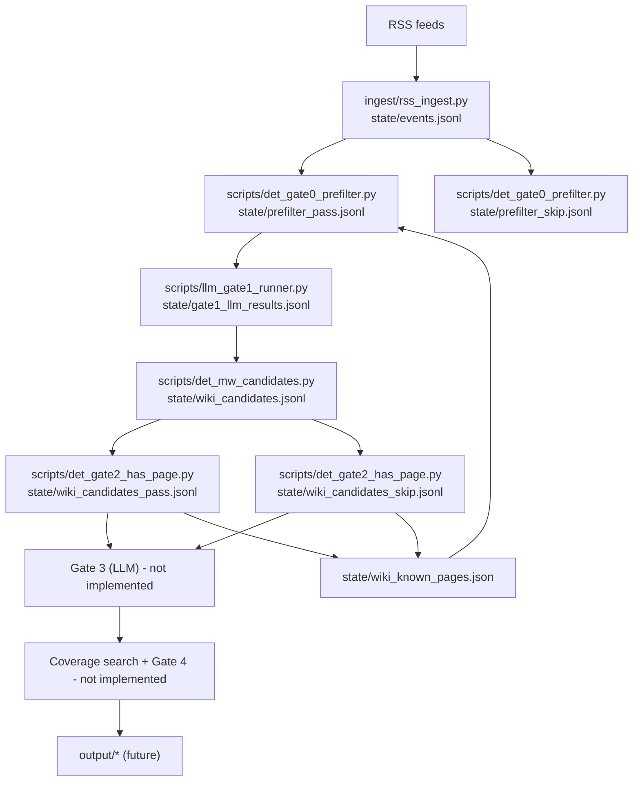

# Data Flow

```mermaid
flowchart TD
    A[RSS feeds] --> B["ingest/rss_ingest.py<br/>state/events.jsonl"]
    J["state/wiki_known_pages.json"] --> C
    B --> C["scripts/det_gate0_prefilter.py<br/>state/prefilter_pass.jsonl"]
    B --> D["scripts/det_gate0_prefilter.py<br/>state/prefilter_skip.jsonl"]
    C --> E["scripts/llm_gate1_runner.py<br/>state/gate1_llm_results.jsonl"]
    E --> F["scripts/det_mw_candidates.py<br/>state/wiki_candidates.jsonl"]
    F --> G["scripts/det_gate2_has_page.py<br/>state/wiki_candidates_pass.jsonl"]
    F --> K["scripts/det_gate2_has_page.py<br/>state/wiki_candidates_skip.jsonl"]
    G --> L["Gate 3 (LLM) - not implemented"]
    K --> L
    G --> J
    K --> J
    L --> H["Coverage search + Gate 4 - not implemented"]
    H --> I["output/* (future)"]
```

## Notes

- Deterministic stages: ingest, Gate 0 prefilter, MediaWiki candidates.
- LLM stages: Gate 1, Gate 2, Gate 3.
- All intermediate artifacts live under `state/`.
