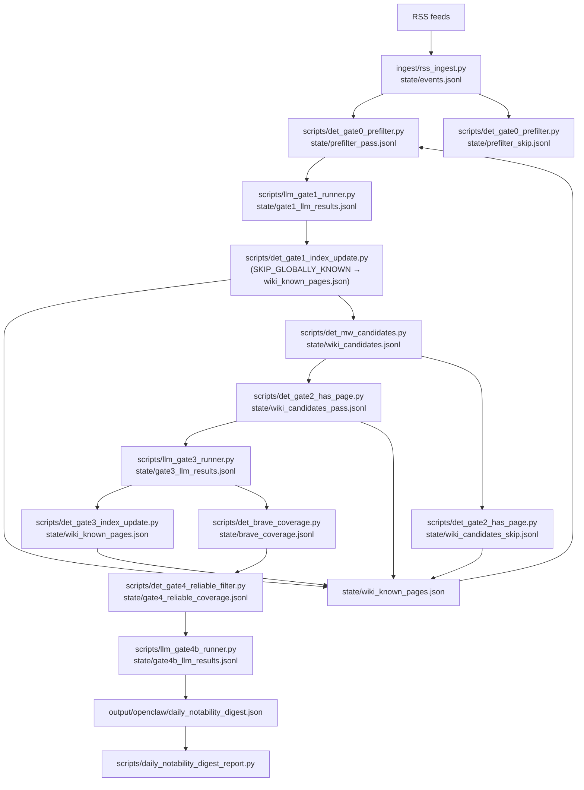

# Data Flow

## Notes

- Deterministic stages: ingest, Gate 0 prefilter, Gate 1 index update, MediaWiki candidates, Gate 2 has-page, Gate 3 index update, Gate 4 reliable filtering.
- LLM stages: Gate 1 triage, Gate 3 page-match, Gate 4b coverage verifier (two-pass: first pass counts distinct domains from a curated Wikipedia-reliable source list → `LIKELY_NOTABLE`; second pass asks the LLM to judge source reliability from the full Brave result set → `POSSIBLY_NOTABLE`).
- Summary artifacts:
  - `state/gate4b_llm_results.jsonl` (per-event domain counts)
  - `output/openclaw/daily_notability_digest.json` + `scripts/daily_notability_digest_report.py`
