# Overarching System Specification

**Status:** Approved
**Date:** 2026-07-24
**Branch:** `refactor/rearchitecture`

## Purpose and Authority

Notable Person Finder is a personal, non-interactive, once-daily batch tool
that finds people in configured visual-arts feeds, checks current English
Wikipedia identity, gathers bounded coverage evidence, and produces a small
Markdown shortlist for one human editor. It never decides Wikipedia notability,
writes an article, or edits Wikipedia.

This document is the architectural index for the clean-slate rewrite. It owns
the system boundary, component ownership, dependency direction, end-to-end
lifecycle, and cross-cutting invariants. It does not duplicate the detailed
schemas, policies, or acceptance matrices in the focused specifications.

Authority descends in this order:

1. approved product decisions and explicit amendments;
2. this document for cross-cutting system ownership and reconciliation;
3. the focused specifications for their named concerns; and
4. legacy implementation, tests, prompts, and documentation as historical
   evidence only.

If a focused specification conflicts with a cross-cutting invariant here, the
conflict must be resolved by an explicit amendment rather than an implicit
implementation choice.

## System Boundary

The system is one installed Python modular monolith, one `notable` CLI, and one
SQLite database. Its four architectural layers are:

- **Operator boundary:** validated configuration, CLI commands, Markdown
  digest, safe terminal diagnostics, structured logs, and audit views.
- **Application capabilities:** runs, ingestion, people, Wikipedia identity,
  coverage research, lead assessment, and digest generation.
- **Integration boundary:** feed retrieval and parsing, MediaWiki, Brave Web
  Search, article retrieval and extraction, and OpenRouter.
- **Durable foundation:** SQLite connections, migrations, configuration
  snapshots, work items, attempts, and immutable domain observations.

The tool is not a service, daemon, autonomous agent, distributed worker system,
notification platform, article generator, or general research framework. The
operating-system scheduler may invoke it daily, but scheduling remains outside
the application.

## Component Ownership

| Component | Owns | Depends on |
| --- | --- | --- |
| `cli` | command parsing, streams, process status, safe human messages | application services and configuration |
| `config` | TOML graph loading, defaults, validation, redaction, fingerprinting | Pydantic and platform paths |
| `runs` | run lifecycle, work scheduling, retries, budgets, provider pauses, terminal state | feature services, provider protocols, database transactions |
| `ingestion` | feed identities, fetch observations, source items, text and date normalization | feed protocol and database |
| `people` | mentions, person entities, sourced names, relations, and merges | model protocol and database |
| `wikipedia` | query plans, MediaWiki observations, candidate assembly, identity state | MediaWiki and model protocols, people, database |
| `coverage` | Brave query plans, result occurrences, article identity and views, source screening, article assessment | search, article, and model protocols, people, database |
| `assessment` | deterministic lead outcomes, ranking factors, and current assessment | people, Wikipedia and coverage records, database |
| `digest` | pending queue, resurfacing, optional synthesis, Markdown rendering, digest history | runs, people, assessment, model protocol, database |
| `providers` | narrow typed adapters and shared bounded transport | external libraries and services only |
| `db` | connections, transactions, migrations, and SQLite primitives | standard-library SQLite only |

The CLI invokes application services; it does not contain product policy.
`runs` coordinates eligible work but does not absorb feature decisions. Each
feature owns its domain types and SQL. `db` owns no product queries, and
`providers` owns no workflow transitions. Provider implementations are passed
behind application-owned protocols so domain modules never import HTTPX,
feedparser, Trafilatura, or OpenRouter SDK types.

Features may consume explicit upstream records, but cyclic feature ownership
is prohibited. A downstream result never mutates an upstream immutable
observation. It creates a new observation, transition, assessment, or current
pointer under the owning feature.

## End-to-End Lifecycle

```mermaid
flowchart LR
    A[Validate local configuration] --> B[Acquire lock and migrate]
    B --> C[Create run and recover interrupted work]
    C --> D[Ingest configured feeds]
    D --> E[Detect meaningful people]
    E --> F[Resolve durable person identity]
    F --> G[Check English Wikipedia identity]
    G --> H[Search and assess coverage]
    H --> I[Compute lead outcome]
    I --> J[Update digest queue]
    J --> K[Optional grounded synthesis]
    K --> L[Render digest and finish run]
```

This is a dependency graph, not a set of global stage barriers. A committed
result makes its bounded dependent work eligible. Independent feed items,
people, articles, and provider requests may progress concurrently within the
configured limits. Required first-pass work is scheduled before optional
synthesis, with older eligible work preferred within ordinary workflow order.

The operational sequence is:

1. Load and locally validate the selected configuration graph. No provider
   request begins after local validation fails.
2. Resolve the data root, acquire its nonblocking OS lock, apply checked
   migrations with a pre-migration backup, and create a run with a canonical
   redacted configuration snapshot.
3. Mark any abandoned prior `running` run and attempts interrupted, then make
   their unfinished work eligible without adding a special resume mode.
4. Fetch feeds conditionally and retain source provenance, usable entries, and
   recoverable parser warnings.
5. Run the approved focused semantic tasks only when their bounded evidence is
   ready. Before a model's first paid use in the run, perform its shared fresh
   capability preflight under the central retry policy.
6. Stop active research after a confirmed matching English Wikipedia page.
   Absence or genuine uncertainty continues to bounded coverage research.
7. Retrieve, extract, and assess selected coverage one person–article pair at
   a time, then aggregate immutable evidence deterministically.
8. Update the durable digest queue for promising or possible leads. Optional
   synthesis may improve presentation but never inclusion, ordering, or
   source selection.
9. Atomically render the latest-attempt Markdown digest when durable state
   permits, record its hash and run summary, and assign the truthful terminal
   run state and process status.

Every same-day invocation creates a new run after successful startup. Matching
persisted work is reused by versioned fingerprint, while provider-specific
freshness rules determine when external observations require refresh.

## Sources of Truth

SQLite is the only durable application source of truth. It contains two kinds
of state:

- immutable domain and operational observations recording what was supplied,
  attempted, returned, validated, and decided; and
- small mutable projections such as current pointers, pending work, and the
  digest queue.

The selected TOML graph owns prospective settings and policy. Each run stores
the exact resolved, redacted snapshot that governed it. A later configuration,
prompt, model, source-policy, schema, or profile change does not reinterpret
historical observations automatically.

The Markdown digest is a human review artifact, not state. Logs are diagnostic
events, not provenance. Provider caches are typed observations with explicit
freshness, not opaque files. The application never reconstructs truth from
terminal output, logs, or a digest.

## Decision Boundary

Models perform exactly five evidence-bound semantic tasks:

1. `detect_people`;
2. `resolve_person_entity`;
3. `match_wikipedia_identity`;
4. `assess_article`; and
5. optional `compose_lead_summary`.

Each request contains one task unit and only supplied evidence. Models have no
tools, network access, memory lookup, workflow control, publisher-policy
authority, ranking authority, or candidate-level notability verdict.

Deterministic code owns provider calls, parsing, normalization, candidate and
passage selection, query planning, bounds, caching, policy, aggregation,
ranking, rendering, scheduling, retries, budgets, persistence, and transitions.
A valid semantic uncertainty is a domain result. Operational breakage is a
typed failure. Neither may be converted into the other.

## Cross-Cutting Invariants

- The application never writes or edits Wikipedia and never presents a lead
  outcome as a Wikipedia-policy conclusion.
- One person's evidence never enters another person's model request or lead
  assessment.
- Names generate identity candidates but never establish identity. Uncertain
  people remain separate and do not share evidence.
- A confirmed person merge preserves history and atomically reconciles active
  work, current observations, and digest-queue state against one survivor.
- One application-owned article-URL normalization policy joins feed, search,
  and redirect provenance onto canonical articles.
- Publisher aliases are deterministic policy. Version one does not infer
  cross-publisher syndication or claim intellectual independence from domain
  counts.
- Every external request is finite, attributable to one persisted attempt, and
  retried only by the central application coordinator.
- No SQLite transaction remains open across network or model work. Successfully
  persisted matching work is reusable; the remote-success/local-crash window
  remains explicitly at-least-once.
- Provider failure, missing work, budget exhaustion, and truncation cannot
  become a confident semantic negative.
- Optional work cannot make an otherwise complete run partial or remove a
  useful digest entry.
- Stored timestamps are UTC. Human dates and observation windows use the
  configured IANA timezone.
- Credentials and authorization values never enter TOML, SQLite snapshots,
  logs, digests, or ordinary error output.
- One OS-managed lock prevents concurrent mutation of a data root. Read-only
  status, path, digest, and audit operations remain available.
- The renderer constructs Markdown and validated links; model text never
  creates structure or untrusted URLs.

## Failure, Continuation, and Completion

Expected provider alternatives such as a missing page, inaccessible article,
or partial feed are typed data. Network, provider, validation, configuration,
budget, storage, and internal failures use the approved typed operational
vocabulary. One item failure commits independently and cannot roll back
unrelated successful work.

Only the central retry coordinator starts another visible provider attempt. It
respects `Retry-After`, otherwise uses bounded backoff, and never retries valid
uncertainty or permanent failure. Exhausted transient required work is deferred
to the next ordinary run. Permanent failure waits for materially changed input
or configuration. A transient OpenRouter preflight failure defers only work
using that model and does not prevent unrelated deterministic work.

Run state is derived from durable outcomes:

- `complete`: all required eligible work reached a terminal usable result;
- `partial`: useful results and a digest exist, but required work remains
  deferred or incomplete;
- `failed`: a run-level problem prevented meaningful work or trustworthy
  reporting;
- `interrupted`: the process stopped before another terminal state was stored.

The CLI returns `0`, `2`, or `1` for complete, partial, or failed runs and
preserves normal signal semantics for interruption. The next invocation creates
a new run and continues pending durable work; it never resumes a process or
stage in place.

## Verification Ownership

Verification is divided by what can establish the claim:

- default offline pytest owns deterministic policy, schemas, configuration,
  SQLite constraints and migrations, provider contracts, retries, budgets,
  locking, CLI behavior, digest snapshots, and end-to-end continuation;
- Promptfoo owns the five model task datasets, strict structured output,
  grounded references, per-task reports, and designated critical unsafe cases;
- explicitly invoked manual live tests check current feed, MediaWiki, Brave,
  article, and OpenRouter integration without using operator state; and
- the one-time qualitative legacy comparison is the go/no-go review before the
  rewrite replaces the Git-preserved prototype.

No paid or credentialed test runs in default pytest, pre-commit, or ordinary
CI. A production batch is not a test. A legacy behavior receives a replacement
test only when its approved disposition preserves or changes a requirement.

## Focused Specifications

The following documents remain authoritative for detail:

- [Product workflow and decision policy](2026-07-24-product-workflow-design.md)
  owns lifecycle policy, high-recall behavior, scheduling, lead outcomes, and
  human boundaries.
- [Domain model, persistence, and continuation](2026-07-24-domain-persistence-design.md)
  owns records, constraints, transactions, migrations, idempotency, merges,
  and storage layout.
- [LLM tasks and evaluation](2026-07-24-llm-evaluation-design.md) owns the five
  semantic contracts, prompts, schemas, production model policy, and Promptfoo
  evaluation.
- [Provider adapters](2026-07-24-provider-adapters-design.md) owns transport,
  provider DTOs, URL safety, failure translation and retry metadata, pacing,
  and live contract checks.
- [Operator experience and verification](2026-07-24-operator-experience-verification-design.md)
  owns configuration precedence, CLI commands and statuses, locking, logs,
  digest presentation, actionable errors, and test layers.

The approved [legacy behavior inventory](../../architecture/legacy-behavior-inventory.md)
remains the evidence and disposition index, not a competing system design.

## Reconciled Decisions

This specification confirms the following cross-document interpretations:

- configuration validation is local and complete before provider work;
  current model capability inspection is lazy before that model's first paid
  call and follows ordinary retry and deferral policy;
- fresh model capability metadata is always required, while fresh usable
  pricing blocks a call only when a hard cost cap requires a reservation;
- one URL identity policy applies regardless of whether an article arrived
  through a feed, Brave result, or redirect;
- confirmed person merges reconcile mutable projections atomically but never
  rewrite immutable historical foreign keys;
- the lack of automated syndication inference is intentional for the initial
  human-reviewed pilot; domain counts prioritize attention without claiming
  independent Wikipedia-qualifying sources; and
- `latest.md` always represents the latest attempt, including a partial or
  failed one, rather than preserving a stale successful appearance.

## System Acceptance

The integrated design is accepted when an isolated offline fixture can invoke
the installed CLI from valid configuration and empty SQLite state, then
exercise feed ingestion, supplied semantic outcomes, person identity,
Wikipedia handling, coverage evidence, lead assessment, digest queuing,
Markdown rendering, and a truthful terminal run state.

The same fixture must interrupt execution after a committed provider result and
show that the next ordinary invocation creates a new run, reuses that result,
and continues dependent work without duplicate active state. Separate focused
tests remain responsible for the detailed acceptance criteria linked above.

## Deferred

All deferrals in the focused specifications remain in force. In particular,
the initial system adds no daemon, distributed workers, multi-user service,
notification delivery, model-selected tools, alternative LLM gateway,
automated syndication inference, compatibility import, automatic database
repair, or machine-output API.
