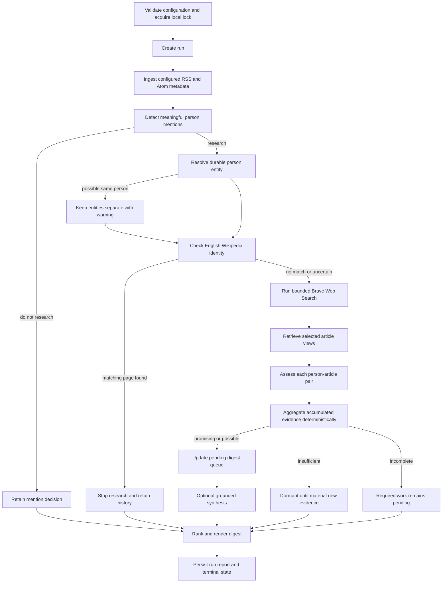

# Product Workflow and Decision Policy

**Status:** Approved
**Date:** 2026-07-24
**Branch:** `refactor/rearchitecture`

## Purpose

This specification connects the approved legacy-behavior decisions into one
once-daily product workflow. It defines what progresses, what waits, what
surfaces, and where deterministic code or a model may decide. It does not
choose Python modules, database tables, provider transport details, or exact
LLM schemas; those belong to the following focused designs.

The seven approved capability reviews are indexed by the
[legacy behavior inventory](../../architecture/legacy-behavior-inventory.md).
Where this specification summarizes a capability, the focused review remains
the authority for its detailed behavior and verification boundary.

## Product Boundary

The product is a personal, non-interactive, once-daily batch tool. It monitors
editor-configured RSS or Atom feeds, finds meaningful individual subjects,
checks English Wikipedia, researches English-language coverage, and produces a
small inspectable Markdown shortlist. It never writes Wikipedia content,
drafts an article, or decides that a person satisfies Wikipedia policy.

The visual-arts source profile is the development pilot, not application
logic. Every workflow decision operates on configured sources and domain
profiles without publisher-specific Python branches.

## End-to-End Flow

The apparent sequence does not impose global batch barriers. It describes
dependencies. Each committed result makes the next required task eligible,
and unrelated people progress independently.

## Cross-Cutting Decision Boundary

Deterministic code owns explicit mechanics: provider calls, parsing,
normalization, candidate retrieval, configured rules, query construction,
selection, bounds, caching, retries, budgets, persistence, workflow
transitions, aggregation, ranking, and rendering.

Models are used only for irreducibly semantic judgments over supplied context:

- meaningful individual-subject detection;
- same-person comparison between discovered mentions;
- same-person comparison with plausible MediaWiki pages;
- article identity, depth, content-type, and subject-relationship assessment;
- grounded attention-signal extraction; and
- optional shortlist synthesis and source reconnaissance.

Every model call performs one focused decision:

- one discovery item for person detection;
- one mention plus bounded existing-person candidates for entity resolution;
- one person plus bounded MediaWiki candidates for Wikipedia identity;
- one person-article pair for coverage assessment; or
- one shortlisted person for optional synthesis.

There is no cross-candidate model batching, open-ended agent loop, model-
selected tool, candidate-level notability verdict, or model-controlled rank.
Task-specific context improves focus, token efficiency, retry isolation,
provenance, and Promptfoo evaluation.

All synthesis follows one minimal universal rule: use only supplied evidence
and preserve attribution and uncertainty. Version one adds no special
living-person classifier, sensitive-topic taxonomy, or policy-heavy prompt.

## Mention and Person Identity

A `do_not_research` result applies only to one source mention. It never creates
a name-level rejection cache. A later, more substantive mention can start a
new research path for the person.

For a research-worthy mention, code retrieves a bounded set of existing people
using source-grounded names and aliases. Names generate candidates but never
establish identity. A model compares supplied profession, place, era, work,
association, and event context:

- a positive semantic match associates the mention with the durable person;
- no plausible match creates a new durable person; and
- uncertainty creates or retains separate provisional entities connected by a
  `possible_same_person` relation.

Uncertain entities never share or combine evidence. Material new identity
facts may trigger one bounded reconsideration. If two unresolved entities both
qualify for the digest, show them separately with a possible-duplicate warning
rather than suppressing either. A later positive match permits consolidated
future assessment while preserving original mentions and decision history.

This deliberately replaces the prototype's normalized-name identity and
case-folded digest grouping.

## Scheduling and Fairness

Use a bounded dependency queue rather than rigid global stages or person-first
completion. A completed required task makes its dependent task eligible. The
scheduler prioritizes:

1. required first-pass work;
2. older pending work within ordinary workflow order;
3. optional synthesis or refinement.

This prevents early candidates from consuming the model budget while later
feed items receive no triage. It also prevents one slow record from holding a
global stage barrier. Models do not select the next task.

When several mentions positively resolve to one person in a run, retain every
mention and discovery article but coalesce downstream person-level work:

- build one bounded provenance-preserving identity context;
- perform at most one MediaWiki refresh;
- perform one coverage-search plan; and
- calculate one current lead assessment.

Every article remains an atomic assessment. All supported aliases inform the
person search plan, and deterministic selection chooses the most informative
context. A materially new source-grounded alias or identity fact changes the
search fingerprint and may permit one additional plan. A merely repeated
mention does not.

Every research-worthy person without a confirmed matching Wikipedia page gets
the initial exact-name Brave Web Search even when discovery articles already
meet the promising threshold. Finding useful source material is itself a
product outcome. Alias and contextual searches remain conditional on the
configured retrieval target.

## Person Lifecycle

Mention decisions, provider observations, article assessments, and lead
assessments remain separate facts rather than being collapsed into one mutable
pipeline status.

| Current condition | Workflow consequence |
| --- | --- |
| Mention is `do_not_research` | Retain the decision; do no person research for that mention. |
| Mention has inadequate stable identity | Retain for review; do not invent or merge a person. |
| Person has `matching_page_found` | Stop coverage research and future surfacing; retain history. |
| Person has `no_matching_page_found` | Continue coverage research. |
| Person has `uncertain_identity` | Continue coverage with a visible warning; uncertainty never suppresses. |
| Assessment is `promising_lead` | Make newly eligible or materially improved person pending for digest. |
| Assessment is `possible_lead` | Make newly eligible or materially improved person pending for digest below promising leads. |
| Assessment is `insufficient_evidence` | Keep durable and dormant until material new evidence. |
| Assessment is `assessment_incomplete` | Keep required work pending; never convert missing work to a negative. |

New evidence can reactivate a dormant person and improve a current assessment.
Evidence accumulates across runs. Publisher-policy, prompt, model, and profile
changes apply prospectively as approved in capability 5. A later confirmed
English Wikipedia page stops future work without rewriting historical lead
assessments.

## Lead Policy and Human Boundary

Code applies the approved lead decision table:

- `promising_lead` requires qualifying coverage from the configured number of
  distinct canonical eligible publisher domains, initially two;
- `possible_lead` requires at least one useful coverage or grounded attention
  reason but does not meet the strongest threshold;
- `insufficient_evidence` requires a completed bounded assessment with no
  qualifying or unresolved useful evidence; and
- `assessment_incomplete` records missing required work.

The application does not infer intellectual independence or syndication and
does not call these outcomes Wikipedia notability decisions. Substantial
editorially commissioned interviews from eligible independent publications
may qualify as attention evidence, while primary claims remain labelled.
Domain-neutral attention and caution signals can strengthen or order a
possible lead but cannot replace the multi-domain promising threshold.

The batch never pauses for human input. Writing a candidate into the Markdown
digest marks it surfaced; queue emission measures delivery, not confirmed
reading or editorial action. Version one has no acknowledge, dismiss, snooze,
annotation, or article-writing workflow. Material improvements can cause
resurfacing under the approved deterministic rules.

## High-Recall Semantics

“Optimize for recall” has concrete workflow consequences:

- every usable feed item receives bounded person detection;
- uncertain but actionable people continue;
- an uncertain Wikipedia match never suppresses a candidate;
- sparse evidence persists for later accumulation;
- technical failure and budget deferral never become semantic rejection;
- an unclassified source can remain a visible provisional lead;
- digest limits create durable backlog rather than data loss; and
- possible namesakes stay separate rather than being merged for convenience.

High recall does not mean unbounded research or automatic inclusion. Searches,
context, calls, retries, costs, and digest size stay finite and configurable.
Promptfoo reports false negatives on a small labelled set and gives special
visibility to known high-cost mistakes. No percentage recall SLA is set until
the evaluation set is large and representative enough to support one.

## Reporting and Run Completion

Every usable run renders the approved Markdown digest and a compact run
summary, including an empty successful shortlist. Complete candidate results
can appear in a partial run. Optional synthesis failure uses deterministic
fallback and never suppresses a lead.

Pending candidates remain queued until shown, with the approved starvation
guard. Queue arrival, emission, backlog, age, saturation, and net-clearance
metrics measure whether digest capacity keeps pace with candidate creation.
They do not claim to measure human review completion.

The run-state, retry, budget, provider-pause, locking, interruption, and exit-
code rules are defined by
[capability 7](../../architecture/legacy-behaviors/07-failures-budgets-and-resumability.md).

## Acceptance Criteria

The focused workflow design is satisfied when:

- a new feed item can produce zero, one, or several independently traceable
  person mentions;
- identical names alone cannot merge people or reuse Wikipedia mappings;
- a confirmed recurring person accumulates evidence without duplicate
  person-level search in the same run;
- uncertain entity and Wikipedia identity cases continue without unsafe
  combination or suppression;
- required first-pass work is scheduled before optional model work;
- every model request contains exactly one task unit and no unrelated person's
  context;
- qualifying and incomplete evidence produce the approved deterministic lead
  outcomes;
- a later substantive item can start research despite an earlier
  `do_not_research` mention, or reactivate a dormant person;
- digest limits retain rather than discard eligible candidates;
- an optional model or unrelated item failure cannot prevent a useful digest;
  and
- no workflow path creates, drafts, or edits Wikipedia content.

Pytest will verify transitions, scheduling, entity safety, coalescing,
reactivation, outcome aggregation, queue behavior, and failure isolation.
Promptfoo will verify only the bounded semantic judgments. The lightweight
legacy comparison will identify major recall changes without imposing
prototype compatibility.

## Deferred

- interactive review, acknowledgement, dismissal, snoozing, and annotation;
- multi-user assignment or notification delivery;
- automated article drafting or editing;
- multilingual research;
- cross-publisher syndication inference;
- percentage recall targets unsupported by the initial evaluation set; and
- workflow frameworks such as LangGraph unless observed complexity later
  justifies them.
