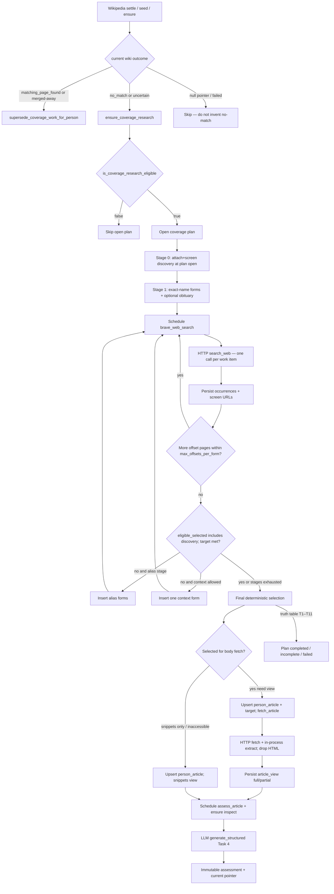

# Milestone 5: Coverage Evidence

| Field | Value |
| --- | --- |
| **Status** | Draft (revision 4) |
| **Date** | 2026-07-30 |
| **Author** | (design agent) |
| **Branch** | `feat/coverage-evidence` (proposed) |
| **Programme** | Notable Person Finder clean-slate rewrite |
| **Depends on** | Milestones 1–4 complete on `refactor/rearchitecture` (HEAD e646e55) |

## Amendments

### 2026-08-01 — publisher policy ships as a tracked artifact

The curated publisher policy ships as the **tracked repository artifact**
`config/source_policies/visual_arts.toml`, not as an operator-copied
`*.example.toml`. The curated eligible/ineligible set is product content whose
changes belong in a reviewed diff, not a per-machine preference, and every
screening decision stores `source_policy_fingerprint` over it. Wherever this
design writes `visual_arts.example.toml` (the file tree in the Files section
and the Source policy section), read `visual_arts.toml`;
`config/notable.example.toml` points `source_policy_file` at it, and it is a
config-load error for the file to be missing. Nothing else changes: the policy
schema, the `curated_eligible` / `curated_ineligible` / absent-rule
`unclassified` statuses of K8, the first-match-wins ordering of K33, and the
fingerprint definition are all unchanged.

This is the only decision carried over from the superseded
`2026-08-01-coverage-research-design.md`. That document and its plan
(`docs/superpowers/plans/2026-08-01-coverage-discovery.md`) were written
without knowledge of this branch, were never implemented, and must not be used
to amend K1–K34 in any other respect.

## Overview

Milestone 4 records durable Wikipedia identity outcomes, including
`matching_page_found`, but nothing yet stops or starts coverage research.
Milestone 5 turns eligible canonical people into inspectable **coverage
evidence**: bounded Brave Web Search plans, deterministic publisher screening
from a versioned domain/source policy, shared canonical articles and URL
aliases, article fetch + Trafilatura extraction (never raw HTML),
person-specific passage selection, and immutable person–article assessments
via OpenRouter Task 4 `assess_article`.

This milestone owns:

- the `WebSearchClient`, `ArticleFetcher`, and `ArticleExtractor` provider
  adapters;
- the new `coverage/` capability package (query plans, screening, selection,
  article views, person–article assessments);
- work-item kinds that respect **exactly one external call per execute**;
- the product stop rule: current completed `matching_page_found` suppresses
  coverage research eligibility;
- merge reconciliation for coverage work when people merge;
- truthful coverage counters on the digest and `notable status`.

It reuses dual HTTP/LLM worker pools, shared transport, pacing, retry
coordination, multi-model inspection, prepare/execute/settle handlers, attempt
accounting, and `ingestion.urls.canonicalize_article_url` from milestones
2–4. It does **not** run lead assessment, ranking, digest shortlist
synthesis, the digest queue, audit commands, Promptfoo suites, or legacy
comparison. It never writes or edits Wikipedia.

## Background & Motivation

### Current state (end of milestone 4)

- Pipeline: feeds → detect → resolve people → Wikipedia identity.
- Canonical people, mentions, Wikipedia identity observations, and
  `person.current_wikipedia_identity_observation_id` exist.
- Outcomes `matching_page_found`, `no_matching_page_found`, and
  `uncertain_identity` are durable; m4 status/digest report identity only and
  deliberately do **not** invent “coverage skipped” counters.
- `canonicalize_article_url` and `canonical_article` / `article_url_alias`
  exist under ingestion. Alias kinds today: `feed_original`,
  `redirect_destination`. Migration `0003` comments that m5 adds
  `search_result`.
- Pacing already defines `brave_min_interval_ms = 1100` and maps provider key
  `"brave"`. Credentials already load `BRAVE_API_KEY`.
- Transport already defines `max_article_response_bytes` (default 10 MiB).
- Priorities end at MediaWiki HTTP 50 / Wikipedia match 55.
- Migrations through `0006_wikipedia_identity.sql`; next is `0007_...`.
- No Brave client, article fetch/extract, coverage package, source-policy
  screening, PassageSelector, or `assess_article` task.

### Pain points this milestone removes

- Operators cannot see whether people without a matching Wikipedia page have
  been searched, screened, fetched, or assessed for English-language coverage.
- Discovery-feed articles linked to a person are not yet assessed as
  person–article evidence on the same path as search results.
- Milestone 6 lead policy has no durable person–article assessments to consume.
- The stop rule for `matching_page_found` is recorded but not enforced by any
  coverage scheduler.

### Authorities this design refines

This document refines, without replacing:

- `docs/architecture/legacy-behaviors/04-coverage-and-source-reliability.md` —
  approved dispositions (preserve/delete/change table).
- `docs/superpowers/specs/2026-07-24-product-workflow-design.md` — lifecycle
  stop/continue table; exact-name search always; alias/context conditional on
  retrieval target; coalesce one coverage-search plan per person.
- `docs/superpowers/specs/2026-07-24-domain-persistence-design.md` — Coverage
  Evidence Records (plans, queries, occurrences, articles, views, assessments,
  policy provenance).
- `docs/superpowers/specs/2026-07-24-provider-adapters-design.md` —
  `WebSearchClient`, `ArticleFetcher`, `ArticleExtractor`, PassageSelector,
  Brave pacing ≥1100 ms, Trafilatura, `BRAVE_API_KEY`.
- `docs/superpowers/specs/2026-07-24-llm-evaluation-design.md` — Task 4
  `assess_article` I/O contract.
- `docs/superpowers/specs/2026-07-24-overarching-system-design.md` —
  `coverage` package ownership.
- `docs/superpowers/specs/2026-07-30-wikipedia-identity-matching-design.md` —
  plan multi-wave patterns, empty short-circuits, dual pools, one call per
  execute, merge reconcile, K11 stop rule, counter honesty.
- `docs/superpowers/specs/2026-07-30-durable-person-identity-design.md` —
  people, fingerprints, operational projection, merge.
- `docs/superpowers/specs/2026-07-29-model-gateway-and-detection-design.md` —
  dual pools, prepare/execute/settle, multi-model inspection.
- `docs/architecture/at-least-once-execution.md` — external crash windows.
- `docs/superpowers/plans/2026-07-27-ingestion.md` — m5 adds `search_result`
  alias kind; reuses `canonicalize_article_url`.

## Goals & Non-Goals

### Goals

Milestone 5 must:

1. Add `WebSearchClient` in `providers/` as the only module that performs Brave
   Web Search HTTP (`search_web`), using shared transport, pacing (`brave`),
   concurrency, and failure classification. Auth via `BRAVE_API_KEY` only;
   secrets never enter durable product state or logs.
2. Add `ArticleFetcher` and `ArticleExtractor` in `providers/`. Fetcher performs
   one ordinary HTTP GET with URL safety, redirects, timeouts, content-type,
   and body-size rules. Extractor is pure Trafilatura + deterministic cleanup;
   **raw HTML is never persisted**.
3. Introduce the `coverage/` package: person search plans, query forms,
   search observations and ranked result occurrences, source screening,
   deterministic selection, article views, person–article relations, immutable
   assessments, PassageSelector, and handlers.
4. Reuse shared article identity via `canonicalize_article_url` and
   `article_url_alias`; migration extends alias `kind` with `search_result`
   (and records redirect destinations as today).
5. Screen every search (and discovery) URL against a **versioned source-policy
   TOML**; copy rule id, rule status, policy fingerprint, and decision time
   into screening and assessment provenance. Never rejoin historical rows
   against today’s TOML for reinterpretation.
6. Honor Wikipedia outcomes for coverage **eligibility**:
   - current completed `matching_page_found` → **ineligible** (stop research);
   - current completed `no_matching_page_found` → eligible;
   - current completed `uncertain_identity` → eligible (warning surface only);
   - no current completed Wikipedia observation (pending Wikipedia work,
     failed-only history, none) → **not yet eligible**; do not invent no-match.
7. Always run the initial **exact-name** Brave search for eligible people,
   even when discovery articles already look strong. Alias and contextual
   queries are conditional on a configured retrieval target after exact-name
   results are screened/selected.
8. Include **discovery-feed articles** linked to the person (via operational
   mentions → source items → canonical articles) on the same assessment path
   as selected search results.
9. Split work so each `execute` performs exactly one external call under a
   fixed handler `provider`/`operation`. Extract is not a work item.
10. Call `assess_article` only for person–article pairs with a prepared view
    (full, partial, or snippets-only fallback) and screening provenance.
11. Empty complete search with nothing selected for assessment is a terminal
    **coverage plan completed** state with zero assess work and **no** lead
    outcomes invented.
12. Reconcile coverage work and pointers on confirmed person merge.
13. Extend multi-model inspection so the assess model is inspected when this
    run has or will need assess work (mirror m4 K21 cold-start pattern).
14. Expose truthful coverage progress on digest and `notable status` without
    inventing lead ranking, shortlist synthesis, or false “skipped because
    Wikipedia” claims beyond the eligibility stop rule this milestone enforces.
15. Preserve every run-engine invariant: no transaction across network calls,
    workers never open SQLite, every external call maps to one attempt, only
    the central coordinator retries, secrets never enter durable product state.

### Non-goals

- Lead assessment, `promising_lead` / `possible_lead` thresholds, ranking,
  digest shortlist synthesis, digest queue, `notable digest show`, audit
  commands (milestone 6).
- Promptfoo suites, full live verification matrix, legacy comparison, cutover
  (milestone 7).
- Brave News cascade, model-invented queries, silent provider spelling
  acceptance as identity, global cross-query rerank, cross-source independence
  clustering, publisher-specific scrapers, paywall bypass, robots.txt
  proactive crawl.
- Automated Wikipedia edits, drafts, or notability verdicts.
- Migrating legacy JSONL coverage indexes.
- Engine extensions for multi-call execute, per-attempt provider override, or
  prepare-time network I/O.
- Claiming overall “reliable publisher” or notability booleans from the model.
- Status/digest inventing m6 backlog tiers or budget breakdown.

## Key Decisions

| # | Decision | Rationale |
| --- | --- | --- |
| K1 | **New `coverage/` package; do not fold into `people/` or `wikipedia/`.** | Overarching design assigns Brave plans, occurrences, article views, screening, and assessments to `coverage`. People remain the subject entity; Wikipedia remains the identity gate; coverage is a sibling capability. |
| K2 | **Three work-item kinds: `brave_web_search` (HTTP), `fetch_article` (HTTP), `assess_article` (LLM).** Extract is **not** a work item. | Engine contract: one external call per execute; fixed provider/operation per handler. Brave, article origin HTTP, and OpenRouter cannot share one execute. |
| K3 | **`ArticleExtractor` runs in-process after a successful fetch on the worker: execute performs the single HTTP fetch, then extract, then **must** drop all HTML references before returning.** `TaskOutcome.payload` is cleaned `ExtractedArticle` / typed access result only. **Never** place HTML or full article bodies in `attempt.detail_json`, `ProviderFailure.detail`, logs, or SQLite. Snippets-only paths never call the fetcher. Crash after a successful GET (at-least-once windows) **re-issues the GET** on retry — reuse only after successful persist. Trafilatura on the worker is intentional (CPU-heavy work stays off the SQLite thread). | Provider design + engine payload not stored by engine; secrets/body hygiene; architecture note on crash windows. |
| K4 | **Subject of coverage planning is always the canonical `person`.** Mentions and source items feed discovery evidence and names; they are never plan subjects. | Product: one coverage-search plan per person when multiple mentions resolve together. |
| K5 | **Wikipedia gate for coverage eligibility is precise (normative algorithm below).** Eligible only when current completed Wikipedia outcome is `no_matching_page_found` or `uncertain_identity`. `matching_page_found` stops. Missing/failed Wikipedia does **not** unlock coverage. **In-progress Wikipedia plans leave `current_wikipedia_identity_observation_id` null** (m4: pointer is completed-only); coverage treats null like “none” — not a first-class incomplete semantic outcome. When Wikipedia settles `matching_page_found` (or person is merged away), **`supersede_coverage_work_for_person` runs before any new ensure** so mid-flight Brave/fetch/assess work is cancelled. | Product lifecycle + m4 K11; avoids inventing no-match or racing Wikipedia. |
| K6 | **Exact-name queries always open the plan. Alias queries are scheduled only when exact-name stage fails the retrieval target (counting discovery curated-eligible selected at plan open). At most one contextual query is scheduled only when still below target after alias stage (or when no aliases exist and exact-name is below target).** Obituary variants: at most those that fit remaining `max_exact_forms` budget, inserted **with the stage-1 exact wave at plan open** when operational facts explicitly support death/obituary; never invent death facts; count against `max_exact_forms`. | Product workflow + approved legacy change; adapter never invents follow-ups. |
| K7 | **Adapter never invents queries, switches to Brave News, assesses reliability, or reranks across calls.** Application owns plan, bounds, altered-query policy, screening, selection. | Provider-adapters design. |
| K8 | **Source screening is deterministic and happens after a result (or discovery article) has a canonical URL / publisher key, and before fetch selection.** Ineligible URLs are retained as occurrences with disposition; bodies are not fetched. | Legacy selection order; audit retains rejected results. |
| K9 | **Shared article identity: only `ingestion.urls.canonicalize_article_url`.** Alias kind `search_result` added. Feed and search converge on one `canonical_article`. | Domain persistence + ingestion plan note. |
| K10 | **Discovery-feed articles attach and screen at plan open (stage 0), before exact-name Brave runs.** They enter the same selection/fetch/assess pipeline as search hits under the same screening rules, without a Brave call for those URLs. Curated-eligible discovery counts toward `eligible_selected_count` when gating alias/context after exact-name (exact-name still always runs). Final selection re-runs after all search stages before fetch. **`coverage_discovery_article` rows exist only for usable URLs that produce a `canonical_article_id` and a screening row (`screening_id NOT NULL`).** Unusable discovery URLs (empty/missing URL, or `UnusableArticleUrl` from canonicalize) **do not** get a discovery row; they still write a `source_screening` row with `rule_status='unusable'`, null `canonical_article_id`, the raw URL, `plan_id`, and `source_item_id` provenance — not silent drop. | Legacy disposition + single attach timing; external review Issues 2–3. |
| K11 | **Selection is deterministic:** curated-eligible first (by query stage ordinal, then original Brave rank; discovery stage ordinal 0), then capped unclassified fallback if below retrieval target; never fetch curated-ineligible bodies. **`assess_ineligible=false` (default, only legal m5 value): curated-ineligible occurrences are stored with screening disposition but never create `coverage_article_target` rows. `assess_ineligible=true` is rejected at config validation in m5 (reserved for a later milestone; not a live toggle).** **`selection_reason` encodes both source and selection tier** (four-value enum — see Selection / K34); screening status remains on `source_screening`, not as a substitute for selection_reason. | Approved legacy selection; external review Issue 5. |
| K12 | **Plan terminal status follows the normative truth table T1–T11 (section “Plan terminal status truth table”).** Empty-claim (T1) only when every *required scheduled* form completed successfully and NOT truncated. Discovery-only salvage after dead Brave is T10 (`completed`, `partial_retrieval=1`). Mixed form failure with empty selection is T11 (`failed`, `partial_retrieval_empty`). Never invents lead `insufficient_evidence`. | Mirrors m4 empty short-circuit honesty; lead outcomes are m6. |
| K13 | **Unsafe truncation of search pagination never claims “no coverage found” as a semantic product outcome.** Record completeness flags; plan may complete with partial evidence assessed, or fail/incomplete when required retrieval cannot finish. | Legacy: exhausted bounds are incomplete search, not absence. |
| K14 | **Priority: feed 10 → inspect 20 → detect 30 → resolve/reconsider 40 → MediaWiki HTTP 50 → Wikipedia match 55 → Brave search 60 → article fetch 65 → assess_article 70.** | Discovery/identity before coverage; retrieval before assess within a person; inspections still claim first. |
| K15 | **Brave and article HTTP attempts are not OpenRouter USD budget reservations.** Assess-model generations reserve under the existing OpenRouter hard cap. | Budget policy is OpenRouter-only today (same as MediaWiki). |
| K16 | **One migration `0007_coverage_evidence.sql` ships full coverage DDL in PR1**, including `search_result` alias CHECK change, article views, plans, forms, occurrences, screening, person–article, assessments, signals. Later PRs do not edit 0007. | Same forward-only rule as 0005/0006. |
| K17 | **Coverage plan is durable and person-scoped under a coverage material fingerprint.** Plan rows drive which search/fetch/assess items exist; multi-wave advancement mirrors Wikipedia plans. At most one active plan per person per material fingerprint. | Resumable multi-call without multi-call execute. |
| K18 | **Merge never copies another person’s coverage current pointers as-is.** Supersede loser coverage work; reassign/merge `person_article` rows per the normative merge algorithm; **assessment rows keep the `person_id` recorded at observation time** (audit immutability — do not rewrite child person_id); schedule `ensure_coverage_research` for the survivor under combined identity fingerprint. | Domain merge policy; mirror m4 K16; review Issue 10. |
| K19 | **Shared eligibility algorithm `is_coverage_research_eligible`** used by seed, digest, and status. Assess-model inspection uses a broader arming set (K20). | Prevents perpetual planning; counters share one predicate. |
| K20 | **Assess-model inspection arming: (a)+(b).** Include assess model when any of: K19-eligible people; active `assess_article` work; **or active coverage plans / Brave / fetch work.** Additionally, plan advancement calls `ensure_model_inspections_for_run` whenever it schedules `assess_article`. | Mirrors m4 K21 cold-start. |
| K21 | **PassageSelector is deterministic application code in `coverage/`**, not a provider and not a model. Builds person-specific bounded passages; block IDs only from supplied text. **Title and dek (synthetic blocks `t0`/`d0`) always enter the candidate list first when present, and they count toward both `max_passage_blocks` and `max_passage_characters`.** Caps apply after per-field `max_title_characters` / `max_summary_characters` truncation; because title/dek are filled first, body blocks are what the caps drop first. | Provider-adapters PassageSelector; Task 4 citation bounds; external review Q3. |
| K22 | **`assess_article` model schema uses Task 4 fields; code validates passage IDs and bounds; code never asks the model for publisher reliability or notability.** Screening state is an input, not an output. | LLM-evaluation Task 4. |
| K23 | **Permanent preflight for the assess model settles active `assess_article` work out-of-band** (extend existing preflight settler pattern), writing failed assessments with the inspection `attempt_id` where required. HTTP kinds do not depend on model inspection. | Matches detect/resolve/match preflight. |
| K24 | **Altered-query policy:** if Brave reports a material query alteration, record it on the search observation; do **not** silently accept it as the person name. Version-one default: mark occurrence provenance with `provider_altered_query`; still store ranked results; do not auto-retry with a model-invented correction. Optional config `reject_altered_query` may fail the form when alteration is detected (default false so sparse cases still get results, with audit). | Legacy delete of silent spelling correction as identity; still usable retrieval with provenance. |
| K25 | **Current person–article pointer only for `disposition='completed'` assessments.** Permanent failed assessments do not move the current pointer. | Mirror m4 K25. |
| K26 | **Domain `failure_category` vocabulary is separate from `ProviderFailure.category`.** Assessment/plan CHECKs allow domain categories (`unsafe_truncation`, `partial_retrieval_empty`, `selection_empty_incomplete`, `invalid_model_output`, `permanent_provider`, `permanent_preflight`, `inaccessible_article`, …) plus provider category strings when a call failed. | Mirror m4 K26. |
| K27 | **Operational projection for person-derived coverage inputs.** Names, aliases, discovery articles, and identity facts use 3b2 helpers (`canonical_person_id`, closure, `mentions_for_canonical_person`, sourced names). Do not merge-blind load `person_id = canonical` only. | Mirror m4 K27. |
| K28 | **Snippets-only assessment path:** when fetch is skipped (not selected), fails access, or extraction is empty/unusable, an article view with `access_kind='snippets'` may still be assessed using Brave title/snippets (and feed title/summary for discovery) under explicit truncation metadata. | Legacy fallback; high-recall sparse evidence. |
| K29 | **No second model for passage selection or publisher reconnaissance in m5.** | Product: PassageSelector is code; source recon is Task 5 / m6 adjacent. |
| K30 | **Refresh:** after `coverage_refresh_interval_hours`, a completed or incomplete plan may re-arm under `refresh_of_plan_id` / material fingerprint including refresh anchor (forward recompute only). Failed plans do not time-refresh. Material identity change opens a new plan fingerprint: identity_fingerprint, source-policy fingerprint, prompt/schema/model, **all AssessArticleConfig fields in `coverage_material_fingerprint`** (including `reject_altered_query`; `assess_ineligible` is fixed false in m5 but still hashed), extractor/query-plan adapter versions, refresh_of anchor. Multi-refresh test required: O0 → R1 → R2. | Domain caching + fingerprint policy; mirror m4 refresh_of. |
| K31 | **Upsert `person_article(person_id, canonical_article_id)` when creating a `coverage_article_target` (or when a selected discovery article is promoted to a target).** Idempotent on UNIQUE(person_id, canonical_article_id). Assess work subject is that row; multiple assessments (new views/refreshes) share one relation. | Review Issue 11: single creation site before assess subject_id exists. |
| K32 | **`notable run` always requires `BRAVE_API_KEY` (and OpenRouter key) via existing `require_secrets=True` loader path.** No coverage disable flag in m5; no pre-seed conditional Brave client. Document as product cost of no disable switch; do not claim parity with a non-existent conditional OpenRouter key pattern. | Matches current `config/loader.py` / CLI; review Issue 8. |
| K33 | **Config ownership locked:** `MainConfig.source_policy_file: Path` (required); `MainConfig.brave: BraveConfig` (**endpoint only** — not retrieval bounds); `TasksConfig.assess_article: AssessArticleConfig` holds model, generation bounds, **and every field that enters `coverage_material_fingerprint`** (retrieval/selection/passage caps **plus** `reject_altered_query` and `assess_ineligible`). No alternate `[coverage]` table. Missing/invalid policy file fails config load. `assess_ineligible` must be `false` in m5 (validator rejects `true`). Plan-level knobs such as `coverage_refresh_interval_hours` live here because they enter the fingerprint — example TOML must comment that co-location is intentional, not that refresh is “assessment-specific.” | Mirrors MediaWiki + match_wikipedia_identity; external review Issue 6. |
| K34 | **`coverage_article_target.selection_reason` four-value enum** (source × tier): `discovery_curated_eligible`, `discovery_unclassified_fallback`, `search_curated_eligible`, `search_unclassified_fallback`. Never invent a bare `'discovery'` value that drops screening tier. Curated-ineligible never creates a target. Source is discovery iff a `coverage_discovery_article` exists for `(plan_id, canonical_article_id)`; otherwise search. | External review Issue 5; avoids conflating source with screening. |

## Proposed Design

### Component ownership

```text
src/notable_person_finder/
  providers/
    brave.py                  # NEW: WebSearchClient, DTOs, failure translation
    articles.py               # NEW: ArticleFetcher + ArticleExtractor (Trafilatura)
  coverage/                   # NEW package
    __init__.py
    queries.py                # exact / alias / context query-form generation
    screening.py              # load source-policy TOML; match rules; fingerprint
    selection.py              # deterministic fetch/assess selection
    passages.py               # PassageSelector
    assessment.py             # Task 4 I/O, schema hash, validate, prompt hash
    models.py                 # domain DTOs
    repository.py             # plans, forms, occurrences, views, assessments SQL
    service.py                # seed, ensure, handlers, multi-model hooks
    merge_hooks.py            # called from people/merge reconciliation
    prompts/
      assess_article.md
  config/models.py            # BraveConfig (endpoint); AssessArticleConfig (model+all
                              # coverage bounds); source_policy_file on MainConfig
  db/migrations/
    0007_coverage_evidence.sql
  config/
    source_policies/
      visual_arts.example.toml  # curated eligible/ineligible seeds
  people/merge.py             # call coverage merge hook (thin, after wikipedia)
  wikipedia/                  # unchanged semantics; eligibility read by coverage
  ingestion/urls.py           # unchanged canonicalize_article_url (THE policy)
  ingestion/repository.py     # reuse upsert canonical_article + alias helpers
  reporting/digest.py         # Coverage section
  cli/main.py                 # register handlers, seed, status lines, Brave key
```

| Component | Owns | Must not own |
| --- | --- | --- |
| `coverage/` | plans, screening, selection, passages, assess schema/prompt, SQL, handlers, eligibility | HTTPX, Brave SDK/wire, Trafilatura import, person ER merges, lead outcomes |
| `providers/brave.py` | one `search_web` request; typed `SearchPage`; `ProviderFailure` | query inventing, screening, ranking across calls |
| `providers/articles.py` | one fetch; pure extract; typed access states | workflow selection, person names, reliability |
| `ingestion/` | `canonicalize_article_url`, `publisher_key`, article upsert helpers | Brave, assess, source-policy semantics |
| `people/` | person entity, identity fingerprint, merge transaction | coverage HTTP/LLM, screening rules |
| `wikipedia/` | identity observations and pointer | coverage scheduling (coverage reads outcomes) |
| `runs/` | work items, attempts, retry, dual pools, budget | coverage domain rules |
| `config/` | `source_policy_file`; `BraveConfig` endpoint only; `AssessArticleConfig` (model + all fingerprint fields / bounds) | retrieval SQL; provider wire |
| `reporting/` / `cli/` | rendering counters | inventing lead tiers |

### End-to-end data flow



### Provider adapters

#### Placement and protocols

`providers/brave.py` and `providers/articles.py` are the only modules that may
perform Brave HTTP and article HTTP/Trafilatura. Domain code depends on narrow
protocols:

```python
class WebSearchClient(Protocol):
    def search_web(
        self,
        query: str,
        *,
        count: int,
        offset: int,
    ) -> SearchPage: ...


class ArticleFetcher(Protocol):
    def fetch_article(self, url: str) -> ArticleFetchResult: ...


class ArticleExtractor(Protocol):
    def extract_article(self, html: bytes, *, content_type: str | None) -> ExtractedArticle: ...
```

Only `providers/` may import `httpx` or Trafilatura (add `trafilatura` to
project dependencies in the PR that implements the extractor).

#### Brave `WebSearchClient`

| Setting | Default / rule |
| --- | --- |
| Base URL | `https://api.search.brave.com/res/v1/web/search` (configurable HTTPS; no query/fragment in base) |
| Auth | `X-Subscription-Token: $BRAVE_API_KEY` (header only; never logged) |
| Product | Web Search only — **not** News |
| Language / region | English-language results; global; moderate SafeSearch (fixed product settings) |
| Query correction | Disable silent correction when API permits; always record provider-reported altered query |
| Provider key for pacing/pause | `"brave"` |
| Operation | `search_web` |
| Transport | shared run-scoped `HttpTransport` |
| Pacing | `brave_min_interval_ms` (default 1100) |
| Response size | `transport.max_api_response_bytes` |
| Retries | disabled in client; only central coordinator retries |

`search_web(query, count, offset)` performs **exactly one** HTTP request.
Returns a `SearchPage`:

- submitted query string;
- provider-reported altered query if any;
- offset, count, estimated total if available;
- completeness / whether more results exist;
- ordered results: original rank (1-based within page), URL, title, snippets /
  extra snippets, language when present, provider result id when present.

Adapter never chooses follow-up queries, News, reliability, or cross-page
rerank.

#### ArticleFetcher

`fetch_article(url)`:

1. `assert_safe_url` on request URL and every redirect (existing safety);
2. ordinary GET with application user agent;
3. enforce `max_redirects`, timeouts, `max_article_response_bytes`;
4. accept HTML-ish content types (`text/html`, `application/xhtml+xml`, and
   tolerant `text/*` that looks like HTML); typed unsupported for others;
5. return requested URL, final URL, redirect chain, status, byte count, and
   **HTML bytes held only for the current attempt**.

Typed expected alternatives (discriminated success/access states, not
exceptions): `not_found`, `authentication_required`, `access_denied` /
paywall-detectable, `unsupported_content`, `response_too_large`. Operational
breakage remains `ProviderFailure`.

Fetcher does not extract text or judge significance.

#### ArticleExtractor

`extract_article(html)` is pure and network-free. Uses Trafilatura plus
deterministic cleanup to return:

- title, dek, byline, publication date (normalized when parseable);
- editorial labels when detectable without site-specific scrapers;
- ordered main-text blocks with stable block ids (`b1`…);
- extraction quality: `full` / `partial` / `empty`;
- warnings (boilerplate residual, empty body, etc.).

Removes navigation, footer, consent, comments, related/trending links,
repeated boilerplate as far as the generic extractor safely can. **No
publisher-specific scraper in v1.** Raw HTML is never returned to domain
persistence, never written to `detail_json`, and must not remain reachable
from locals after execute returns (K3).

#### Failure classification

Translate to existing `FailureCategory` values. Honor `Retry-After`. Never leak
API keys, full query strings, or response bodies into
`ProviderFailure.detail` — type names and compact codes only (same as feeds /
MediaWiki). Routine logs omit complete search queries and full article URLs
unless explicit debug mode.

### Source policy

#### File and fingerprint

Configuration adds `source_policy_file` (path relative to config root, same
resolution style as `feeds_file` / `domain_profile_file`). Example:

`config/source_policies/visual_arts.example.toml`.

Policy content hash:

```text
source_policy_fingerprint = sha256(canonical_bytes_of_loaded_policy)
```

Stored on every screening decision and copied onto assessments. Historical
rows are never re-evaluated against a newer TOML for past decisions.

#### TOML shape (normative sketch)

```toml
schema_version = 1
key = "visual-arts-en-sources"
label = "English visual arts publisher policy"

[[rules]]
id = "eligible.nytimes"
status = "curated_eligible"   # curated_eligible | curated_ineligible | unclassified is default
match = { host_suffix = "nytimes.com" }
rationale = "Major news publisher; pilot eligible for investigation"
review_date = "2026-07-24"
provenance_url = "https://en.wikipedia.org/wiki/Wikipedia:Reliable_sources/Perennial_sources"
# optional path_prefix, host_exact, publisher_key_exact

[[rules]]
id = "ineligible.twitter"
status = "curated_ineligible"
match = { host_suffix = "twitter.com" }
rationale = "Social / UGC"
review_date = "2026-07-24"
```

Rules may match host exact, host suffix, simple path prefix, or
`publisher_key` equality (using `ingestion.urls.publisher_key` output).
**First matching rule in file order wins.** No match ⇒ `unclassified` with
synthetic rule id `default.unclassified`.

Seed example includes pilot discovery publishers as curated eligible, plus
clear ineligible classes (major social, PR wires distribution hosts as
deliberately listed, etc.). Reuters/AP eligible when discovered. The file is
manually reviewed; never auto-synced from Perennial Sources at runtime.

### Query plan generation

Owned by `coverage/queries.py`. Inputs use the **operational projection**
(K27): sourced names and name-kind facts on the canonical person; non-name
facts for **context query only**.

#### Stage order (K6) — single attach timing

| Stage | Variant kind | When scheduled |
| --- | --- | --- |
| 0 Discovery | (no Brave query) | **At plan open only:** for each operational mention → source item with a candidate article URL, run the discovery attach algorithm below. Already-aliased feed URLs still run through `canonicalize_article_url` (idempotent identity). **No `coverage_discovery_article` row unless canonicalize + screen succeed.** |
| 1 Exact-name | `exact`, optional `exact_obituary` | **At plan open:** one form per distinct exact search string from operational names (quoted exact source-written name); dedupe; cap `max_exact_forms`. **Obituary:** if operational identity facts explicitly support death/obituary, insert up to remaining exact-form budget as `exact_obituary` variants in the **same stage-1 wave** (same plan-open transaction). Never invent death facts. |
| 2 Alias | `alias` | Only after **all stage-1 forms terminal**, if `eligible_selected_count < retrieval_target` (count includes stage-0 curated-eligible discovery already attached) and under `max_alias_forms` |
| 3 Context | `context` | At most one form after stage 2 terminal (or after stage 1 when no aliases), still below target; built from profession/place/work facts + primary display name; never model-invented |

Exact-name query text: honorific-stripped, whitespace-collapsed, quoted for
Brave phrase intent where the product settings require. Preserve useful casing.
**Forbidden:** nickname maps, model aliases, initials expansion from memory,
Brave News, automatic multipart shortening.

**`eligible_selected_count` (for alias/context gating):** count of distinct
`canonical_article_id` that are curated-eligible under provisional selection
from discovery + completed search stages so far (same ordering as final
selection, capped by `max_eligible_fetches`). Unclassified does **not** count.

#### Retrieval target

`retrieval_target` (default **5**): minimum number of distinct
curated-eligible articles in `eligible_selected_count` before conditional
stages are skipped. Unclassified fallback selections do **not** count toward
meeting the target (consolation path only after search stages exhaust).
Exact-name (stage 1) **always** runs even when discovery alone already meets
the target.

### Screening (K8)

#### Search results (Brave settle)

For each unique result URL on a settled search page:

1. Attempt `canonicalize_article_url` (always). On `UnusableArticleUrl`:
   insert `search_result_occurrence` with null `canonical_article_id`,
   `url_issue` provenance, and a `source_screening` row with
   `rule_status='unusable'`, null `canonical_article_id` — never fetch.
2. Else upsert `canonical_article` + alias kind `search_result`.
3. Derive `publisher_key` via `ingestion.urls.publisher_key`.
4. Match source policy → status + rule id (first match wins).
5. Persist `source_screening` and set `occurrence.screening_id` (NOT NULL
   once screening finished for that occurrence).

#### Discovery attach at plan open (K10) — normative

```text
function attach_discovery_at_plan_open(plan, person, policy) -> void:
  for each operational mention M of person with source_item S:
    url = S.article_url or equivalent non-empty article URL field
    if url is null/empty:
      # Nothing to canonicalize; no screening row; no discovery row.
      continue

    try:
      canon = canonicalize_article_url(url)
    except UnusableArticleUrl:
      # NOT silent: durable audit via screening only.
      insert source_screening(
        canonical_article_id=NULL,
        url=url,
        publisher_key=NULL,
        rule_id='url_unusable',
        rule_status='unusable',
        source_policy_fingerprint=policy.fingerprint,
        decided_at=now,
        plan_id=plan.id,
        source_item_id=S.id,          # provenance for discovery skips
        person_mention_id=M.id        # optional but preferred when known
      )
      # Do NOT insert coverage_discovery_article (canonical_article_id
      # would be null; discovery table requires a real article identity).
      continue

    upsert canonical_article + feed alias if needed (idempotent)
    screening = screen(canon, policy)   # curated_eligible | curated_ineligible | unclassified
    insert source_screening(..., canonical_article_id=canon.id, plan_id=plan.id,
                              source_item_id=S.id, ...)
    upsert coverage_discovery_article(
      plan_id=plan.id,
      canonical_article_id=canon.id,
      source_item_id=S.id,
      person_mention_id=M.id,
      screening_id=screening.id       # NOT NULL — invariant
    )
```

**Invariants:**

| Row | When present | `screening_id` | `canonical_article_id` |
| --- | --- | --- | --- |
| `coverage_discovery_article` | Usable URL + successful screen | **NOT NULL** | **NOT NULL** |
| `source_screening` (discovery unusable) | Unusable/missing-canonicalize discovery URL | n/a (is the screening row) | **NULL** |
| `source_screening` (usable discovery/search) | Every usable attach/search URL | n/a | **NOT NULL** |

Empty/missing source-item URLs produce **neither** screening nor discovery rows
(there is no URL to audit). Unusable non-empty URLs are **never** silently
dropped: a `source_screening` `unusable` row always exists for that plan.

Screening is pure relative to network once URL and policy are in hand; it runs
on the application thread during plan open (discovery), search settle, and
plan advancement — not as its own work item.

### Selection (K11 / K34)

**Provisional selection** (alias/context gating): after each search stage
becomes terminal, recompute `eligible_selected_count` from discovery + all
completed search occurrences so far.

**Final selection** (after all search stages that will run are terminal):

1. Candidate pool = distinct `canonical_article_id` from:
   - `coverage_discovery_article` rows on this plan (usable discovery only), and
   - search occurrences with non-null `canonical_article_id` and screening.
2. Partition by **screening status** (`source_screening.rule_status`):
   - `curated_eligible` → eligible quota
   - `unclassified` → unclassified fallback quota
   - `curated_ineligible` / `unusable` → never create targets
3. Order within each partition: lower query stage ordinal (discovery = 0),
   then lower original Brave rank (discovery rank = 0), then lower
   `canonical_article_id`.
4. Take unique articles until `max_eligible_fetches` (default **8**) from the
   eligible partition.
5. If unique curated-eligible selected `< retrieval_target`, add up to
   `max_unclassified_fetches` (default **2**) from the unclassified partition
   by the same ordering.
6. **Curated-ineligible / unusable:** retained on occurrence or discovery
   screening rows; **never** create `coverage_article_target` (m5:
   `assess_ineligible` is always `false`).

For each selected article: **upsert `person_article`** (K31) and create
`coverage_article_target` if missing, with **`selection_reason`**:

| Condition | `selection_reason` |
| --- | --- |
| From discovery row **and** screening `curated_eligible` | `discovery_curated_eligible` |
| From discovery row **and** screening `unclassified` (fallback slot) | `discovery_unclassified_fallback` |
| From search only **and** screening `curated_eligible` | `search_curated_eligible` |
| From search only **and** screening `unclassified` (fallback slot) | `search_unclassified_fallback` |

**Source vs screening:** screening status lives on `source_screening` (and the
discovery/occurrence FK). `selection_reason` answers “why is this a fetch
target?” as the product of **source path** (discovery vs search) and
**selection tier** (eligible quota vs unclassified fallback). An article that
appears on both discovery and search is still one target (dedupe by
`canonical_article_id`); prefer discovery source in `selection_reason` when a
`coverage_discovery_article` exists for the plan.

Deduplicate by `canonical_article_id` only — never collapse distinct ranks
across occurrences.

### Article views and fetch

| access_kind | When |
| --- | --- |
| `full` | Fetch OK + extractor quality full |
| `partial` | Fetch OK + extractor partial / truncated blocks |
| `snippets` | No fetch, fetch inaccessible, or empty extraction; use search/feed title+snippets |

`fetch_article` work subject is a durable `coverage_article_target` row:
plan_id, canonical_article_id, selected URL, status. **When creating a
target, upsert `person_article` first (K31)** so assess has a subject.

One external GET per work item. On success:

1. Run `extract_article` on the worker (network-free).
2. Build cleaned payload (`ExtractedArticle` + response facts only).
3. **Drop all references to raw HTML** before execute returns (K3).
4. Never assign HTML or full body text into `ProviderFailure.detail` or
   attempt `detail_json` (compact codes only).

Persist `article_view` with cleaned fields only; record final URL as
`redirect_destination` alias when it differs.

Idempotent persist: `UNIQUE(attempt_id)` on views that map to external calls
(NULL `attempt_id` allowed for pure snippets paths; SQLite permits multiple
NULLs).

**At-least-once:** a crash after a successful GET but before settle finishes
(see `docs/architecture/at-least-once-execution.md` windows 1–2) returns the
work item to pending and **re-issues the GET**. Reuse applies only after
successful domain persist. Operators accept duplicate article fetches; no
provider idempotency key is assumed.

### PassageSelector (K21)

**Cap rule (locked):** synthetic title (`t0`) and dek (`d0`) **count toward**
both `max_passage_blocks` and `max_passage_characters`. They are **not**
exempt. They are ordered first so the fill algorithm prefers them over body
blocks when the budget is tight.

```text
function select_passages(person, article_view, config) -> PassageView:
  # Name match uses the same normalization as people identity match_key
  # construction (casefold + the repo's existing whitespace/honorific
  # collapse helpers) — not a second ad-hoc Unicode policy.
  names = operational sourced names + aliases for person (match_key forms
          and display strings casefolded for containment)

  # 1) Build ordered candidates (head = highest priority / filled first)
  candidates = []
  if article_view.title:
    candidates.append(synthetic t0, text=truncate(title, max_title_characters))
  if article_view.dek:
    candidates.append(synthetic d0, text=truncate(dek, max_summary_characters))
    # dek uses max_summary_characters as its per-field ceiling; body blocks
    # still share the global max_passage_characters budget below.

  append opening main_text blocks up to opening_block_count (default 2)
  for each main_text block whose casefolded text contains any name form:
    append block and adjacent ±1 within document bounds (stable order, dedupe)
  if no name hit among main_text:
    name_absent = true
    append search/feed snippet synthetic blocks (s1..) if present
  else:
    name_absent = false

  # 2) Fill under global caps — title/dek count as ordinary blocks
  selected = []
  chars = 0
  for c in candidates:
    if len(selected) >= max_passage_blocks: break
    if chars >= max_passage_characters: break
    take = c.text truncated so chars + len(take) <= max_passage_characters
    if take is empty: continue
    selected.append(take)
    chars += len(take)

  # 3) Renumber for the model as p1..pN with map to source block ids
  record truncation flags:
    truncated_by_blocks = len(candidates) > len(selected) or block cap hit
    truncated_by_chars = any candidate text was shortened or skipped for budget
  return PassageView(selected, name_absent, truncation flags)
```

Never call a model to select passages.

### Observation model and DDL sketch

Migration **`0007_coverage_evidence.sql`** (full DDL in PR1).

#### Alias kind extension

```sql
-- recreate or CHECK-replace article_url_alias.kind to include 'search_result'
-- SQLite: table rebuild pattern used elsewhere if needed
kind TEXT NOT NULL CHECK (
  kind IN ('feed_original', 'redirect_destination', 'search_result')
)
```

#### `person_coverage_plan`

```text
person_coverage_plan(
  id INTEGER PK,
  person_id INTEGER NOT NULL REFERENCES person(id),
  run_id INTEGER NOT NULL REFERENCES run(id),
  material_fingerprint TEXT NOT NULL,  -- 64 hex
  status TEXT NOT NULL CHECK IN (
    'retrieving',      -- search stages in progress
    'selecting',       -- searches terminal; selection/fetch in progress
    'assessing',       -- assessments outstanding
    'completed',
    'failed',
    'incomplete',      -- bound exhausted / partial required work
    'superseded'
  ),
  refresh_of_plan_id INTEGER REFERENCES person_coverage_plan(id),
  source_policy_fingerprint TEXT NOT NULL,
  truncated_unsafe INTEGER NOT NULL CHECK (0/1),
  partial_retrieval INTEGER NOT NULL CHECK (0/1),
  retrieval_target INTEGER NOT NULL,
  eligible_selected_count INTEGER NOT NULL DEFAULT 0,
  created_at TEXT NOT NULL,
  completed_at TEXT,
  failure_category TEXT,
  UNIQUE active: partial unique (person_id, material_fingerprint)
    WHERE status IN ('retrieving','selecting','assessing')
)
```

#### Plan terminal status truth table (normative — K12/K13)

Evaluated only when no active search forms, no pending targets, and no
pending assess work remain (or when permanent failure makes further work
impossible). Flags `truncated_unsafe` and `partial_retrieval` are sticky ORs
accumulated during the plan.

| # | Condition (after forms/targets/assess terminal) | `status` | `truncated_unsafe` | `partial_retrieval` | `failure_category` | Refreshable like completed? | May claim “empty evidence set” for m6 later? |
| --- | --- | --- | --- | --- | --- | --- | --- |
| T1 | All required forms succeeded (or legitimately skipped); NOT truncated_unsafe; zero articles selected; zero assessments | `completed` | 0 | 0 | NULL | yes | yes (empty complete safe) |
| T2 | Same as T1 but ≥1 selected path finished with completed and/or failed assessments | `completed` | 0 | 0/1 | NULL | yes | no claim of absence — evidence exists |
| T3 | At least one form/page hit offset bound while provider reported more results (`truncated_unsafe=1`), **and** zero **completed** assessments (failed-only or none) | `incomplete` | 1 | 0/1 | `unsafe_truncation` | yes (K30) | **no** — incomplete retrieval |
| T4 | `truncated_unsafe=1` **and** ≥1 completed assessment | `completed` | 1 | 0/1 | NULL | yes | no — partial evidence assessed; flag retained |
| T5 | ≥1 form permanent-failed **and** ≥1 other form succeeded with usable occurrences that produced assessments or selectable articles | `completed` | 0/1 | **1** | NULL | yes | no |
| T6 | All stage-1 exact forms permanent-failed **and** zero usable occurrences from any form **and** zero discovery curated-eligible selected | `failed` | 0/1 | 1 | `permanent_provider` or provider category | **no** | no |
| T7 | Permanent Brave configuration/auth failure that prevents any successful search for this plan (no successful observation) and discovery alone yields zero selected | `failed` | 0 | 1 | `permanent_provider` / `authentication` | **no** | no |
| T8 | Discovery and/or searches produced selections; every target terminal; mix of completed + failed assessments | `completed` | 0/1 | 0/1 | NULL | yes | no |
| T9 | Plan actively superseded (merge or matching_page_found stop via ensure/seed/Wikipedia settle — not via eligibility alone) | `superseded` | unchanged | unchanged | NULL or prior | n/a | n/a |
| T10 | **Discovery-only salvage:** no search form produced usable occurrences (all stage-1 exact forms permanent-failed and/or completed empty; later stages skipped or likewise empty/failed), **and** ≥1 discovery and/or unclassified selected path is terminal (assess completed and/or failed) | `completed` | 0/1 | **1** | NULL | yes | **no** — evidence may exist from discovery; not empty-complete |
| T11 | **Mixed form failure + empty selection:** ≥1 required scheduled form permanent-failed, ≥1 other form completed (possibly empty), NOT truncated_unsafe, **zero** usable occurrences from any form, **zero** articles selected (no discovery salvage) | `failed` | 0 | **1** | `partial_retrieval_empty` | **no** | **no** — cannot claim empty-complete; cannot claim total provider death (T6) |

**Evaluation order when multiple rows could match:** T9 (superseded) first if
plan was superseded; else T3/T4 if `truncated_unsafe`; else T10 if any
selected path terminal without successful search occurrences; else T5/T8 if
partial success with selections/assessments; else T6/T7 total retrieval death;
else T11 mixed failure empty; else T1/T2 complete-safe paths.

**Rules of construction:**

- **Empty-claim (T1 only):** every *required scheduled* form completed
  successfully (no permanent form failure), NOT `truncated_unsafe`, zero
  articles selected, zero assessments. Legitimately skipped conditional
  stages (alias/context never inserted because target met or caps zero) do
  not block T1. A permanent-failed required form **disqualifies** T1.
- Prefer `completed` when the plan finished allowed work with assessed
  evidence (T2/T4/T5/T8/T10) or safe empty (T1).
- Prefer `incomplete` only for **unsafe truncation with zero completed
  assessments** (T3) — not when assessments already landed (T4).
- Prefer `failed` when required retrieval is permanently dead with no usable
  path (T6/T7) **or** mixed form failure leaves empty selection without safe
  complete forms (T11 / `partial_retrieval_empty`). Not when partial evidence
  exists (T5/T8/T10).
- Never invent lead outcomes from any terminal status in m5.
- Digest counters: count `completed` / `incomplete` / `failed` / `superseded`
  separately; `incomplete` is refresh-eligible like `completed`; `failed` is not.

#### `coverage_query_form`

```text
coverage_query_form(
  id INTEGER PK,
  plan_id INTEGER NOT NULL REFERENCES person_coverage_plan(id),
  ordinal INTEGER NOT NULL,
  stage INTEGER NOT NULL,              -- 1 exact, 2 alias, 3 context
  variant_kind TEXT NOT NULL CHECK IN (
    'exact', 'alias', 'context', 'exact_obituary'
  ),
  query_text TEXT NOT NULL,
  status TEXT NOT NULL CHECK IN ('pending', 'completed', 'failed'),
  offsets_used INTEGER NOT NULL,
  result_count INTEGER,
  truncated INTEGER NOT NULL CHECK (0/1),
  failure_category TEXT,
  UNIQUE (plan_id, ordinal)
)
```

#### `brave_search_observation`

```text
brave_search_observation(
  id INTEGER PK,
  query_form_id INTEGER NOT NULL REFERENCES coverage_query_form(id),
  run_id INTEGER NOT NULL,
  attempt_id INTEGER NOT NULL,
  query_text TEXT NOT NULL,
  altered_query TEXT,                 -- provider-reported
  offset_in INTEGER NOT NULL,
  count_requested INTEGER NOT NULL,
  result_count INTEGER NOT NULL,
  truncated INTEGER NOT NULL CHECK (0/1),
  response_complete INTEGER NOT NULL CHECK (0/1),
  observed_at TEXT NOT NULL,
  FOREIGN KEY (attempt_id, run_id) REFERENCES attempt(id, run_id),
  UNIQUE (attempt_id)
)
```

#### `brave_search_result_occurrence`

```text
brave_search_result_occurrence(
  id INTEGER PK,
  search_observation_id INTEGER NOT NULL,
  rank INTEGER NOT NULL,              -- 1-based within this page
  url TEXT NOT NULL,
  title TEXT,
  snippet TEXT,
  extra_snippet TEXT,
  language TEXT,
  provider_result_id TEXT,
  canonical_article_id INTEGER REFERENCES canonical_article(id),
  screening_id INTEGER REFERENCES source_screening(id),
  UNIQUE (search_observation_id, rank)
)
```

#### `source_screening`

```text
source_screening(
  id INTEGER PK,
  canonical_article_id INTEGER,       -- NULL iff rule_status='unusable'
  url TEXT NOT NULL,
  publisher_key TEXT,
  rule_id TEXT NOT NULL,
  rule_status TEXT NOT NULL CHECK IN (
    'curated_eligible', 'curated_ineligible', 'unclassified', 'unusable'
  ),
  source_policy_fingerprint TEXT NOT NULL,
  decided_at TEXT NOT NULL,
  plan_id INTEGER REFERENCES person_coverage_plan(id),
  -- Discovery provenance (NULL for search-path screenings):
  source_item_id INTEGER,             -- set for discovery attach / unusable discovery
  person_mention_id INTEGER
)
```

#### `coverage_discovery_article`

Only rows for **usable** discovery URLs that completed screening. Unusable
discovery URLs live only as `source_screening` (`unusable`) with
`source_item_id` set — see K10 attach algorithm.

```text
coverage_discovery_article(
  id INTEGER PK,
  plan_id INTEGER NOT NULL,
  canonical_article_id INTEGER NOT NULL,
  source_item_id INTEGER NOT NULL,
  person_mention_id INTEGER,
  screening_id INTEGER NOT NULL REFERENCES source_screening(id),
  UNIQUE (plan_id, canonical_article_id)
)
```

Invariant: `screening_id` is **never NULL**. If implementers cannot produce a
screening row, they must not insert a discovery row.

#### `coverage_article_target` (fetch subject)

```text
coverage_article_target(
  id INTEGER PK,
  plan_id INTEGER NOT NULL,
  canonical_article_id INTEGER NOT NULL,
  request_url TEXT NOT NULL,
  -- K34: source × selection tier (not screening alone; not bare "discovery")
  selection_reason TEXT NOT NULL CHECK IN (
    'discovery_curated_eligible',
    'discovery_unclassified_fallback',
    'search_curated_eligible',
    'search_unclassified_fallback'
  ),
  status TEXT NOT NULL CHECK IN (
    'pending', 'fetched', 'snippets_only', 'failed', 'superseded'
  ),
  article_view_id INTEGER REFERENCES article_view(id),
  attempt_id INTEGER,
  failure_category TEXT,
  UNIQUE (plan_id, canonical_article_id)
)
```

#### `article_view`

```text
article_view(
  id INTEGER PK,
  canonical_article_id INTEGER NOT NULL,
  run_id INTEGER NOT NULL,
  attempt_id INTEGER,                 -- null for pure snippets-from-search path
  access_kind TEXT NOT NULL CHECK IN ('full', 'partial', 'snippets'),
  requested_url TEXT,
  final_url TEXT,
  title TEXT,
  dek TEXT,
  byline TEXT,
  published_at TEXT,
  editorial_labels_json TEXT NOT NULL,
  main_text_blocks_json TEXT NOT NULL, -- [{id, text}, ...]
  snippets_json TEXT NOT NULL,         -- search/feed snippets retained
  extraction_quality TEXT,
  extractor_version INTEGER NOT NULL,
  observed_at TEXT NOT NULL,
  -- UNIQUE(attempt_id): SQLite treats each NULL as distinct, so multiple
  -- snippets-only views with attempt_id IS NULL are allowed. Migration MUST
  -- comment this SQLite-specific behavior. Prefer CREATE UNIQUE INDEX
  -- ... WHERE attempt_id IS NOT NULL if that makes intent clearer; outcome
  -- is identical for non-null attempt_ids.
  UNIQUE (attempt_id)
)
```

Raw HTML column: **forbidden**.

#### `person_article`

```text
person_article(
  id INTEGER PK,
  person_id INTEGER NOT NULL REFERENCES person(id),
  canonical_article_id INTEGER NOT NULL REFERENCES canonical_article(id),
  first_plan_id INTEGER REFERENCES person_coverage_plan(id),
  current_assessment_id INTEGER REFERENCES person_article_assessment(id),
  UNIQUE (person_id, canonical_article_id)
)
```

#### `person_article_assessment`

```text
person_article_assessment(
  id INTEGER PK,
  person_article_id INTEGER NOT NULL REFERENCES person_article(id),
  person_id INTEGER NOT NULL,          -- person_id at observation time (audit)
  canonical_article_id INTEGER NOT NULL,
  plan_id INTEGER REFERENCES person_coverage_plan(id),
  article_view_id INTEGER NOT NULL REFERENCES article_view(id),
  run_id INTEGER NOT NULL,
  attempt_id INTEGER,                 -- see CHECK truth table
  model_inspection_id INTEGER,
  disposition TEXT NOT NULL CHECK IN ('completed', 'failed'),
  person_relation TEXT CHECK (
    person_relation IS NULL OR person_relation IN (
      'same_person', 'different_person', 'uncertain'
    )
  ),
  coverage_depth TEXT CHECK (
    coverage_depth IS NULL OR coverage_depth IN (
      'significant', 'passing', 'uncertain'
    )
  ),
  content_types_json TEXT,            -- JSON array; values validated in app to
    -- closed Task 4 set (below); SQL CHECK length only if needed
  subject_relationship TEXT CHECK (
    subject_relationship IS NULL OR subject_relationship IN (
      'editorially_independent', 'affiliated', 'self_published', 'uncertain'
    )
  ),
  screening_rule_id TEXT NOT NULL,
  screening_rule_status TEXT NOT NULL,
  source_policy_fingerprint TEXT NOT NULL,
  canonical_supplied_input_json TEXT NOT NULL,
  validated_output_json TEXT,
  prompt_hash TEXT,
  schema_hash TEXT,
  schema_version INTEGER,
  task_fingerprint TEXT NOT NULL,     -- 64 hex
  rationale TEXT NOT NULL,
  failure_category TEXT,              -- domain vocabulary (K26)
  observed_at TEXT NOT NULL,
  UNIQUE (person_article_id, task_fingerprint)
)
```

**Uniqueness (locked):** only `UNIQUE (person_article_id, task_fingerprint)`.

**Closed `content_types` set (application validation, Task 4):**
`reporting`, `profile`, `review`, `interview`, `obituary`, `listing`,
`announcement`, `press_release`, `sponsored`, `other`. Array length 1–3;
duplicates rejected. Tokens are **snake_case** in schema/prompt/validator
(product prose “press release” → `press_release`).

##### Assessment CHECK truth table (normative)

###### Completed rows (may set `person_article.current_assessment_id` — K25)

| Field | Required value |
| --- | --- |
| disposition | `completed` |
| failure_category | NULL |
| person_relation | non-NULL ∈ enum |
| coverage_depth | non-NULL ∈ enum |
| subject_relationship | non-NULL ∈ enum |
| content_types_json | non-NULL validated array length 1–3 |
| validated_output_json | non-NULL |
| attempt_id | non-NULL (generation attempt) |
| model_inspection_id | non-NULL |
| prompt_hash / schema_hash / schema_version | non-NULL |
| rationale | non-empty |

###### Failed rows (do **not** move current pointer — K25)

| Path | attempt_id | model_inspection_id | failure_category (domain) | semantic fields |
| --- | --- | --- | --- | --- |
| Permanent OpenRouter generation | non-NULL (that call) | non-NULL when known | `permanent_provider` or provider category string | all NULL; validated_output_json NULL |
| Permanent assess-model preflight (K23) | non-NULL (**inspection** attempt) | non-NULL when known | `permanent_preflight` | all NULL |
| Invalid model output after retries | non-NULL (last generate) | non-NULL | `invalid_model_output` | all NULL |
| Local refuse (plan superseded mid-prepare; no call) | NULL | NULL | `superseded` / `local_refuse` | all NULL — only these domain categories allow NULL attempt |

CHECK sketch:

```text
CASE disposition
  WHEN 'completed' THEN
    failure_category IS NULL
    AND person_relation IS NOT NULL AND coverage_depth IS NOT NULL
    AND subject_relationship IS NOT NULL
    AND validated_output_json IS NOT NULL
    AND attempt_id IS NOT NULL AND model_inspection_id IS NOT NULL
  WHEN 'failed' THEN
    person_relation IS NULL AND coverage_depth IS NULL
    AND subject_relationship IS NULL AND validated_output_json IS NULL
    AND failure_category IS NOT NULL
    AND (
      attempt_id IS NOT NULL
      OR failure_category IN ('superseded', 'local_refuse')
    )
END
```

Ownership triggers (mirror Wikipedia/ER): when
`person_article.current_assessment_id` is set, the assessment’s
`person_article_id` must equal the relation row; disposition must be
`completed`.

#### Attention / caution signals

```text
article_assessment_signal(
  id INTEGER PK,
  assessment_id INTEGER NOT NULL REFERENCES person_article_assessment(id),
  signal_kind TEXT NOT NULL CHECK IN ('attention', 'caution'),
  category TEXT NOT NULL CHECK (length(category) > 0),  -- free string; not a
    -- closed SQL enum (mirrors mention_signal); domain profile examples guide
    -- the model; app validates non-empty + max length (e.g. 128)
  claim TEXT NOT NULL CHECK (length(claim) > 0),
  supporting_passage_ids_json TEXT NOT NULL,
  ordinal INTEGER NOT NULL,
  UNIQUE (assessment_id, signal_kind, ordinal)
)
```

### Material match helper and eligibility (K19 / K30)

#### `plan_matches_live_material` (forward recompute only)

```text
function plan_matches_live_material(plan, P, config) -> bool:
  expected = coverage_material_fingerprint(
      P, config, refresh_of_plan_id=plan.refresh_of_plan_id
  )
  return plan.material_fingerprint == expected
```

There is **no** reverse-hash API. If person identity or config bounds changed,
a prior plan’s fingerprint will not match live material.

#### `is_coverage_research_eligible` — normative

Shared by seed, digest `coverage_eligible_remaining`, and status.
**Not** the sole assess-model inspection gate (K20).

```text
function is_coverage_research_eligible(connection, person_id, config, now) -> bool:
  P = load person
  if P.merged_into_person_id is not null: return false
  if no sourced_name on operational projection with non-empty match_key: return false

  # --- Wikipedia gate (K5) ---
  # In-progress Wikipedia plans leave current_wikipedia_identity_observation_id
  # null (m4 pointer is completed-only). Null is treated like "none" — not a
  # first-class Wikipedia incomplete semantic_outcome.
  wiki_id = P.current_wikipedia_identity_observation_id
  if wiki_id is null: return false
  W = load wikipedia_identity_observation(wiki_id)
  if W.disposition != 'completed': return false   # defensive
  if W.semantic_outcome == 'matching_page_found': return false
  if W.semantic_outcome not in ('no_matching_page_found', 'uncertain_identity'):
    return false

  base_fp = coverage_material_fingerprint(P, config, refresh_of_plan_id=None)

  def has_active_plan(fp):
    return exists person_coverage_plan for (P.id, material_fingerprint=fp)
           status in ('retrieving', 'selecting', 'assessing')

  def has_terminal_plan(fp):
    return exists person_coverage_plan for (P.id, material_fingerprint=fp)
           status in ('completed', 'failed', 'incomplete')

  # --- Branch 1: latest terminal plan that still matches live material ---
  # Prefer the latest terminal plan (by id) for P where plan_matches_live_material.
  cur_plan = latest terminal plan for P with plan_matches_live_material(plan, P, config)
  if cur_plan is not null:
    if cur_plan.status == 'failed':
      return false  # closed until material/config changes (no time refresh)
    if cur_plan.status in ('completed', 'incomplete'):
      if now - cur_plan.completed_at < config.coverage_refresh_interval_hours:
        return false
      live_fp = coverage_material_fingerprint(P, config, refresh_of_plan_id=cur_plan.id)
      return not has_terminal_plan(live_fp) and not has_active_plan(live_fp)

  # --- Branch 2: no live-matching terminal; work under base_fp ---
  if has_terminal_plan(base_fp):
    t = terminal_plan(base_fp)  # any disposition for that fingerprint
    if t.status == 'failed':
      return false
    if t.status in ('completed', 'incomplete'):
      if now - t.completed_at < config.coverage_refresh_interval_hours:
        return false
      live_fp = coverage_material_fingerprint(P, config, refresh_of_plan_id=t.id)
      return not has_terminal_plan(live_fp) and not has_active_plan(live_fp)

  if has_active_plan(base_fp):
    return false
  return true
```

#### `ensure_coverage_research` live_fp table

| Condition | Action | `live_fp` / plan `refresh_of_plan_id` |
| --- | --- | --- |
| Person merged away | `supersede_coverage_work_for_person`; return `ineligible` | — |
| Current Wikipedia `matching_page_found` | `supersede_coverage_work_for_person`; return `stopped_matching` | — |
| Wikipedia pointer null / failed / other | return `ineligible` (no supersede of foreign work) | — |
| Branch 1 interval elapsed | open plan if absent | `refresh_of_plan_id = cur_plan.id` |
| Branch 2, no terminal base_fp | open plan if absent | `refresh_of_plan_id = null` (`base_fp`) |
| Branch 2, completed/incomplete base interval elapsed | open plan if absent | `refresh_of_plan_id = that plan id` |
| Ineligible / active plan exists | no-op | — |

**Clock-controlled multi-refresh (required test):** under fixed person+config
material, complete plan O0 at t0; advance past one `coverage_refresh_interval_hours`
→ plan R1 with `refresh_of_plan_id=O0.id`; advance another interval → R2 with
`refresh_of_plan_id=R1.id` is scheduled/eligible (not blocked by O0 alone).

#### `supersede_coverage_work_for_person` (normative — Issue 2)

```text
function supersede_coverage_work_for_person(connection, person_id, *, run_id, now):
  # 1. Supersede active work items chaining to this person:
  #    - assess_article where subject person_article.person_id = person_id
  #      (or person_article still points at loser during merge)
  #    - brave_web_search where form.plan.person_id = person_id
  #    - fetch_article where target.plan.person_id = person_id
  # 2. Mark active plans status='superseded' (retrieving|selecting|assessing)
  # 3. Mark non-terminal forms/targets superseded as needed for audit
  # 4. Do NOT delete historical assessments, occurrences, or views
  # 5. Do NOT open a new plan here
```

Called from:

- `schedule_coverage_after_wikipedia_ready` when semantic outcome is
  `matching_page_found`;
- `reconcile_on_merge` for the **loser** (before survivor ensure);
- optionally seed when it observes matching current Wikipedia and active plans
  (defensive).

`is_coverage_research_eligible` alone only returns false — **ensure and
Wikipedia settle paths must call supersede**, not only skip scheduling.

#### Mandatory `schedule_coverage_after_wikipedia_ready` call sites

```text
function schedule_coverage_after_wikipedia_ready(connection, person_id, ...):
  P = load person
  if P.merged_into_person_id is not null:
    supersede_coverage_work_for_person(P.id); return
  W = current completed Wikipedia observation or null
  if W is null:
    return  # incomplete Wikipedia: pointer null; do not open coverage
  if W.semantic_outcome == 'matching_page_found':
    supersede_coverage_work_for_person(P.id); return
  if W.semantic_outcome in ('no_matching_page_found', 'uncertain_identity'):
    ensure_coverage_research(P.id)
```

| Path | When |
| --- | --- |
| Wikipedia observation completed (any semantic outcome) | After pointer update / empty no-match settle — **including matching (supersede path)** |
| Run seed | For each canonical person: if matching → supersede; else `ensure` if eligible |
| Confirmed merge | coverage `reconcile_on_merge` → supersede loser + ensure survivor |
| Identity fingerprint recompute | `ensure` only if already coverage-eligible; no-op when fingerprint unchanged |

Do **not** schedule coverage from detection alone or from
`do_not_research` mentions that never created a person.

**Mutation evidence:** delete supersede call on matching path → named test
fails (active Brave work remains for matched person).

### Work-item kinds

| Task type | Pool | provider | operation | Subject kind | Priority |
| --- | --- | --- | --- | --- | --- |
| `brave_web_search` | HTTP | `brave` | `search_web` | `coverage_query_form` | 60 |
| `fetch_article` | HTTP | `article_http` | `fetch_article` | `coverage_article_target` | 65 |
| `assess_article` | LLM | `openrouter` | `generate_structured` | `person_article` | 70 |

Constants live in `coverage/service.py`.

Pacing: Brave uses `"brave"`. Article fetches use per-origin concurrency only
(no Brave-like global interval); provider key `"article_http"` for pause/failure
accounting without a min-interval (interval 0 / omit from pacing gate or map
interval 0).

#### Fingerprints

**Coverage material fingerprint** (plan / reuse core):

```text
sha256(canonical_json({
  "task": "coverage_evidence",
  "adapter_version": COVERAGE_ADAPTER_VERSION,  # 1
  "person_id": <canonical int>,
  "identity_fingerprint": <person.identity_fingerprint>,
  "query_plan_version": COVERAGE_QUERY_PLAN_VERSION,  # 1
  "source_policy_fingerprint": <64 hex>,
  "extractor_version": EXTRACTOR_VERSION,  # 1
  "model": <assess model slug>,
  "parameters": {temperature, top_p, reasoning_effort},
  "max_input_tokens": ...,
  "max_completion_tokens": ...,
  "retrieval_target": ...,
  "max_exact_forms": ...,
  "max_alias_forms": ...,
  "max_context_forms": ...,          # 0 or 1 in v1
  "search_count": ...,
  "max_offsets_per_form": ...,
  "max_results_per_form": ...,
  "max_eligible_fetches": ...,
  "max_unclassified_fetches": ...,
  "max_passage_characters": ...,
  "max_passage_blocks": ...,
  "opening_block_count": ...,
  "max_title_characters": ...,
  "max_summary_characters": ...,
  "reject_altered_query": <bool>,
  "assess_ineligible": <bool>,   # always false in m5; still hashed for forward compat
  "prompt_hash": <64 hex>,
  "schema_hash": <64 hex>,
  "schema_version": ASSESS_SCHEMA_VERSION,
  "refresh_of_plan_id": <int or null>,
}))
```

**Work-item fingerprints:**

- `brave_web_search`: plan material fingerprint + `query_form_id` + `offset_in`.
- `fetch_article`: plan material fingerprint + `coverage_article_target_id`.
- `assess_article` **work-item fingerprint** =
  `sha256(canonical_json({ "material": <plan material fingerprint>,
  "person_article_id": <int>, "article_view_id": <int> }))` (view identity
  matters; same article re-fetched may new view).

**Assessment row fingerprint (locked):**
`person_article_assessment.task_fingerprint` is **exactly** the same 64-hex
string as the `assess_article` work-item fingerprint above (material +
`person_article_id` + `article_view_id`). `UNIQUE(person_article_id,
task_fingerprint)` therefore admits one completed/failed assessment per
view under a material plan without colliding multi-view re-assessments.
Helper: `assess_task_fingerprint(material_fp, person_article_id,
article_view_id)` used by both work scheduling and assessment persist.

#### Offset pagination semantics (Issue 7 — locked)

`max_offsets_per_form` = maximum number of **additional** search pages after
the first page (m4-style `max_continuations_per_form`).

| Value | Pages fetched | Offsets used |
| --- | --- | --- |
| **0 (default)** | one page only | `offset_in = 0` only |
| 1 | up to two pages | offsets 0 and `search_count` |
| N | up to N+1 pages | offset ∈ {0, count, 2·count, …} while provider has more |

Form field `offsets_used` counts **additional** pages completed after the
first (0 if only the first page ran). Schedule next page only when:

```text
provider_reports_more
AND offsets_used < max_offsets_per_form
AND cumulative_results < max_results_per_form
```

If provider reports more but the bound stops further pages, set form
`truncated=1` and plan `truncated_unsafe=1`.

#### Handler phases

**`brave_web_search`**

| Phase | Behavior |
| --- | --- |
| prepare | Load form + offset; refuse if form not pending / plan superseded |
| execute | Exactly one `client.search_web(query, count=search_count, offset=...)` |
| persist | Insert-or-load observation by `UNIQUE(attempt_id)`; insert occurrences; canonicalize + screen each URL; update form counters; if more pages allowed (offset semantics above), schedule next; if form complete, `maybe_advance_coverage_plan` |
| persist_failure | Permanent → mark form `failed`; set `partial_retrieval` as needed; `maybe_advance_coverage_plan`; never invent lead outcomes |

**`fetch_article`**

| Phase | Behavior |
| --- | --- |
| prepare | Load target; refuse if superseded or already terminal; ensure `person_article` exists (K31) |
| execute | Exactly one `fetcher.fetch_article(url)`; on success, `extractor.extract_article(html)` in-process; **drop HTML**; return cleaned payload only (K3) |
| persist | Upsert aliases for final URL; insert `article_view`; link target; schedule `assess_article` if view usable (including partial); `ensure_model_inspections_for_run`; `maybe_advance_coverage_plan` |
| persist_failure / typed access deny | Mark target `snippets_only` or `failed`; may still create snippets view from stored occurrence/discovery text and schedule assess (K28) |

**`assess_article`**

| Phase | Behavior |
| --- | --- |
| prepare | Load `person_article` + view + screening; build PassageSelector input; refuse if plan superseded |
| execute | Exactly one `generate_structured` Task 4 |
| persist | Validate output (passage IDs ∈ supplied; content_types closed set); insert assessment + signals; set `person_article.current_assessment_id` on completed only; `maybe_advance_coverage_plan` |
| persist_failure | Permanent → failed assessment (no current pointer move); advance plan |

**`maybe_advance_coverage_plan`** (application thread, txn-neutral join):

1. If plan terminal/superseded → return.
2. If any query form still pending → return.
3. **Discovery is already attached at plan open** — do not re-attach here;
   may re-screen only if policy fingerprint changed (should not mid-plan).
4. Recompute `eligible_selected_count` (includes discovery).
5. If stage-1 (exact, including obituary) terminal and target unmet → insert
   alias forms if any (once); schedule searches; return.
6. If alias stage terminal (or skipped) and target unmet → insert at most one
   context form if allowed; schedule; return.
7. All search stages that will run are terminal → **final selection**; for
   each selected article: upsert `person_article` (K31), create
   `coverage_article_target` if missing, schedule fetch; plan → `selecting`.
8. If any target pending fetch → return.
9. Ensure every selected target has a view (snippets fallback) and
   `assess_article` work or completed/failed assessment; plan → `assessing`
   when assess pending.
10. If any assess pending → return.
11. All selected paths terminal → apply **plan terminal status truth table**
    (T1–T11); set `completed_at` for `completed`/`incomplete`/`failed`.

### Task 4 contract (`assess_article`)

Mirror existing matching.py / detection patterns:

- Prompt: `coverage/prompts/assess_article.md`
- Pydantic schema version `ASSESS_SCHEMA_VERSION = 1`
- Input: person bounded facts; article id; screening state; title/dek/byline/
  date/labels; numbered passages; access/truncation metadata; domain-profile
  attention examples (from existing `domain_profile_file`)
- Output: `person_relation`, `coverage_depth`, `content_types` (1–3 from
  closed set), `subject_relationship`, attention/caution signals with passage
  IDs, per-field rationales
- **Schema enum tokens are snake_case.** Product language “press release”
  maps to wire/schema token `press_release` (likewise other multi-word Task 4
  types). Prompt, JSON Schema, Pydantic, and validator must use the **same**
  tokens so Promptfoo later does not fork.
- Validation: reject unknown passage IDs; closed content_types; bound list
  sizes; ≤1 malformed domain retry then permanent failed assessment
- Model must not emit accepted-source / reliable-publisher / notability booleans

### Merge reconciliation (K18) — normative algorithm

Called from `people/merge.py` after Wikipedia reconcile (order: identity →
Wikipedia → coverage):

```text
function reconcile_on_merge(connection, *, survivor_id, loser_id, run_id, now):
  # 1. Supersede all active coverage work for loser (and any still-pointing
  #    assess subjects).
  supersede_coverage_work_for_person(loser_id)

  # 2. Mark loser active plans superseded (included in supersede).

  # 3. Reassign person_article rows from loser → survivor:
  for each person_article PA where PA.person_id = loser_id:
    if exists survivor_row SR with (survivor_id, PA.canonical_article_id):
      # Conflict: keep lower person_article.id as keeper; retire the other
      keeper, retiree = order_by_id(SR, PA)
      # Current pointer precedence on keeper:
      #   a) if keeper.current is completed, keep it
      #   b) else if retiree.current is completed, set keeper.current =
      #      retiree.current_assessment_id (assessment row stays immutable;
      #      its person_id remains the observation-time person_id)
      #   c) else leave keeper.current null
      # Assessments are NOT rewritten: person_article_assessment.person_id
      # stays as recorded at observation time (audit). person_article_id on
      # assessments that pointed at retiree are re-pointed to keeper only if
      # required by FK when retiree row is deleted; prefer UPDATE
      # assessment.person_article_id = keeper.id then DELETE retiree.
      merge_person_article_conflict(keeper, retiree)
    else:
      UPDATE person_article SET person_id = survivor_id WHERE id = PA.id
      # assessment.person_id columns unchanged (observation-time audit)

  # 4. Never invent survivor current pointers from loser without the
  #    conflict rules above. Never copy Wikipedia-style "blind pointer set".

  # 5. ensure_coverage_research(survivor) under combined identity fingerprint
  #    (may supersede if survivor now matching_page_found).
  ensure_coverage_research(survivor_id)
```

**Immutability:** assessment semantic fields and `person_id` at observation
time are never edited. Relation reassignment may update
`person_article.person_id` and, on conflict, `person_article_id` FKs on
assessment rows so they hang off the surviving relation id — that is
structural, not a rewrite of the judgment.

### Configuration (K32 / K33 — locked shape)

No alternate `[coverage]` table. Bounds that enter
`coverage_material_fingerprint` live only under
`[tasks.assess_article]` (mirror `tasks.match_wikipedia_identity`).

```toml
# MainConfig — required paths (same resolution style as feeds_file)
source_policy_file = "source_policies/visual_arts.toml"  # REQUIRED
domain_profile_file = "discovery_profiles/art.toml"      # existing
feeds_file = "discovery-feeds.toml"                      # existing

[brave]  # BraveConfig: endpoint only (like MediaWikiConfig)
endpoint = "https://api.search.brave.com/res/v1/web/search"
# secret: [secrets] brave_api_key = "BRAVE_API_KEY" → env BRAVE_API_KEY

# All coverage bounds that affect plan/material fingerprint live under
# [tasks.assess_article] (K33) — including plan-level refresh — so one config
# object owns the fingerprint field list. They are not "assessment-only".
[tasks.assess_article]  # AssessArticleConfig: model + ALL coverage bounds
model = "openai/gpt-5.4-mini"
max_input_tokens = 4096
max_completion_tokens = 1024
max_title_characters = 500
max_summary_characters = 4000
retrieval_target = 5
max_exact_forms = 4
max_alias_forms = 4
max_context_forms = 1
search_count = 10
max_offsets_per_form = 0          # default: first page only (see offset table)
max_results_per_form = 20
max_eligible_fetches = 8
max_unclassified_fetches = 2
max_passage_characters = 6000
max_passage_blocks = 24
opening_block_count = 2
coverage_refresh_interval_hours = 720
reject_altered_query = false   # in coverage_material_fingerprint
assess_ineligible = false        # m5: must be false; true rejected at validation
                                 # both fields enter coverage_material_fingerprint

[tasks.assess_article.parameters]
temperature = 0.0
top_p = 1.0
reasoning_effort = "low"
```

| Config field | Default | Bound |
| --- | --- | --- |
| `retrieval_target` | 5 | 1–20 |
| `max_exact_forms` | 4 | 1–16 |
| `max_alias_forms` | 4 | 0–16 |
| `max_context_forms` | 1 | 0–2 |
| `search_count` | 10 | 1–20 |
| `max_offsets_per_form` | **0** | 0–5 |
| `max_results_per_form` | 20 | 1–100 |
| `max_eligible_fetches` | 8 | 1–32 |
| `max_unclassified_fetches` | 2 | 0–16 |
| `max_passage_characters` | 6000 | 500–50_000 |
| `max_passage_blocks` | 24 | 4–64 |
| `opening_block_count` | 2 | 0–10 |
| `coverage_refresh_interval_hours` | 720 | 1–87_600 |

**Config load failures (hard):**

- `source_policy_file` missing, unreadable, or `schema_version` unsupported →
  config load error (same class as missing feeds/domain profile).
- Invalid bounds / model slug → validation error before run claims work.
- `assess_ineligible = true` → validation error in m5 (reserved; only `false`
  accepted).
- `BraveConfig.endpoint` must be public HTTPS without query/fragment (mirror
  MediaWiki endpoint validator).

**Secrets (K32):** `notable run` continues to use `require_secrets=True`,
which already demands **both** `OPENROUTER_API_KEY` and `BRAVE_API_KEY` on
every run. m5 does **not** introduce conditional Brave key loading or a
coverage disable flag. Document this as the product cost of no disable switch;
do not claim OpenRouter is conditional-only today. Clients may be constructed
at process start with non-null keys (existing CLI pattern).

- `PacingConfig.brave_min_interval_ms` already exists (default 1100).
- Example TOML and example source policy updated in the config PR(s).

### Seed composition (CLI)

`_compose_seed` order becomes:

```text
1. seed_feeds
2. seed_untriaged
3. seed_unresolved_mentions
4. seed_wikipedia_identity
5. seed_coverage_research            # NEW — after Wikipedia seed
   # for each person: matching → supersede; else ensure if eligible
6. ensure_model_inspections_for_run  # includes assess model when needed (K20)
```

Wikipedia settlement paths that write a completed current observation call
`schedule_coverage_after_wikipedia_ready` (not bare ensure) so matching
outcomes supersede mid-flight coverage in the same run.

### Status / digest surface

#### Digest section (new)

```markdown
### Coverage evidence
- People with coverage stopped (current matching Wikipedia page): N
- Coverage plans completed this run: N
- Coverage plans incomplete this run: N
- Coverage plans failed this run: N
- Brave searches this run: N
- Articles fetched this run: N
- Assessments completed this run: N
- Assessments failed this run: N
- Same-person significant assessments this run: N
- Coverage eligible remaining: N
- Canonical people with ≥1 current assessment: N
- Active possible coverage (uncertain Wikipedia + eligible): N
- Brave work deferred: N
- Brave work permanently failed: N
- Article fetch deferred: N
- Article fetch permanently failed: N
- Assess model deferred: N
- Assess model permanently failed: N
```

Counter definitions must match status:

| Counter | Definition |
| --- | --- |
| `coverage_eligible_remaining` | Count of canonical people where `is_coverage_research_eligible` is true |
| `coverage_stopped_matching_wikipedia` | Canonical people with `merged_into_person_id IS NULL` and current completed Wikipedia `semantic_outcome = matching_page_found` only — **not** “would have been eligible except match,” and **not** a claim that historical leads were rewritten |
| `people_with_current_assessment` | Canonical people with ≥1 `person_article.current_assessment_id` not null |
| `coverage_uncertain_wikipedia_eligible` | Eligible people whose Wikipedia outcome is `uncertain_identity` |

Tests must include a **positive control** that makes
`coverage_stopped_matching_wikipedia` non-zero so the digest line is not a
vacuous negative assertion.

Do **not** emit lead tier counts, shortlist rankings, or “promising_lead”
language. OpenRouter cost remains the single shared budget line. Shortlist
section remains a placeholder until m6.

#### `notable status`

When 0007 schema present, add the corpus counters above (eligible remaining,
stopped matching Wikipedia, people with current assessment, uncertain-wiki
eligible). Per-task deferred/failed for Brave/fetch/assess may ride general
required deferred/failed until status gains a breakdown; digest carries
per-run lines.

Still no digest backlog tiers or budget breakdown on status.

## Public interfaces

```python
# providers/brave.py
PROVIDER = "brave"
class WebSearchClient(Protocol): ...
class HttpxBraveWebSearchClient: ...

# providers/articles.py
ARTICLE_PROVIDER = "article_http"
class ArticleFetcher(Protocol): ...
class ArticleExtractor(Protocol): ...
class HttpxArticleFetcher: ...
class TrafilaturaArticleExtractor: ...

# coverage/service.py
BRAVE_WEB_SEARCH_TASK_TYPE = "brave_web_search"
FETCH_ARTICLE_TASK_TYPE = "fetch_article"
ASSESS_ARTICLE_TASK_TYPE = "assess_article"
SUBJECT_KIND_COVERAGE_QUERY_FORM = "coverage_query_form"
SUBJECT_KIND_COVERAGE_ARTICLE_TARGET = "coverage_article_target"
SUBJECT_KIND_PERSON_ARTICLE = "person_article"
BRAVE_SEARCH_PRIORITY = 60
FETCH_ARTICLE_PRIORITY = 65
ASSESS_ARTICLE_PRIORITY = 70

def build_brave_web_search_handler(...) -> TaskHandler: ...
def build_fetch_article_handler(...) -> TaskHandler: ...
def build_assess_article_handler(...) -> TaskHandler: ...
def seed_coverage_research(...) -> int: ...
def ensure_coverage_research(...) -> str: ...  # scheduled|reused|ineligible|stopped_matching|...
def is_coverage_research_eligible(...) -> bool: ...
def schedule_coverage_after_wikipedia_ready(...) -> None: ...
def supersede_coverage_work_for_person(...) -> None: ...
def plan_matches_live_material(...) -> bool: ...
def coverage_material_fingerprint(...) -> str: ...

# coverage/merge_hooks.py
def reconcile_on_merge(connection, *, survivor_id, loser_id, run_id, now) -> None: ...

# coverage/screening.py
def load_source_policy(path) -> SourcePolicy: ...
def fingerprint_source_policy(policy) -> str: ...
def screen_url(policy, *, url, publisher_key) -> ScreeningDecision: ...

# coverage/passages.py
def select_passages(...) -> PassageView: ...

# coverage/assessment.py
ASSESS_SCHEMA_VERSION = 1
def render_assess_input(...) -> ...: ...
def validate_assess_output(...) -> ...: ...
```

CLI registers the three handlers on `notable run`. No new top-level commands.

Dependency: add `trafilatura` (pinned range) to `pyproject.toml` / `uv.lock` in
the extractor PR.

## Alternatives considered

### A1. Single work item that searches, fetches, extracts, and assesses in one execute

Rejected: violates exactly-one-external-call execute contract and fixed
provider/operation per handler.

### A2. Fold coverage into `people/` or `wikipedia/`

Rejected: overarching design assigns a `coverage` capability package; keeps
identity and Wikipedia focused; mirrors m4 package split.

### A3. Extract as its own work-item kind

Rejected: extract is network-free; a pure-CPU work kind adds queue noise
without attempt semantics that match external calls. In-process after fetch
preserves one external call and drops HTML early (K3 HTML lifetime + no
`detail_json` body; re-fetch on crash windows).

### A4. Exact-name only in m5; defer alias/context to later

Rejected as default: product and legacy require conditional alias/context in
the coverage capability. Implementing only exact-name would under-serve sparse
cases and force a second schema migration for forms. **v1 ships staged
phasing (K6)** with config caps; operators may set `max_alias_forms=0` and
`max_context_forms=0` to force exact-only.

### A5. Screen only after fetch

Rejected: wastes fetch budget on curated-ineligible hosts; legacy screens
before body retrieval.

### A6. Assess only search results; exclude discovery articles

Rejected: approved legacy deletion of “discovery article excluded.”

### A7. Coverage eligible whenever Wikipedia is not matching (including no observation)

Rejected: invents no-match; races Wikipedia; contradicts m4 failed/none table.

### A8. Model chooses URLs to fetch or global cross-query rank

Rejected: code owns selection; provider/adapters forbid adapter-side rerank;
product forbids model tool loops.

### A9. Multi-call execute with multiple attempt rows

Rejected: engine forbids; would be an out-of-scope engine extension.

### A10. Emit lead outcomes from empty coverage plans in m5

Rejected: lead policy is milestone 6; empty plan completes without
`insufficient_evidence` lead rows.

## Risks and mitigations

| Risk | Severity | Mitigation |
| --- | --- | --- |
| Coverage runs despite `matching_page_found` | **Critical** | K5 eligibility; `supersede_coverage_work_for_person` on matching settle; mutation test deletes supersede branch |
| False “no coverage” from truncated Brave pages | **Critical** | K13 flags; incomplete vs completed; never invent lead negatives |
| Secret `BRAVE_API_KEY` leakage | **Critical** | Header-only auth; redacting logs; never store key in SQLite/snapshots |
| SSRF via article fetch redirects | **Critical** | Existing `assert_safe_url` on every hop; public unicast only |
| Raw HTML retained in DB | **Critical** | No column; extract before payload return; tests assert schema |
| Namesake pollution via weak assessments | **High** | Task 4 same/different/uncertain; evidence stays person–article scoped; m6 lead policy |
| Merge attaches wrong assessments | **High** | K18 supersede + survivor ensure; UNIQUE person+article conflict rules |
| Assess model never inspected on cold-start | **Critical** | K20 active plan/HTTP arming + mid-run ensure; cold-start test |
| Brave rate limits / cost | **Medium** | 1100 ms pacing; form/offset caps; coalesce one plan per person |
| Trafilatura quality variance | **Medium** | partial/snippets fallback (K28); no publisher scrapers |
| Source policy drift reinterpretation | **Medium** | fingerprint copied into rows; prospective only |
| Priority inversion starves Wikipedia | **Medium** | Coverage priorities 60–70 after Wikipedia 50–55 |
| Crash double paid Brave or assess | **Medium** | Architecture note; idempotent persists by attempt_id |
| Unclassified flood | **Low** | `max_unclassified_fetches` cap |

## Observability

- Structured attempt logs: run/work ids, provider operation, host, status,
  duration, retry ordinal, byte count, safe request id. No API keys, no full
  query strings or full article URLs in routine logs.
- Digest/status counters as above.
- Plan `failure_category` and assessment failures queryable in SQLite for
  operator debugging (`notable` audit commands remain m6).

## Security & Privacy Considerations

| Topic | Treatment |
| --- | --- |
| Brave auth | Env secret only; redacted everywhere |
| Article fetch | Public HTTP(S) only; no auth bypass; no credentialed publisher logins |
| PII | Person names and article text stored as product evidence; no third-party
  analytics; indefinite retention v1 per domain design |
| Prompt injection from articles | Model sees only PassageSelector output; schema validation; no tools |
| Dependency surface | Trafilatura added deliberately; pin version; no HTML exec |

## Rollout plan

1. Approve this design; write implementation plan under
   `docs/superpowers/plans/` (separate task; keep under ~1,500 lines).
2. Implement on `feat/coverage-evidence` via ordered PRs targeting
   `refactor/rearchitecture`.
3. Offline gates green; mutation evidence for locked rules (eligibility stop,
   no raw HTML, extract not a work item, screening before fetch, Wikipedia
   gate).
4. Optional live smokes: Brave (key), article fetch to public HTML, OpenRouter
   assess (key).
5. No feature flag: backfill on next `notable run` after migrate for eligible
   people.
6. Rollback = previous package version; new tables inert if code does not
   schedule coverage. No reverse migration.

## Completion gate / verification strategy

### Offline gate (milestone close)

```bash
uv sync --frozen
uv run ruff check .
uv run ruff format --check .
uv run pyright
uv run pytest tests/foundation tests/run_engine tests/ingestion tests/people tests/wikipedia tests/coverage
```

### Required test themes

- Migration 0006 → 0007; full DDL; `search_result` alias kind; no HTML column;
  assessment CHECK truth table; person_article current pointer ownership.
- Brave adapter: fixtures for results, altered query, pagination completeness,
  rate limit, auth failure; secret not logged.
- Article fetcher: safety redirect deny, too large, unsupported content,
  typed access states.
- Extractor: fixture HTML → blocks; no raw HTML in outputs; empty/partial.
- Source policy: first-match wins; fingerprint stability; unclassified default;
  provenance copied onto screening/assessment.
- Query plan: exact always; alias/context gated by retrieval_target; no
  nickname map; obituary only with explicit facts.
- Selection: eligible before unclassified; ineligible not fetched; discovery
  included; URL dedupe by canonicalize; `selection_reason` four-value matrix
  (discovery/search × eligible/fallback).
- Discovery attach: usable → discovery row + screening NOT NULL; unusable URL
  → screening only with source_item_id; empty URL → neither row.
- Empty complete search + no discovery → plan completed, zero assess, zero
  lead rows.
- Plan terminal truth table T1–T11 (incl. T10 discovery-only salvage, T11 mixed failure empty) (empty complete completed; truncated empty
  incomplete; permanent dead failed; partial evidence completed with flags).
- Offset semantics: max_offsets_per_form=0 ⇒ single page only.
- Wikipedia gate matrix: matching stops + supersedes mid-flight; no_match/
  uncertain continue; null pointer (in-progress wiki) and failed do not unlock.
- Multi-refresh O0 → R1 → R2 clock test for coverage plans.
- Merge conflict algorithm: assessment person_id audit immutability.
- Fetch+extract one external call; assess one call; worker never opens SQLite.
- PassageSelector name hit / name absent / bounds; title/dek count toward
  block and character caps and fill first.
- Assess validation: bad passage id rejected; screening input present.
- K20 cold-start assess inspect arming.
- Merge supersede + survivor ensure; no pointer theft.
- Digest/status counters aligned; no lead tier language.
- Live opt-in: `tests/coverage -m live` (Brave + fetch + assess) deselected by
  default.

### Mutation evidence (mandatory for locked rules)

Before reporting complete, mutate and restore (cp backup + diff; no git stash;
`PYTHONDONTWRITEBYTECODE=1`; clear `__pycache__`):

| Rule | Mutation | Expected kill |
| --- | --- | --- |
| K5 stop | Ignore `matching_page_found` in eligibility | Named eligibility test fails |
| K5 supersede | Skip `supersede_coverage_work_for_person` on matching settle | Named mid-flight cancel test fails |
| K8 screen-before-fetch | Schedule fetch for curated_ineligible | Selection/fetch test fails |
| K3 no raw HTML | Persist html column / pass html to model / HTML in detail_json | Schema or assess input test fails |
| K2 extract work item | Add network call inside extract path | Handler contract test fails |
| K9 single URL policy | Second canonicalize function used for search | Convergence test fails |
| K12 terminal | Force `completed` on truncated empty (T3) | Plan truth-table test fails |
| K10 discovery | Insert discovery row with null screening_id / unusable URL | Schema or attach test fails |
| K34 selection_reason | Emit bare `discovery` or eligible reason for unclassified fallback | Selection test fails |
| K21 title/dek caps | Exempt title/dek from max_passage_blocks | PassageSelector budget test fails |

## Open questions

None that block implementation after revision 4.

**Revision 4** (external design review clarifications):

- K10 / discovery: `coverage_discovery_article.screening_id NOT NULL`; usable
  URLs only; unusable discovery URLs write `source_screening` (`unusable` +
  `source_item_id`) and **do not** create discovery rows (not silent drop).
- K34 / `selection_reason`: four-value source × tier enum replaces bare
  `discovery` / ambiguous eligible-or-unclassified encoding.
- K21 / PassageSelector: title and dek **count** toward `max_passage_blocks`
  and `max_passage_characters`; ordered first so caps drop body first.

Prior revision 2–3 blockers remain resolved in-doc. Residual product
evaluation (assess quality, unsafe same_person rate) belongs to Promptfoo in
milestone 7. Lead threshold application of these assessments is milestone 6.

## References

- `docs/architecture/legacy-behaviors/04-coverage-and-source-reliability.md`
- `docs/superpowers/specs/2026-07-24-redesign-program-design.md`
- `docs/superpowers/specs/2026-07-24-overarching-system-design.md`
- `docs/superpowers/specs/2026-07-24-product-workflow-design.md`
- `docs/superpowers/specs/2026-07-24-domain-persistence-design.md`
- `docs/superpowers/specs/2026-07-24-provider-adapters-design.md`
- `docs/superpowers/specs/2026-07-24-llm-evaluation-design.md`
- `docs/superpowers/specs/2026-07-29-model-gateway-and-detection-design.md`
- `docs/superpowers/specs/2026-07-30-durable-person-identity-design.md`
- `docs/superpowers/specs/2026-07-30-wikipedia-identity-matching-design.md`
- `docs/superpowers/plans/2026-07-27-ingestion.md`
- `docs/architecture/at-least-once-execution.md`
- `Agents.md`
- Code: `src/notable_person_finder/people/`,
  `src/notable_person_finder/wikipedia/`,
  `src/notable_person_finder/ingestion/urls.py`,
  `src/notable_person_finder/providers/`,
  `src/notable_person_finder/runs/engine.py`,
  `src/notable_person_finder/reporting/digest.py`,
  `src/notable_person_finder/cli/main.py`,
  `src/notable_person_finder/db/migrations/0003_ingestion.sql`,
  `src/notable_person_finder/db/migrations/0006_wikipedia_identity.sql`,
  `src/notable_person_finder/config/models.py`

---

## PR Plan

Incremental PRs targeting `refactor/rearchitecture`. **Migration:** PR1 ships
complete `0007_coverage_evidence.sql` with **frozen** plan terminal CHECKs and
assessment CHECK truth tables from this design. No later PR edits 0007.
Migration tests: old `article_url_alias` rows survive rebuild;
`search_result` kind inserts successfully.

### PR 1 — Full coverage DDL + repository writers

| Field | Content |
| --- | --- |
| **Title** | `coverage: evidence schema (0007)` |
| **Files** | `db/migrations/0007_coverage_evidence.sql`; `coverage/repository.py` writers; CHECK truth-table insert tests; `search_result` alias rebuild test |
| **Depends on** | None (against integration branch with 0006) |
| **Description** | Full unused-capable schema implementing plan statuses, assessment completed/failed CHECKs, signals, person_article ownership triggers. No HTML column. |

### PR 2 — Brave WebSearchClient adapter

| Field | Content |
| --- | --- |
| **Title** | `providers: WebSearchClient Brave search_web` |
| **Files** | `providers/brave.py`; fixture tests; `BraveConfig` endpoint on `MainConfig` |
| **Depends on** | None |
| **Description** | Shared transport; auth header; SearchPage DTOs; no workflow. |

### PR 3 — ArticleFetcher + ArticleExtractor

| Field | Content |
| --- | --- |
| **Title** | `providers: ArticleFetcher and Trafilatura ArticleExtractor` |
| **Files** | `providers/articles.py`; trafilatura dep; fixture HTML; safety/size tests; assert no HTML on returned DTOs |
| **Depends on** | None |
| **Description** | One GET; pure extract; typed access; HTML dropped at adapter boundary. |

### PR 4 — Source policy, screening, selection, queries + Wikipedia gate unit tests

| Field | Content |
| --- | --- |
| **Title** | `coverage: policy, selection, queries, eligibility gate` |
| **Files** | `screening.py`, `selection.py`, `queries.py`; pure `is_coverage_research_eligible` + Wikipedia gate matrix tests (no HTTP); example source policy; `MainConfig.source_policy_file` required load |
| **Depends on** | PR 1 (repository types optional; pure functions may use fakes) |
| **Description** | First-match policy; discovery at open; retrieval_target; **K5 gate matrix early** so stop rule is not only PR9. Ineligible ⇒ no targets. |

### PR 5 — PassageSelector + assess_article contract + locked AssessArticleConfig

| Field | Content |
| --- | --- |
| **Title** | `coverage: assess_article contract, passages, AssessArticleConfig` |
| **Files** | `passages.py`, `assessment.py`, `models.py`, prompt; `TasksConfig.assess_article` with **all** fingerprint bounds; example.toml; validation + fingerprint field list tests |
| **Depends on** | Locked config section of this design (K33); merge after PR1 for ease |
| **Description** | Task 4 I/O; closed content_types; match_key-aligned passage match; `max_offsets_per_form` default 0 documented in config model. |

### PR 6a — Plan advancement + Brave search handler

| Field | Content |
| --- | --- |
| **Title** | `coverage: plan lifecycle and brave_web_search handler` |
| **Files** | `service.py` plan open (discovery attach), staged alias/context, terminal truth table T1–T9, `brave_web_search` handler; offset semantics; CLI register Brave kind only; `search_result` aliases |
| **Depends on** | PR1, PR2, PR4, PR5 (fingerprint/config) |
| **Description** | One Brave call per execute; empty complete → T1 completed; truncated empty → T3 incomplete. Intermediate fixtures must pass before merge. |

### PR 6b — fetch_article handler + extract persist

| Field | Content |
| --- | --- |
| **Title** | `coverage: fetch_article handler and article views` |
| **Files** | `fetch_article` handler; person_article upsert (K31); snippets fallback; HTML ban in detail_json tests; CLI register fetch kind |
| **Depends on** | PR3, PR6a |
| **Description** | One GET + in-process extract; drop HTML; re-fetch crash-window documented in tests as at-least-once expectation. |

### PR 7 — Assess handler + multi-model inspection

| Field | Content |
| --- | --- |
| **Title** | `coverage: assess_article handler and inspect gating` |
| **Files** | assess handler; K20 models_needed + mid-run ensure; K23 preflight; priority 70 |
| **Depends on** | PR5, PR6b |
| **Description** | Model assessments; cold-start inspect; permanent preflight. |

### PR 8 — Seed, Wikipedia supersede hooks, merge

| Field | Content |
| --- | --- |
| **Title** | `coverage: seed, supersede on matching, merge hooks` |
| **Files** | `seed_coverage_research`, `schedule_coverage_after_wikipedia_ready`, `supersede_coverage_work_for_person`, wikipedia settle call sites, `merge_hooks.py`, people/merge; ensure live_fp table; multi-refresh clock test |
| **Depends on** | PR6a–7 |
| **Description** | Matching → supersede mid-flight; no_match/uncertain → ensure; K18 merge algorithm; always-required Brave key unchanged (K32). |

### PR 9 — Operator surface + milestone gate

| Field | Content |
| --- | --- |
| **Title** | `coverage: digest and status counters` |
| **Files** | digest/status counters; positive control for stopped-matching line; live smoke stubs; full `tests/coverage` |
| **Depends on** | PRs 6–8 |
| **Description** | Offline programme gate; mutation evidence K5/K5-supersede/K8/K3/K2/K9/K12. Closes m5. |

### Merge order

```text
PR1 → PR4 → PR6a → PR6b → PR7 → PR8 → PR9
PR2 ↗         ↗
PR3 ──────────↗
PR5 ──────────↗ (config+contract before HTTP)
```

PR2/PR3/PR5 parallel with PR1/PR4. **K5 gate unit tests land in PR4** (not
only PR8–9). PR6 split keeps review size closer to m4’s HTTP vs match split.
Intermediate must-pass fixtures: PR6a plan truth table + Brave; PR6b fetch
without seed; PR7 assess without full CLI seed. Full CLI seed/backfill PR8–9.

```bash
uv run pytest tests/foundation tests/run_engine tests/ingestion tests/people tests/wikipedia tests/coverage
```

Keep K2 three-handler split, K3 extract-not-work-item, K5 Wikipedia gate +
supersede, K32 always-required Brave key, and no lead-assessment boundary
unchanged in the implementation plan completion wording.
