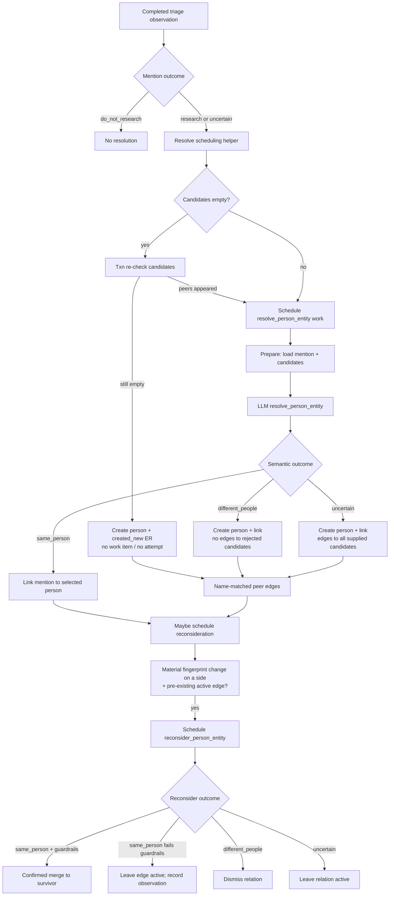

# Milestone 3b2: Durable Person Identity and Entity Resolution

| Field | Value |
| --- | --- |
| **Status** | Draft (revision 5 — human review C1/I1–I5) |
| **Date** | 2026-07-30 |
| **Author** | (design agent) |
| **Branch** | `feat/durable-person-identity` (proposed) |
| **Programme** | Notable Person Finder clean-slate rewrite |
| **Depends on** | Milestones 1–3b1 complete on `refactor/rearchitecture` |

## Overview

Milestone 3b1 leaves every research-worthy or uncertain person mention
**unresolved**: durable triage observations exist, exact source-written names
and identity facts are stored, but no `person` rows, identity links, or
relations are created. Milestone 3b2 turns those unresolved mentions into
durable application people through bounded, evidence-grounded entity
resolution.

This milestone owns durable people and sourced names; code-selected candidate
retrieval; the OpenRouter `resolve_person_entity` task; immutable
entity-resolution observations; deterministic new-person creation when no
plausible candidates exist (schedule-time, no work item, no attempt — same
pattern as 3b1 `insufficient_input`); `possible_same_person` relations;
material-fact reconsideration; confirmed merges with canonical work
reconciliation; and the operator-facing counts that make identity progress
inspectable. It reuses the 3b1 `LlmClient`, dual worker pools,
prepare/execute/settle handlers, dynamic budget reservation, and attempt
accounting without inventing a second gateway or a second retry coordinator.

## Background & Motivation

### Current state (end of 3b1)

- Untriaged source items receive `detect_people` work, **or** a schedule-time
  durable `insufficient_input` triage observation when both normalized title
  and summary are empty — **no work item, no attempt, no paid call**
  (`people/service.py` `_write_insufficient_input`). That schedule-time
  deterministic terminal is the **precedent** for 3b2 empty-candidate person
  creation.
- Completed triage writes immutable `triage_observation` rows plus
  `person_mention`, `mention_identity_fact`, and `mention_signal` children.
- Mentions preserve exact names and mononyms; neither exact nor normalized
  names are unique; **`person_mention` has no `person_id`**.
- The digest and `notable status` report triage and unresolved-mention
  counters only. No identity surface exists.
- Code lives under `src/notable_person_finder/people/`
  (`detection.py`, `models.py`, `repository.py`, `service.py`,
  `prompts/detect_people.md`) with migration `0004_people_detection.sql`.
- `TaskHandler` (`runs/engine.py`) carries fixed `provider` and `operation`
  used by every `start_attempt`; there is no per-attempt provider override.
- `ensure_model_inspection` today early-returns when no usable untriaged
  source item exists and hard-codes `config.tasks.detect_people.model`.
- Priorities: feed 10, inspect 20, detect 30.

### Pain points this milestone removes

- Mentions cannot accumulate evidence across runs: every discovery looks new.
- Namesakes cannot safely coexist under durable IDs (only under ordinals
  within one observation).
- Downstream Wikipedia matching, coverage research, and lead assessment have no
  person subject to attach to.
- Operators cannot see how many people exist, how many mentions remain
  unresolved, or how many possible-duplicate warnings are open.

### Authorities this design refines

This document refines, without replacing:

- `docs/superpowers/specs/2026-07-24-product-workflow-design.md` — mention
  lifecycle, candidate policy, uncertainty, merges.
- `docs/superpowers/specs/2026-07-24-domain-persistence-design.md` — people,
  sourced names, relations, entity-resolution observations, merge
  reconciliation.
- `docs/superpowers/specs/2026-07-24-llm-evaluation-design.md` — Task 2
  `resolve_person_entity` I/O contract.
- `docs/superpowers/specs/2026-07-29-model-gateway-and-detection-design.md` —
  explicit 3b2 ownership list and 3b1 patterns to match.
- `docs/architecture/at-least-once-execution.md` — crash windows for paid
  calls.

## Goals & Non-Goals

### Goals

Milestone 3b2 must:

1. Introduce durable `person` rows and `sourced_name` rows with deterministic
   display-name selection and **no** uniqueness constraint on exact or
   normalized names across people.
2. Link eligible mentions to people through immutable
   `entity_resolution_observation` rows and a mutable current pointer on the
   mention.
3. Retrieve a **bounded** set of existing-person candidates from
   source-grounded names and aliases; never treat name equality as identity.
4. Call `resolve_person_entity` exactly when candidates are non-empty; create a
   new person **without** a model call, work item, or attempt when the
   candidate set is empty at schedule time (mirrors 3b1 `insufficient_input`).
5. Persist `same_person`, `different_people`, and `uncertain` outcomes with
   domain validation of selected IDs and fact references.
6. Create `possible_same_person` relations on uncertainty (all code-supplied
   candidates) and on post-create name-matched peer scan; keep evidence
   separate; never combine or redirect on that relation.
7. Support one bounded **reconsideration** per material identity-fingerprint
   change against each active possible-same-person peer.
8. Support **confirmed merges**: directed survivor, no historical FK rewrite,
   no deletion, redirect flattening, active work supersession (person- and
   relation-scoped), survivor replacement scheduling, and a digest-queue
   reconciliation **hook** for milestone 6.
9. Backfill all already-triaged unresolved eligible mentions at run seed, and
   schedule or settle resolution idempotently when new detection observations
   complete.
10. Expose truthful identity progress on the digest and `notable status`.
11. Preserve every run-engine invariant: no transaction across network calls,
    workers never open SQLite, every **external** call maps to one attempt,
    only the central coordinator retries, secrets never enter durable product
    state. Deterministic terminals (empty-candidate create) use no attempt.

### Non-goals

- MediaWiki / Wikipedia identity matching (milestone 4).
- Brave coverage research, article fetch/extract (milestone 5).
- Lead assessment, ranking, digest shortlist synthesis, audit commands
  (milestone 6). 3b2 may leave merge/digest-queue hooks only.
- Promptfoo suites, full live verification, legacy comparison, cutover
  (milestone 7).
- Automated Wikipedia edits of any kind.
- Migrating legacy JSONL person state.
- Operator-driven manual merge/split UI or interactive review.
- Cross-person model batching, open-ended agent loops, or tool use.
- Changing detection semantics, feed ingestion, or the OpenRouter adapter
  surface beyond multi-model inspection readiness.
- Engine extensions for per-attempt provider/operation or prepare-settle hooks.

## Key Decisions

| # | Decision | Rationale |
| --- | --- | --- |
| K1 | **Extend `people/` rather than invent a new package.** Resolution, merges, and people SQL live beside detection under `people/`. | Domain ownership already assigns people and mentions to `people`; keeps one place for mention→person transitions. |
| K2 | **Two work-item kinds: `resolve_person_entity` (subject `person_mention`) and `reconsider_person_entity` (subject `person_relation`).** | First-pass resolution is mention-scoped; reconsideration is edge-scoped and must not re-fire for every mention. |
| K3 | **Empty candidates ⇒ schedule-time deterministic create: no work item, no attempt, ER `created_new` with `attempt_id IS NULL`.** Mirrors 3b1 `insufficient_input`. No `provider='local'` attempt and no engine extension. | Matches LLM-evaluation empty-candidate rule; matches real `TaskHandler` contract (fixed provider/operation); keeps attempt table billable-external-only. |
| K4 | **`uncertain` opens an active `possible_same_person` edge to every code-supplied candidate** (up to `max_candidates`). Schema has no per-candidate labels; Promptfoo may later add subsetting via schema_version bump. | Product high-recall rule; bound is the existing candidate cap. |
| K5 | **`same_person` requires a supplied candidate ID; code rejects unseen IDs before domain writes.** | Same validation pattern as detection passage IDs in 3b1. |
| K6 | **`different_people` creates a new person** even when candidates existed; no edges to those rejected candidates. | Model judged the mention is not any candidate; namesakes must coexist. |
| K7 | **Confirmed merge survivor = lower `person.id` among the two canonical ids** (after resolving any existing redirects). No “more evidence” heuristic in v1. | Deterministic, history-preserving. |
| K8 | **Mentions with outcome `do_not_research` never enter resolution.** | Product: do-not-research is mention-scoped and starts no person research path. |
| K9 | **Every `research` / `uncertain` mention with non-empty `exact_name` is resolution-eligible, including mononyms.** Product “inadequate stable identity” maps to **detection-time** paths already enforced (no eligible mention / insufficient_input), not a mononym filter. If `match_key(exact_name)` is empty after normalize (e.g. whitespace-only exact_name), write ER disposition **`skipped`** (no person, no attempt) — see truth table. | Aligns with product table; gives a CHECK-legal durable skip for the rare unusable-name edge. |
| K10 | **Candidate retrieval is name-gated only** (exact name or match_key hit). Scoring ranks within that set; no score floor that drops name hits; no fact-only candidates in v1. | Code owns bounds; model never searches. |
| K11 | **Reuse `LlmClient` and dual pools. Schedule `inspect_model` for model M only when this run has work that depends on M** (see Multi-model inspection). Parameterize readiness and permanent-preflight dependents by task→model map. | 3b1 hard-codes detect model + untriaged gate; post-triage resolve backlog must still get inspections. |
| K12 | **Merge does not rewrite historical FKs.** Operational projection uses `canonical_person_id` and **`mentions_for_canonical_person(P)`** (mentions whose stored `person_id` is P or any person with `merged_into_person_id` eventually P). Fingerprint, candidate facts, and counts use that projection. | Domain invariant; prevents post-merge fact loss. |
| K13 | **Digest-queue reconciliation is a named no-op hook until the queue table exists.** 3b2 merge reconciles only: relations, sourced names, identity fingerprints, display names, and active work items. No Wikipedia/coverage/lead pointers exist yet. | Milestone 6 owns the queue; merge must not pretend full programme reconciliation. |
| K14 | **One migration `0005_people_identity.sql` ships full identity DDL in PR1** (tables may exist unused until later PRs). Forward-only: no rewriting applied 0005. | Avoids partial-migration edit fights. |
| K15 | **Priority order: feed 10 → inspect 20 → detect 30 → resolve/reconsider 40.** | Required first-pass triage before identity so budget serves discovery before identity work on late items. |
| K16 | **First-pass material fingerprint excludes live candidate-set identity.** Fields listed under First-pass fingerprints. Recovery when later namesakes appear: post-create name-matched peer edges + reconsideration — not re-resolution of already-settled mentions. | Prevents permanent `created_new` from blocking all future identity work *and* prevents corpus churn from re-firing every mention on every new person. |
| K17 | **On deterministic empty-candidate create, re-query candidates inside the write transaction.** If any peer now exists, **do not create**; schedule model-path work instead. **Peer-edge scan** (after create, and when new non-name material attaches to a person): open active `possible_same_person` to name-matched canonical peers outside any just-rejected candidate set, **only if at least one of {creating/updated side, peer} already has ≥1 non-name identity fact** in its operational projection (or the creating mention supplies one). Bound by `max_candidates`. | Closes unlinked-duplicate races without piling permanent name-only↔name-only edges that K18 can never merge. |
| K18 | **Automatic merge only on reconsider `same_person` with guardrails:** single peer; both still canonical; validated non-empty `supporting_fact_ids`; each side’s operational projection has ≥1 non-name identity fact. Guardrail failure leaves the edge **active** (intentional warning, not a defect) and does not re-arm until the identity fingerprint changes again. | Reduces unsafe auto-merge; name-only pairs never auto-merge; long-lived edges from model `uncertain` are accepted operator-visible caution. |
| K19 | **`match_key(s)` is centralized next to `mechanical_search_name`** and used for sourced_name insert, retrieval, fingerprints, and peer scan. 3b1 `search_name` is honorific-strip only; `match_key` adds casefold + whitespace collapse on top. | Prevents drift. |
| K20 | **Uncertain → all code-supplied candidates (K4). Survivor = lower id (K7). Empty-create accounting (K3). Mononyms eligible (K9).** These are design locks, not plan-time open questions. | Review closed product/architecture ambiguity before implementation. |
| K21 | **Reconsideration only when identity material changes *after* the edge exists.** Edges opened in the same settlement as a material attach (first-pass `uncertain`, peer-scan on create) do **not** schedule `reconsider_person_entity`. | Avoids paying up to `max_candidates` model calls that re-ask the pairwise question on identical evidence. |
| K22 | **ER `completed` CHECKs branch on subject kind.** Mention-scoped first-pass rows require `created_person_id` for `different_people` / `uncertain` / `created_new`. Relation-scoped reconsider rows **never** set `created_person_id` (they only dismiss, leave active, or merge). | Reconsider never creates people; a single first-pass-only truth table makes every reconsider insert illegal. |
| K23 | **Permanent-preflight dependents settle out-of-band, like 3b1.** A generalized task→model-map settler (not engine `_settle`) writes failed domain rows using the **inspection** `attempt_id` when the domain CHECK requires a non-null attempt, and settles dependent work items directly. | Matches `settle_active_detect_people_after_permanent_preflight`; dependent handlers' `persist_failure` never runs on this path. |
| K24 | **Shared predicate `is_resolution_eligible_mention`:** outcome ∈ `{research, uncertain}`, non-empty `match_key(exact_name)`, and **no** ER row at the mention's current-material `task_fingerprint` (any disposition). Used identically by seed, `models_needed_for_run`, digest, and status. | Prevents skipped / permanently-failed / completed mentions from forcing perpetual resolve-model inspection. |

## Proposed Design

### Component ownership

```text
src/notable_person_finder/people/
  detection.py          # unchanged contract (3b1)
  resolution.py         # NEW: input/output build, schema, validate, prompt hash
  candidates.py         # NEW: retrieval, scoring, bounds, peer scan
  identity.py           # NEW: person create, sourced names, display name,
                        #       canonical id, operational projection, match_key
  merge.py              # NEW: confirmed merge transaction + work reconciliation
  models.py             # extend with resolution DTOs
  repository.py         # extend with people / ER / relation SQL;
                        #       keep mechanical_search_name; add match_key here
                        #       or re-export from identity.py (single owner)
  service.py            # schedule, handlers, seed/backfill, multi-model inspect
  prompts/
    detect_people.md    # unchanged
    resolve_person_entity.md  # NEW
```

| Component | Owns | Must not own |
| --- | --- | --- |
| `people/` | schemas, prompt, candidate retrieval, validation, people SQL, merge, handlers | OpenRouter SDK, HTTPX, engine claim loop |
| `providers/openrouter.py` | `inspect_model`, `generate_structured` only | task semantics, candidate sets |
| `runs/` | work items, attempts, budget, retry, dual pools | person domain rules |
| `config/` | `tasks.resolve_person_entity` bounds and model | retrieval SQL |
| `reporting/` | identity section rendering | inventing counts from logs |
| `cli/` | handler registration, seed composition | domain decisions |

### End-to-end data flow



### Name helpers (`match_key`)

Centralize in `people/repository.py` (alongside existing
`mechanical_search_name`) or `people/identity.py` with a single import path:

```python
def mechanical_search_name(exact_name: str) -> str:
    """3b1: strip at most one leading honorific; no casefold/collapse."""
    ...

def collapse_whitespace(value: str) -> str:
    return " ".join(value.split())

def match_key(value: str) -> str:
    """Retrieval key: honorific-strip → collapse whitespace → casefold."""
    return collapse_whitespace(mechanical_search_name(value)).casefold()
```

3b1 stores `person_mention.search_name = mechanical_search_name(exact_name)`
only (honorific strip). `sourced_name.match_key` and all retrieval/fingerprint
comparisons use `match_key(...)`. When comparing mention names to sourced
names, always compute `match_key(mention.exact_name)` /
`match_key(mention.search_name)` rather than treating `search_name` as already
casefolded.

### Operational person projection (post-merge safe)

Historical FKs are never rewritten. All **operational** reads use:

```python
def canonical_person_id(connection, person_id: int) -> int:
    """One hop after flatten: follow merged_into_person_id if set."""
    ...

def person_id_closure_for_canonical(connection, canonical_id: int) -> tuple[int, ...]:
    """canonical_id plus every person with merged_into_person_id = canonical_id
    (after flatten, the full merged-away set that redirects to canonical_id)."""
    ...

def mentions_for_canonical_person(connection, canonical_id: int) -> ...:
    """person_mention rows where person_id IN person_id_closure_for_canonical(...)."""
    ...
```

**Required users of this projection:**

| Consumer | Rule |
| --- | --- |
| `identity_fingerprint(P)` | Aggregate names + facts from `mentions_for_canonical_person(P)` and `sourced_name` rows for P and its merged-away set (names already upserted to survivor; still include loser mention facts). |
| Candidate fact aggregation | Facts from `mentions_for_canonical_person(candidate)`. |
| Fact-overlap scoring | Same. |
| Corpus people counts | Count rows with `merged_into_person_id IS NULL` only. |
| Reconsideration trigger | Fingerprint of canonical P after material attach. |

Merge tests **must** prove: (1) mention FKs stay on loser; (2) survivor
fingerprint includes loser-linked mention facts; (3) later candidate retrieval
scores survivor using those facts; (4) status counts de-dupe via canonical id.

### Scheduling relative to detection

#### Exact seed composition (CLI)

`cli/main.py` `_compose_seed` becomes, in order, inside the engine's seed
callback (application thread, brief transactions as each helper requires):

```text
1. seed_feeds(...)                         # existing ingestion
2. seed_untriaged(...)                     # existing detection backfill
   # schedule_source_items may call ensure for detect model when usable items exist
3. seed_unresolved_mentions(...)           # NEW: for each eligible unresolved mention,
   #   either schedule-time created_new OR schedule resolve work (see below)
4. ensure_model_inspections_for_run(...)   # NEW: inspect every model that has
   #   dependent work this run (detect backlog and/or resolve/reconsider backlog)
```

Order rationale: domain work is visible before inspections are ensured, so
inspect scheduling predicates see pending resolve work. Inspections remain
higher priority (20) than detect (30) and resolve (40), so they claim first.

`ensure_model_inspections_for_run` **must not** early-return solely on
“no untriaged source items.”

#### Per-mention resolution scheduling helper

```python
def ensure_resolution_for_mention(
    connection,
    *,
    person_mention_id: int,
    run_id: int,
    config: MainConfig,
    profile: DomainProfileConfig,
    now: str,
) -> str:  # "created_new" | "scheduled" | "reused" | "skipped" | "ineligible"
    """Caller must hold an open transaction when invoked from detection persist.
    Seed may open its own brief BEGIN IMMEDIATE per mention or batch.

    Return value ``skipped`` means a durable ER row with disposition
    ``skipped`` was written (or reused). Return ``ineligible`` means no ER
    row was written (outcome / empty name filters).
    """
```

Algorithm (**hashes and fingerprint before any ER insert**):

1. **Load mention; eligibility without a row.** If outcome ∉
   `{research, uncertain}`, or `exact_name` is empty after strip → return
   **`ineligible`** (no ER insert, no work item). Distinct from disposition
   `skipped`.
2. **Compute material identity first** (required for every durable ER path):
   - Resolve prompt content hash, schema hash, and
     `RESOLUTION_SCHEMA_VERSION` (same helpers as the model path).
   - Build the first-pass material snapshot and
     `task_fingerprint` (see First-pass material fingerprints). Whitespace-only
     / empty-`match_key` names still produce a well-defined fingerprint from
     the stored exact_name, search_name, facts, signals, and config fields.
3. **Reuse.** If an ER observation already exists for
   `(person_mention_id, task_fingerprint)` → point
   `current_entity_resolution_observation_id` (and `person_id` if the prior
   row linked one) → return **`reused`**. **Any** existing row for the
   fingerprint counts as reuse, whatever its disposition: a prior
   disposition-`skipped` row, a `completed` row, **or a `failed` row**. A
   permanent failure is terminal for that material — it is never silently
   re-resolved while the fingerprint is unchanged (the unique index on
   `(person_mention_id, task_fingerprint)` makes a second row impossible
   anyway).
4. **Empty match_key → disposition `skipped`.** If
   `match_key(exact_name)` is empty (normalize left nothing usable — e.g.
   whitespace-only exact_name that still passed length CHECK) → insert ER with
   the **already-computed** `task_fingerprint`, `prompt_hash`, `schema_hash`,
   `schema_version`, and `canonical_supplied_input_json` = material snapshot;
   `disposition='skipped'`; rationale `insufficient_identity_match_key`;
   `validated_output_json` NULL; no person; point current ER pointer; leave
   `person_id NULL` → return **`skipped`**. This is the only resolution-time
   “inadequate identity” path that writes a row.
5. **Candidate retrieval.**
6. **If candidates empty:**
   - Re-query candidates (same txn) — defensive.
   - If still empty: create person, sourced names, link mention, ER
     `completed`/`created_new` using the same precomputed fingerprint and
     hashes, `attempt_id IS NULL`, peer-edge scan (K17) → return
     **`created_new`**.
   - If peers now exist: fall through to step 7.
7. **If candidates non-empty:** supersede stale active resolve work for this
   mention; `schedule_work(task_type=resolve_person_entity,
   subject_kind=person_mention, subject_id=mention_id,
   fingerprint=<precomputed task_fingerprint>, required=True, priority=40)` →
   return **`scheduled`**.

#### Detection persist hook (atomic)

`insert_completed_observation` remains transaction-neutral (3b1). The
detection handler's `persist` **already runs inside** `complete_work`'s open
transaction (`runs/engine.py` `_settle` → `domain_writes`). 3b2 changes
`_persist_detection_for` to:

```text
insert_completed_observation(...)
schedule_resolution_for_observation(...)  # calls ensure_resolution_for_mention
                                           # for each eligible child mention
```

If `schedule_resolution_for_observation` raises, the **entire** settlement
transaction rolls back — including the triage observation. There is no nested
commit and no best-effort partial success. Tests must prove: a forced failure
in the resolution schedule path leaves no triage observation and no resolve
work for that item.

`schedule_resolution_for_observation` must not call `BEGIN`/`COMMIT`; it joins
the caller's transaction (same contract as other repository writers).

#### Readiness and priority

- `resolve_person_entity` / `reconsider_person_entity`
  `ready=lambda run_id: inspection_ready(connection, run_id, resolve_model, config)`.
- Priority 40; older `id` wins within priority.
- No global barrier across people or source items.

### First-pass material fingerprints

#### Work-item / ER `task_fingerprint` for `resolve_person_entity`

```text
sha256(canonical_json({
  "task": "resolve_person_entity",
  "adapter_version": RESOLUTION_ADAPTER_VERSION,
  "person_mention_id": <int>,
  "mention_outcome": "research" | "uncertain",
  "exact_name": <str>,
  "search_name": <str>,
  "identity_facts": sorted list of {local_id, kind, value, supporting_passage_ids},
  "signals": sorted list of {kind, category, claim, grounding, supporting_passage_ids},
  "model": <configured model slug>,
  "parameters": {temperature, top_p, reasoning_effort},
  "max_input_tokens": ...,
  "max_completion_tokens": ...,
  "max_candidates": ...,
  "max_facts_per_candidate": ...,
  "max_names_per_candidate": ...,
  "max_title_characters": ...,
  "max_summary_characters": ...,
  "prompt_hash": <64 hex>,
  "schema_hash": <64 hex>,
  "schema_version": RESOLUTION_SCHEMA_VERSION,
}))
```

**Deliberately excluded:** live candidate person ids, candidate identity
fingerprints, and corpus size. Rationale (K16): a mention resolves once for a
given mention material + model/prompt/schema. Re-resolution is not triggered
when new people appear.

**Recovery when later namesakes appear:**

1. New mentions still retrieve existing people as candidates (including those
   created via `created_new`).
2. On every person create, name-matched peer scan opens `possible_same_person`
   (K17).
3. Material fingerprint changes on either side schedule reconsideration, which
   may merge under guardrails (K18).

**If fingerprint included candidates:** every new corpus person would supersede
and re-run resolution for all open mentions with name overlap — high cost and
unstable history. Rejected (see Alternatives).

#### Reconsideration fingerprint

Unchanged structure; still includes both sides' identity fingerprints and
`relation_id` so a material change re-arms work.

### Candidate retrieval algorithm

Owned by `people/candidates.py`. Application-thread reads only.

#### Query name set

```text
names = { M.exact_name, M.search_name }
∪ { fact.value for fact in M.identity_facts if fact.kind == 'name' }
keys = { match_key(n) for n in names if match_key(n) }
```

#### SQL retrieval (name-gated only)

```sql
SELECT DISTINCT p.id AS person_id
  FROM person AS p
  JOIN sourced_name AS sn ON sn.person_id = p.id
 WHERE p.merged_into_person_id IS NULL
   AND (
        sn.match_key IN (:keys)
     OR sn.exact_name IN (:exact_names)
   );
```

v1 **never** admits fact-only candidates. Merged-away people are excluded;
callers always work with canonical survivors. Sourced names on the loser still
exist under `person_id=loser`; merge **upserts** those names onto the survivor
so name retrieval continues to find the survivor after merge. (Loser rows may
remain as historical name provenance; retrieval joins only canonical `p`.)

#### Scoring (rank only; no drop floor)

| Signal | Points |
| --- | --- |
| Exact `exact_name` equality with mention `exact_name` | +100 |
| match_key equality with mention primary search match_key | +80 |
| Any other query name match_key hit | +60 |
| Per distinct overlapping non-name identity-fact value against operational projection facts | +10 each, cap +40 |
| Person has any prior `research` mention in operational projection | +5 |

Stable tie-break: `person_id ASC`. Keep top `max_candidates`. **No score ≥ 60
filter** — every name-gated hit is eligible; scoring only orders the set.

#### Config bounds

| Field | Default | Bound |
| --- | --- | --- |
| `max_candidates` | 8 | 1–16 |
| `max_facts_per_candidate` | 12 | 1–32 |
| `max_names_per_candidate` | 8 | 1–32 |

#### Candidate payload

For each retained person: id, display_name, up to N sourced names, up to M
identity facts from **operational projection**, candidate-local fact ids
`c{person_id}-f{n}`. No Wikipedia, no articles, no other persons' evidence.

### Empty-candidate path (locked — K3)

| Property | Value |
| --- | --- |
| When | Candidate list empty at `ensure_resolution_for_mention` after txn re-check |
| Work item | **None** |
| Attempt | **None** |
| ER disposition | `completed` |
| ER semantic_outcome | `created_new` |
| attempt_id | `NULL` |
| model_inspection_id | `NULL` |
| `validated_output_json` | Fixed canonical `{"outcome":"created_new"}` (no model output) |
| `canonical_supplied_input_json` | Canonical JSON snapshot of the **same material fields** that enter the first-pass fingerprint (mention ids, names, facts, signals, model/config bounds — not live candidates) |
| prompt_hash / schema_hash / schema_version | From the resolve prompt file + schema (same as model path) so material identity stays coherent |
| Engine changes | **None** |
| Precedent | 3b1 `insufficient_input` via `_write_insufficient_input` |

**Not adopted:** `provider='local'` attempts, OpenRouter-labelled no-op
attempts, prepare-settle engine hooks, or `persist_failure` recovery after a
raising prepare (the engine does not pass a failure into prepare-raise
settlements — see Handler phases).

If candidates are non-empty, a normal `resolve_person_entity` work item is
scheduled and always performs a real OpenRouter generation (handler
`provider=openrouter`, `operation=generate_structured`).

### `resolve_person_entity` contract

#### Input / output (strict Pydantic, `extra=forbid`)

```python
class ResolvePersonEntityInput(_StrictBoundaryModel):
    task: Literal["resolve_person_entity"]
    person_mention_id: int
    source_item_id: int
    exact_name: str
    search_name: str
    mention_outcome: Literal["research", "uncertain"]
    passages: tuple[DetectionPassage, ...]
    identity_facts: tuple[IdentityFact, ...]
    signals: tuple[GroundedSignal, ...]
    candidates: tuple[ResolveCandidate, ...]  # length 1..max_candidates
    max_candidates: int
    view: ResolveView

class ResolvePersonEntityOutput(_StrictBoundaryModel):
    outcome: Literal["same_person", "different_people", "uncertain"]
    selected_person_id: int | None  # required iff same_person
    supporting_fact_ids: tuple[str, ...]
    conflicting_fact_ids: tuple[str, ...]
    rationale: str
```

Validation in **execute** (before any domain write):

- `same_person` ⇒ `selected_person_id` non-null and ∈ supplied candidate ids.
- `different_people` / `uncertain` ⇒ `selected_person_id` is null.
- Supporting/conflicting fact ids ⊆ mention local ids ∪ candidate fact ids.
- Rationale non-empty, length-bounded.
- No unknown fields; no JSON repair; no second model.

`RESOLUTION_SCHEMA_VERSION = 1`. Prompt:
`people/prompts/resolve_person_entity.md`.

#### Settlement outcomes (first-pass)

| Path | Domain effect |
| --- | --- |
| **`created_new`** (schedule-time, no attempt) | Create person; sourced names; link mention; ER completed/`created_new` with fixed `validated_output_json` and fingerprint material as `canonical_supplied_input_json`; peer-edge scan (K17). |
| **`skipped`** (empty match_key) | ER `disposition='skipped'`; no person; `person_id` remains NULL; current ER pointer set. |
| **`same_person`** | Link mention to selected (must be canonical or resolve to canonical — if selected is merged-away, link to canonical and treat as selected); upsert sourced names; ER with attempt + inspection; no new person; `created_person_id IS NULL`. |
| **`different_people`** | Create person; link; sourced names; ER; **no** edges to the rejected candidate set; peer-edge scan only to eligible peers **outside** that set (K17). |
| **`uncertain`** | Create person; link; edges to **all** supplied candidates (K4); peer-edge scan may add other **eligible** name-matched peers; ER. |
| **Permanent failure** | ER `failed` + category; mention stays `person_id NULL`. |
| **Transient / defer** | No ER row. |
| **Fingerprint reuse** | Point current ER + person_id; no call. |

Symmetric `possible_same_person`: store `person_id_a < person_id_b`. Unique
active edge per unordered pair.

### Reconsideration

#### Trigger (K21)

After settlement attaches new identity material to canonical person `P`
(recompute fingerprint via operational projection), for each active
`possible_same_person` edge involving `P` **that existed before this
settlement**, schedule `reconsider_person_entity` with subject_kind
`person_relation` and fingerprint including both identity fingerprints +
relation id + model/prompt/schema.

**Edges created in the same settlement as the material attach do not
trigger reconsideration.** This is a deliberate cost lock, not an emergent
side-effect: a first-pass `uncertain` or peer-scan settlement creates the
person, attaches its first material, and opens its edges in one transaction;
paying an immediate reconsider call per edge (up to `max_candidates` paid
calls) would re-ask the pairwise question on the identical evidence the
model just declined to decide. The edge's baseline is each side's identity
fingerprint at edge-creation time; only a *later* material change on either
side arms reconsideration. That is what Goal 7 ("one bounded
reconsideration per material identity-fingerprint change") means: the
change must postdate the edge. Tests must prove: first-pass `uncertain`
with N candidates creates N edges and **zero** reconsider work items in
that settlement.

#### Subject construction (K17 / Issue 17)

- **Subject side (mention input):** the person whose `identity_fingerprint`
  just changed (the trigger side). Use that person's latest linked mention in
  operational projection (max `person_mention.id`).
- **Sole candidate:** the peer person.
- If both sides' fingerprints changed in one transaction (e.g. merge side
  effects): use lower person id as subject side for determinism.
- Fallback if trigger side has no linked mention: lower-id side (should not
  happen in 3b2).

#### Outcomes and merge guardrails (K18)

| Outcome | Effect |
| --- | --- |
| `same_person` **and** guardrails pass | Confirmed merge to survivor (K7). Close edge as `superseded_by_merge`. |
| `same_person` **but** guardrails fail | Leave edge `active`; write ER observation with rationale noting guardrail; do **not** merge. Do not reschedule until fingerprint changes again. |
| `different_people` | `status='dismissed'`; no merge. |
| `uncertain` | Leave `active`; no reschedule until fingerprint change. |

**Guardrails before merge (all required):**

1. Relation still `active` and kind `possible_same_person`.
2. Both endpoints still canonical (`merged_into_person_id IS NULL`).
3. `selected_person_id` (if present) is the peer or its canonical form.
4. `supporting_fact_ids` non-empty and all validate against the supplied
   reconsider input. The valid id namespace for a reconsider row is the
   subject-side mention's local fact ids (the latest linked mention used to
   build the input) plus the peer candidate's `c{person_id}-f{n}` ids —
   not ids from whichever mention originally opened the edge.
5. Each side's operational projection has **≥1 non-name** identity fact
   (kind ≠ `name`). Name-only pairs never auto-merge in v1.

### Confirmed merges and canonical work reconciliation

Owned by `people/merge.py`. Single application-thread transaction; no network.

#### Invariants

- Do **not** delete the loser; do **not** rewrite historical FKs on mentions or
  ER rows.
- Insert `person_relation(kind='merge', person_id_a=loser, person_id_b=survivor,
  status='active')`.
- Set `loser.merged_into_person_id = survivor`; flatten anyone pointing at loser
  to survivor; reject self-links and cycles.
- Upsert survivor sourced names from loser; recompute survivor display name and
  **identity_fingerprint via operational projection** (includes loser mention
  facts without moving mention FKs).
- Supersede active `possible_same_person` edges involving loser; re-link peers
  to survivor when peer ≠ survivor.

#### Work reconciliation (required in 3b2)

```text
1. Supersede every active work_item where
     subject_kind = 'person' AND subject_id = loser
   reason = 'merged_away'.
   If replacement work is required for survivor under a new fingerprint,
   schedule it against subject_id = survivor.

2. Supersede every active work_item where
     task_type = 'reconsider_person_entity'
     AND subject_kind = 'person_relation'
     AND subject_id IN (relation ids that involve loser as either endpoint)
   reason = 'merged_away'.

3. Supersede every active work_item where
     task_type = 'resolve_person_entity'
     AND subject_kind = 'person_mention'
     AND subject_id references a mention already linked to loser
   only if that work is still pending (normally already succeeded); belt-and-braces.

4. Leave historical succeeded work rows untouched.
```

Idempotent: a second merge attempt where loser is already merged-away is a
no-op that returns the current canonical survivor.

#### What 3b2 merge reconciles vs leaves for later

| Present in 3b2 | Absent (no-op / N/A) |
| --- | --- |
| person redirects + flatten | Wikipedia identity current pointers |
| sourced names + display name | coverage plans / assessments |
| identity_fingerprint | lead assessments |
| possible_same_person / merge relations | digest_queue (hook only) |
| active work items (person + person_relation subjects) | |

#### Digest-queue hook

```python
def reconcile_digest_queue_on_merge(
    connection, *, survivor_id: int, loser_id: int, now: str
) -> None:
    """No-op until milestone 6 creates digest_queue."""
    ...
```

### Interaction with detection (concrete)

| Event | 3b1 today | 3b2 addition |
| --- | --- | --- |
| Detection `persist` after `insert_completed_observation` | end | `schedule_resolution_for_observation` same txn; failure rolls back triage |
| `insert_failed_observation` / insufficient_input | no eligible mentions | no resolution |
| `seed_untriaged` | detection backlog | then `seed_unresolved_mentions` then multi-model ensure |
| Permanent detect-model preflight | fails detect work | resolve model inspect independent |
| Re-triage new fingerprint | new mentions | new mentions get ensure_resolution; historical links retained |

### Handler phases

#### `resolve_person_entity` (model path only)

Work items exist **only** when schedule-time candidate retrieval was non-empty
(K3). The handler never invents a local/OpenRouter no-op create path.

**Engine facts (verified `runs/engine.py` `_prepare`):**

- `ProviderFailure` raised from `prepare` is **re-raised** out of the claim
  loop — it does **not** settle the item.
- Any other exception from `prepare` is caught and settled
  `failed_permanent` with reason `prepare raised {TypeName}` (type name only;
  the exception message is **not** persisted — log-only detail such as a
  `resolve_prepare_refused:` prefix must not be treated as durable state).
- Settlement passes `failure=last_failure` into `_settle` (`engine.py`). For a
  **first-attempt** item that never called the provider, `last_failure` is
  `None`, so **`persist_failure` does not run**. For a **re-armed** item
  (deferred after an earlier real call), `last_failure` is the carried-forward
  failure, so **`persist_failure` does run** even though this prepare made no
  new call.
- No attempt row is written for a raising prepare (correct: no external call).

Therefore empty-at-prepare recovery **must not** raise `ProviderFailure` and
**must not** assume `persist_failure` is skipped — it is skipped only when
`last_failure is None`.

| Phase | Thread | Behavior |
| --- | --- | --- |
| `ready` | app | `inspection_ready(..., resolve_model)` |
| `prepare` | app | Load mention + passages + facts; re-run candidate retrieval. **If candidates ≥ 1 and mention still unresolved:** build input, render prompt, prepare-returned reservation. **If candidates empty, or mention already linked / already has a reusable ER for this fingerprint (rare race):** (1) call `ensure_resolution_for_mention` on the application thread **before** refusing the work item — it opens its own brief `BEGIN IMMEDIATE` when no transaction is open (same as seed helpers), performs `created_new`, schedules model work if peers appeared, reuses, or skips; (2) then raise a plain **`ValueError`** (optional log-only prefix `resolve_prepare_refused:`) so the engine settles this **claimed** work item `failed_permanent` with no new attempt. That permanent state is **accounting noise**, not a domain failure: the mention’s durable state was already fixed in step (1). Never raise `ProviderFailure` from prepare for this path. |
| `execute` | LLM worker | Exactly one `generate_structured`; validate output; malformed ⇒ `ProviderFailure(MALFORMED_RESPONSE, retryable=True)`. Never creates people itself. |
| `persist` | app (settlement txn) | Apply same_person / different_people / uncertain; peer-edge scan (K17); maybe schedule reconsideration (**K21**: only for edges that pre-existed this settlement). |
| `persist_failure` | app | **Idempotent failed-ER write with fingerprint guard.** Whenever the engine invokes this phase (`failure is not None`): (1) load any existing ER at `(person_mention_id, task_fingerprint)` (or relation-scoped equivalent); if one already exists — including a `completed`/`created_new` row written by prepare-time `ensure_resolution_for_mention` — **no-op** (do not insert a second row; do not overwrite disposition); (2) else insert `disposition='failed'` with the attempt that drove the `ProviderFailure` (generation permanent fail, etc.). This covers re-armed prepare-raise after an earlier real call (ensure may have just written `created_new`; a naive failed insert would unique-index-conflict or create a contradictory failed-after-completed pair). Preflight out-of-band settlement never reaches this phase (K23). |

If step (1) scheduled **new** resolve work because peers appeared, that new
work item is independent of the claimed item that fails permanent; it becomes
claimable later in the same run (or the next). If step (1) created/linked the
person, no further resolve work is needed for that mention material.

Handler fields (fixed on `TaskHandler`, no per-attempt override):
`provider=openrouter`, `operation=generate_structured`, `pool=LLM`,
`reserved_nano_usd` default 0 overridden by prepare-returned amount.

#### `reconsider_person_entity`

Same pool and validation; subject is the relation; candidate set is always the
single peer. If the peer is missing or already merged mid-flight: same
prepare pattern — repair domain via repository helpers if needed, then raise
plain `ValueError("resolve_prepare_refused:…")` (never `ProviderFailure` from
prepare). Merge inside `persist` when outcome is `same_person` and guardrails
pass.

### Multi-model inspection (locked)

#### Shared eligibility predicate (K24)

```python
def is_resolution_eligible_mention(
    connection, *, person_mention_id: int, config: MainConfig, profile: DomainProfileConfig
) -> bool:
    """True iff ensure_resolution_for_mention would schedule work or create.

    Normative definition used by seed_unresolved_mentions, models_needed_for_run,
    the digest "Unresolved eligible mentions remaining" line, and notable status.
    Implementations must share one helper — not re-derive the predicate.
    """
    # 1. outcome ∈ {research, uncertain}
    # 2. exact_name non-empty after strip (ineligible otherwise)
    # 3. match_key(exact_name) non-empty (else ensure writes skipped — terminal)
    # 4. no ER row at (person_mention_id, current_material_task_fingerprint)
    #    — any disposition (completed / skipped / failed) closes eligibility
```

Mentions that are only "person_id IS NULL" are **not** sufficient. Skipped and
permanently-failed mentions keep `person_id NULL` forever; counting those would
inspect the resolve model on every run with nothing schedulable. Preflight-
settled mentions **do** receive a failed ER (below), so they also close the
predicate for that fingerprint until config/material fingerprint changes.

#### Models needed

```python
def models_needed_for_run(connection, run_id: int, config: MainConfig) -> tuple[str, ...]:
    needed: list[str] = []
    detect_model = config.tasks.detect_people.model
    resolve_model = config.tasks.resolve_person_entity.model
    if _has_usable_untriaged_source_item(connection) or _has_active_detect_work(connection):
        needed.append(detect_model)
    if _has_resolution_eligible_mentions(connection, config) or _has_active_resolve_or_reconsider_work(connection):
        needed.append(resolve_model)
    # unique, stable order
    return tuple(dict.fromkeys(needed))
```

- One inspect work item per `(run_id, model_id, routing_fingerprint)`.
- `inspection_ready(connection, run_id, model_id, config)` parameterized.
- Detection `ready` → detect model; resolve/reconsider `ready` → resolve model.

#### Permanent-preflight dependent settlement (K23)

This is **not** an engine `_settle` path. 3b1's
`settle_active_detect_people_after_permanent_preflight`
(`people/repository.py`) directly UPDATEs dependent work items and writes
failed domain rows **inside the inspection item's settlement**; dependent
handlers' `persist_failure` never runs. 3b2 generalizes that pattern:

```python
def settle_active_tasks_after_permanent_preflight(
    connection,
    *,
    run_id: int,
    attempt_id: int,          # the inspection attempt that permanently failed
    model_inspection_id: int | None,
    model_id: str,
    failure_category: str,
    rationale: str,
    task_types: tuple[str, ...],  # task→model map: tasks that use model_id
    # plus prompt/schema hashes per task type as needed
    now: str,
) -> int:
    """Fail pending/deferred work for task_types mapped to the lost model.

    Joins the caller's open transaction when present (inspection persist /
    persist_failure). For each active work item:
      - resolve_person_entity (subject person_mention): ensure a failed ER
        exists for that material fingerprint, reusing any existing row so a
        unique-key collision cannot abort the batch; point the mention's
        current ER when needed; settle work failed_permanent.
      - reconsider_person_entity (subject person_relation): ensure a failed
        relation-scoped ER for that fingerprint (reuse on conflict); settle
        work failed_permanent; do not change edge status.
    Does not insert generate_structured attempts.
    """
```

**Failed ER attempt accounting (align with 3b1 triage):** the out-of-band
settler writes `disposition='failed'` with **`attempt_id` = the permanent
inspection attempt** (and `model_inspection_id` when known). That satisfies
the failed CHECK (`attempt_id IS NOT NULL`) without inventing a generation
attempt. The mention keeps `person_id NULL` and has a failed ER for the
current fingerprint, so `is_resolution_eligible_mention` is **false** until
the material fingerprint changes (config/prompt/schema bump). A later run
does **not** re-open perpetual inspect solely because of preflight-failed
mentions.

- **Test:** all source items triaged, resolution-eligible mentions remain,
  resolve model ≠ detect model ⇒ inspect for resolve model runs and resolve
  work becomes ready.
- **Test:** corpus contains only `skipped` and `failed` ER mentions ⇒ no
  resolve-model inspection is scheduled.
- **Test:** permanent inspect failure for resolve model settles active
  resolve/reconsider work, writes failed ER with the inspection attempt_id,
  and does not leave eligible-mention counters open for that fingerprint.

### Name-matched peer edges (K17 detail)

**When to run the scan**

1. After creating person `P` (`created_new`, `different_people`, `uncertain`).
2. After attaching **new non-name** identity material to canonical person `P`
   (same moment reconsideration may be scheduled). This opens edges that a
   pure name-only create correctly skipped.

**Eligibility filter (prevents permanent name-only pile-up under K18)**

Open an edge to peer `Q` only if **at least one** of:

- the creating mention (or newly attached material) includes ≥1 identity fact
  with `kind != 'name'`, or
- `P`’s operational projection already has ≥1 non-name fact, or
- `Q`’s operational projection already has ≥1 non-name fact.

Pure name-only ↔ name-only pairs **do not** get peer-scan edges. They may
still receive edges from model **`uncertain`** (K4 — all supplied candidates);
those edges are accepted long-lived operator warnings until non-name facts
appear on both sides and a later reconsider can merge under K18.

```text
peers = name-gated retrieval using P's names/match_keys
        excluding P
        excluding reject_set
for peer in peers[:max_candidates]:
    if not edge_eligibility(P, peer, creating_mention_or_update):
        continue
    upsert active possible_same_person(P, peer)
```

For `created_new`, `reject_set` is empty. For `uncertain`, `reject_set` is
empty for the peer scan (K4 already edged supplied candidates; scan may add
other eligible name-matched people). For `different_people`, `reject_set` is
the just-evaluated candidate ids so the model’s negative is respected.

## API / Interface Changes

### Configuration

```toml
[tasks.resolve_person_entity]
model = "openai/gpt-5.4-mini"
max_input_tokens = 4096
max_completion_tokens = 1024
max_candidates = 8
max_facts_per_candidate = 12
max_names_per_candidate = 8
max_title_characters = 500
max_summary_characters = 4000

[tasks.resolve_person_entity.parameters]
temperature = 0.0
top_p = 1.0
reasoning_effort = "low"
```

`ResolvePersonEntityConfig` mirrors `DetectPeopleConfig` plus candidate bounds.
`TasksConfig.resolve_person_entity`. Example TOML updated. Secrets unchanged.

### Work-item constants

```python
RESOLVE_PERSON_ENTITY_TASK_TYPE = "resolve_person_entity"
RECONSIDER_PERSON_ENTITY_TASK_TYPE = "reconsider_person_entity"
SUBJECT_KIND_PERSON_MENTION = "person_mention"
SUBJECT_KIND_PERSON_RELATION = "person_relation"
SUBJECT_KIND_PERSON = "person"  # future person-level work + merge supersession
RESOLVE_PERSON_PRIORITY = 40
RESOLUTION_ADAPTER_VERSION = 1
RECONSIDER_ADAPTER_VERSION = 1
```

### Public builders

```python
def build_resolution_handler(...) -> TaskHandler: ...
def build_reconsideration_handler(...) -> TaskHandler: ...
def seed_unresolved_mentions(...) -> int: ...  # uses is_resolution_eligible_mention (K24)
def schedule_resolution_for_observation(...) -> int: ...  # txn-neutral
def ensure_resolution_for_mention(...) -> str: ...
def is_resolution_eligible_mention(...) -> bool: ...  # K24 shared predicate
def ensure_model_inspections_for_run(...) -> int: ...
def models_needed_for_run(...) -> tuple[str, ...]: ...
def inspection_ready(connection, *, run_id, model_id, config) -> bool: ...
def settle_active_tasks_after_permanent_preflight(...) -> int: ...  # K23
def canonical_person_id(...) -> int: ...
def mentions_for_canonical_person(...) -> ...: ...
def confirm_person_merge(...) -> int: ...  # returns survivor id; open txn required
def match_key(value: str) -> str: ...
```

### CLI wiring

Handlers registered on `notable run`:

- `inspect_model` (multi-model seed)
- `detect_people`
- `resolve_person_entity`
- `reconsider_person_entity`

No new top-level commands. `notable audit person` remains milestone 6.

## Data Model Changes

### Migration strategy (locked — K14)

**Single** forward migration `0005_people_identity.sql` with the full identity
DDL, shipped in PR1. Later PRs use the tables; they do **not** edit 0005 after
it has been applied on any database. If a later PR discovers a missing column,
it adds `0006_...sql` — never rewrites 0005.

### Table creation order (circular FK — SQLite-legal)

SQLite **cannot** `ALTER TABLE … ADD FOREIGN KEY`. Migration 0005 must not
use that pattern. Locked approach — **plain `CREATE TABLE` statements, no
PRAGMA statements**:

`PRAGMA foreign_keys` must not appear in 0005, for two reasons. First, it
cannot work: the migration runner wraps each migration in `BEGIN … COMMIT`
(`db/migrate.py`), and SQLite treats `PRAGMA foreign_keys` as a no-op
inside a transaction. Second, it is unnecessary: SQLite records a
`REFERENCES` clause at `CREATE TABLE` time **without** checking that the
target table exists — FK targets are validated at DML time. Mutual
`REFERENCES` between `person_relation` and `entity_resolution_observation`
therefore work with `foreign_keys = ON` throughout (the connection default,
`db/connection.py`), as long as inserts follow the protocol below.

```text
-- Inside 0005_people_identity.sql (single migration transaction of statements,
-- foreign_keys = ON throughout, no PRAGMA statements):

1. CREATE person
2. CREATE sourced_name  (FK → person; origin_mention_id → person_mention from 0004)
3. CREATE person_relation (
     …,
     created_by_observation_id INTEGER
       REFERENCES entity_resolution_observation(id),  -- forward ref: legal DDL
     closed_by_observation_id INTEGER
       REFERENCES entity_resolution_observation(id),
     …
   )
4. CREATE entity_resolution_observation (
     …,
     person_relation_id INTEGER REFERENCES person_relation(id),
     person_mention_id INTEGER REFERENCES person_mention(id),
     …
   )
5. ALTER person_mention ADD person_id / current_entity_resolution_observation_id
6. Ownership triggers for current_entity_resolution_observation_id
```

Notes:

- No `ALTER TABLE … ADD CONSTRAINT` / `ADD FOREIGN KEY` anywhere; no
  `PRAGMA foreign_keys` anywhere in the migration.
- Mutual `REFERENCES` are real, enforced schema FKs from the moment both
  tables exist; runtime connections always open with
  `PRAGMA foreign_keys = ON`.
- **Insert protocol** (immediate FK checks; no need for DEFERRABLE if order is
  respected):
  - First-pass: insert ER with `person_relation_id NULL` → insert
    `person_relation` rows with `created_by_observation_id = ER.id`.
  - Reconsider: relation already exists → insert ER with
    `person_relation_id = R.id` → update `R.closed_by_observation_id` /
    status.
- Migration test: apply 0005, assert `PRAGMA foreign_key_list` shows both
  directions, insert first-pass + reconsider rows in the documented order with
  `foreign_keys=ON`, and assert a deliberate orphan `created_by_observation_id`
  fails.

### Schema outline

```sql
CREATE TABLE person (
    id INTEGER PRIMARY KEY,
    created_at TEXT NOT NULL CHECK (created_at GLOB '*Z'),
    created_by_run_id INTEGER NOT NULL REFERENCES run(id),
    display_name TEXT NOT NULL CHECK (length(display_name) > 0),
    identity_fingerprint TEXT NOT NULL CHECK (length(identity_fingerprint) = 64),
    merged_into_person_id INTEGER REFERENCES person(id),
    CHECK (merged_into_person_id IS NULL OR merged_into_person_id != id)
);

CREATE INDEX person_by_canonical ON person(id) WHERE merged_into_person_id IS NULL;
CREATE INDEX person_by_merged_into
    ON person(merged_into_person_id) WHERE merged_into_person_id IS NOT NULL;

CREATE TABLE sourced_name (
    id INTEGER PRIMARY KEY,
    person_id INTEGER NOT NULL REFERENCES person(id),
    exact_name TEXT NOT NULL CHECK (length(exact_name) > 0),
    search_name TEXT NOT NULL CHECK (length(search_name) > 0),
    match_key TEXT NOT NULL CHECK (length(match_key) > 0),
    kind TEXT NOT NULL CHECK (
        kind IN ('display', 'professional', 'mononym', 'alias', 'other')
    ),
    origin_kind TEXT NOT NULL CHECK (
        origin_kind IN ('person_mention', 'merge', 'manual')
    ),
    origin_mention_id INTEGER REFERENCES person_mention(id),
    first_observed_at TEXT NOT NULL CHECK (first_observed_at GLOB '*Z'),
    last_observed_at TEXT NOT NULL CHECK (last_observed_at GLOB '*Z')
);
-- No uniqueness on exact_name or match_key across people.
CREATE INDEX sourced_name_by_match_key ON sourced_name(match_key, person_id);
CREATE INDEX sourced_name_by_person ON sourced_name(person_id, id);
CREATE INDEX sourced_name_by_exact ON sourced_name(exact_name, person_id);

CREATE TABLE person_relation (
    id INTEGER PRIMARY KEY,
    kind TEXT NOT NULL CHECK (kind IN ('possible_same_person', 'merge')),
    person_id_a INTEGER NOT NULL REFERENCES person(id),
    person_id_b INTEGER NOT NULL REFERENCES person(id),
    status TEXT NOT NULL CHECK (
        status IN ('active', 'dismissed', 'superseded_by_merge')
    ),
    created_at TEXT NOT NULL CHECK (created_at GLOB '*Z'),
    created_by_run_id INTEGER NOT NULL REFERENCES run(id),
    -- Mutual REFERENCES with entity_resolution_observation are legal at CREATE
    -- time (SQLite validates FK targets at DML, not DDL; see Table creation
    -- order). Insert protocol below keeps runtime FK checks satisfied.
    created_by_observation_id INTEGER
        REFERENCES entity_resolution_observation(id),
    closed_at TEXT CHECK (closed_at IS NULL OR closed_at GLOB '*Z'),
    closed_by_observation_id INTEGER
        REFERENCES entity_resolution_observation(id),
    CHECK (person_id_a != person_id_b),
    CHECK (kind != 'possible_same_person' OR person_id_a < person_id_b),
    CHECK (kind != 'merge' OR status = 'active')
);

CREATE UNIQUE INDEX person_relation_active_possible
    ON person_relation(person_id_a, person_id_b)
    WHERE kind = 'possible_same_person' AND status = 'active';

CREATE TABLE entity_resolution_observation (
    id INTEGER PRIMARY KEY,
    person_mention_id INTEGER REFERENCES person_mention(id),
    person_relation_id INTEGER REFERENCES person_relation(id),
    run_id INTEGER NOT NULL REFERENCES run(id),
    attempt_id INTEGER,
    model_inspection_id INTEGER,
    disposition TEXT NOT NULL CHECK (
        disposition IN ('completed', 'failed', 'skipped')
    ),
    semantic_outcome TEXT CHECK (
        semantic_outcome IS NULL OR semantic_outcome IN (
            'same_person', 'different_people', 'uncertain', 'created_new'
        )
    ),
    selected_person_id INTEGER REFERENCES person(id),
    created_person_id INTEGER REFERENCES person(id),
    candidate_person_ids_json TEXT NOT NULL,
    canonical_supplied_input_json TEXT NOT NULL,
    validated_output_json TEXT,
    prompt_hash TEXT NOT NULL CHECK (length(prompt_hash) = 64),
    schema_hash TEXT NOT NULL CHECK (length(schema_hash) = 64),
    schema_version INTEGER NOT NULL CHECK (schema_version >= 1),
    task_fingerprint TEXT NOT NULL CHECK (length(task_fingerprint) = 64),
    supporting_fact_ids_json TEXT,
    conflicting_fact_ids_json TEXT,
    rationale TEXT NOT NULL,
    failure_category TEXT,
    observed_at TEXT NOT NULL CHECK (observed_at GLOB '*Z'),
    FOREIGN KEY (attempt_id, run_id) REFERENCES attempt(id, run_id),
    FOREIGN KEY (model_inspection_id, run_id)
        REFERENCES model_inspection(id, run_id),
    -- Exactly one subject. skipped/first-pass use mention; reconsider uses relation.
    CHECK (
        (person_mention_id IS NOT NULL AND person_relation_id IS NULL)
        OR (person_mention_id IS NULL AND person_relation_id IS NOT NULL)
    ),
    -- K22: completed semantics branch on subject kind. First-pass (mention)
    -- creates people for different_people/uncertain/created_new. Reconsider
    -- (relation) never creates a person — different_people dismisses the edge,
    -- uncertain leaves it active, same_person may merge.
    CHECK (
        CASE disposition
            WHEN 'completed' THEN
                semantic_outcome IS NOT NULL
                AND failure_category IS NULL
                AND validated_output_json IS NOT NULL
                AND (
                    CASE
                        WHEN person_mention_id IS NOT NULL THEN
                            -- First-pass / schedule-time create
                            CASE semantic_outcome
                                WHEN 'created_new' THEN
                                    attempt_id IS NULL
                                    AND model_inspection_id IS NULL
                                    AND selected_person_id IS NULL
                                    AND created_person_id IS NOT NULL
                                    AND candidate_person_ids_json = '[]'
                                WHEN 'same_person' THEN
                                    attempt_id IS NOT NULL
                                    AND model_inspection_id IS NOT NULL
                                    AND selected_person_id IS NOT NULL
                                    AND created_person_id IS NULL
                                    AND candidate_person_ids_json != '[]'
                                WHEN 'different_people' THEN
                                    attempt_id IS NOT NULL
                                    AND model_inspection_id IS NOT NULL
                                    AND selected_person_id IS NULL
                                    AND created_person_id IS NOT NULL
                                    AND candidate_person_ids_json != '[]'
                                WHEN 'uncertain' THEN
                                    attempt_id IS NOT NULL
                                    AND model_inspection_id IS NOT NULL
                                    AND selected_person_id IS NULL
                                    AND created_person_id IS NOT NULL
                                    AND candidate_person_ids_json != '[]'
                            END
                        WHEN person_relation_id IS NOT NULL THEN
                            -- Reconsider: no person creation; model path only
                            semantic_outcome IN (
                                'same_person', 'different_people', 'uncertain'
                            )
                            AND attempt_id IS NOT NULL
                            AND model_inspection_id IS NOT NULL
                            AND created_person_id IS NULL
                            AND candidate_person_ids_json != '[]'
                            AND (
                                CASE semantic_outcome
                                    WHEN 'same_person' THEN
                                        selected_person_id IS NOT NULL
                                    ELSE
                                        selected_person_id IS NULL
                                END
                            )
                    END
                )
            WHEN 'skipped' THEN
                -- Unusable match_key / inadequate identity at resolution time.
                -- Mirrors triage insufficient_input: durable, no attempt, no person.
                semantic_outcome IS NULL
                AND attempt_id IS NULL
                AND model_inspection_id IS NULL
                AND selected_person_id IS NULL
                AND created_person_id IS NULL
                AND validated_output_json IS NULL
                AND failure_category IS NULL
                AND candidate_person_ids_json = '[]'
                AND person_mention_id IS NOT NULL
                AND person_relation_id IS NULL
            WHEN 'failed' THEN
                -- attempt_id is the generate attempt on model permanent fail,
                -- or the inspection attempt_id when written by the out-of-band
                -- permanent-preflight settler (K23 / 3b1 pattern).
                semantic_outcome IS NULL
                AND attempt_id IS NOT NULL
                AND failure_category IS NOT NULL
                AND validated_output_json IS NULL
                AND selected_person_id IS NULL
                AND created_person_id IS NULL
        END
    )
);

CREATE UNIQUE INDEX entity_resolution_mention_material
    ON entity_resolution_observation(person_mention_id, task_fingerprint)
    WHERE person_mention_id IS NOT NULL;

CREATE UNIQUE INDEX entity_resolution_relation_material
    ON entity_resolution_observation(person_relation_id, task_fingerprint)
    WHERE person_relation_id IS NOT NULL;

ALTER TABLE person_mention
    ADD COLUMN person_id INTEGER REFERENCES person(id);
ALTER TABLE person_mention
    ADD COLUMN current_entity_resolution_observation_id INTEGER
        REFERENCES entity_resolution_observation(id);

CREATE INDEX person_mention_by_person
    ON person_mention(person_id, id) WHERE person_id IS NOT NULL;
```

### ER disposition truth table

**First-pass (mention-scoped, `person_relation_id IS NULL`)**

| disposition | semantic_outcome | attempt | inspection | selected | created | candidates JSON | validated_output_json | canonical_supplied_input_json |
| --- | --- | --- | --- | --- | --- | --- | --- | --- |
| completed | created_new | NULL | NULL | NULL | non-NULL | `[]` | fixed `{"outcome":"created_new"}` | fingerprint material snapshot |
| completed | same_person | non-NULL | non-NULL | non-NULL | NULL | non-empty | model validated output JSON | rendered resolve input |
| completed | different_people | non-NULL | non-NULL | NULL | non-NULL | non-empty | model validated output JSON | rendered resolve input |
| completed | uncertain | non-NULL | non-NULL | NULL | non-NULL | non-empty | model validated output JSON | rendered resolve input |
| skipped | NULL | NULL | NULL | NULL | NULL | `[]` | NULL | fingerprint material snapshot (or minimal mention snapshot) |
| failed | NULL | non-NULL | optional | NULL | NULL | any | NULL | best-effort input snapshot |

**Reconsider (relation-scoped, `person_mention_id IS NULL`)** — never creates a person (K22)

| disposition | semantic_outcome | attempt | inspection | selected | created | candidates JSON | effect on edge |
| --- | --- | --- | --- | --- | --- | --- | --- |
| completed | same_person | non-NULL | non-NULL | non-NULL | **NULL** | non-empty (single peer) | merge if guardrails pass; else leave active |
| completed | different_people | non-NULL | non-NULL | NULL | **NULL** | non-empty | `status='dismissed'` |
| completed | uncertain | non-NULL | non-NULL | NULL | **NULL** | non-empty | leave `active` |
| failed | NULL | non-NULL | optional | NULL | NULL | any | edge unchanged; work settled permanent |

`created_new` and `skipped` are **illegal** on relation-scoped rows (CHECK rejects).
Migration and repository tests must insert both first-pass and reconsider
completed rows for every legal outcome before PR1 merges.

### Ownership triggers

Mirror 0004's `source_item` ↔ `triage_observation` pattern:

- BEFORE INSERT/UPDATE on `person_mention` when
  `current_entity_resolution_observation_id` is set: observation must have
  `person_mention_id = NEW.id` (first-pass) **or**, for reconsider-only rows
  that are never current on a mention, forbid pointing a mention at a
  relation-scoped observation (`person_mention_id IS NULL` on ER ⇒ reject).
- Preserve ownership immutability on ER updates analogously.

Application-only enforcement is **not** accepted for this pointer.

### Display-name preference

1. kind order: professional > display > alias > other > mononym  
2. longer exact_name (more tokens)  
3. latest last_observed_at  
4. lower sourced_name.id  

Kind on first create: single token → mononym; else display. Extra name facts →
alias/professional when distinct from primary exact name.

### Identity fingerprint

```text
identity_fingerprint(canonical_P) = sha256(canonical_json({
  "names": sorted distinct match_keys from sourced_name on closure(P),
  "facts": sorted {kind, match_key(value)} from mentions_for_canonical_person(P)
           excluding kind == name if already in names (optional dedupe),
}))
```

Uses operational projection (K12). Trigger for reconsideration only.

## Digest / Status Surface (3b2)

### Digest

```markdown
### Person identity
- People created this run: N
- Mentions resolved this run: N
- Linked same_person: N
- Created via different_people: N
- Created via created_new (no candidates): N
- Uncertain (possible same person): N
- Unresolved eligible mentions remaining: N  (K24 predicate only)
- Active possible_same_person relations (corpus): N
- Confirmed merges this run: N
- Resolution model deferred: N
- Resolution model permanently failed: N
```

OpenRouter cost remains the single shared run budget line (do not double-count).
Shortlist section stays a placeholder.

### `notable status`

Corpus counters (eligibility counters use **K24** only — same helper as seed
and `models_needed_for_run`):

- canonical people (`merged_into_person_id IS NULL`);
- merged-away people (informational);
- unresolved eligible mentions (`is_resolution_eligible_mention`);
- active possible_same_person relations;
- mentions linked to people.

Still no digest backlog, queue tiers, or budget breakdown.

## Failure Semantics

| Failure | Effect |
| --- | --- |
| Transient generation | Central retry; then defer; no ER. |
| Malformed / invalid domain output | ≤1 malformed retry; then permanent + failed ER (idempotent on fingerprint). |
| Valid uncertain | Success; separate person + edges; **no** same-settlement reconsider (K21). |
| Permanent preflight for resolve model | Out-of-band settler (K23) fails active resolve/reconsider work for that model only; writes failed ER/relation ER with **inspection** `attempt_id`; closes eligibility for that fingerprint. Not engine `_settle`; dependent `persist_failure` does not run. |
| Budget exhaustion | Defer required resolve work; no call. |
| Empty at prepare (rare) | `ensure_resolution_for_mention` in prepare (own brief txn), then plain `ValueError`; work item `failed_permanent` is accounting noise; domain already settled. First-attempt: `failure=None` so `persist_failure` skips. Re-armed: `persist_failure` runs and **must no-op** when an ER already exists for the fingerprint. |
| One mention fails | Independent; cannot roll back another mention's person. |
| Merge cycle / already merged | Reject or no-op inside `confirm_person_merge`. |
| Guardrail blocks merge | Edge stays active; no people combined. |

Operational failure never becomes do_not_research, auto-merge, or silent
edge dismissal.

## At-Least-Once and Crash Windows

Paid resolve/reconsider calls share the engine's two crash windows — see
`docs/architecture/at-least-once-execution.md` (do not restate).

3b2-specific:

- **Idempotent persist** on `(person_mention_id, task_fingerprint)` unique
  index: second insert → load existing, point current pointer, **do not**
  create a second person.
- **`created_new`** has no attempt; crash mid-transaction rolls back entirely.
  Re-seed re-enters `ensure_resolution_for_mention` and reuses or creates once.
- **Peer-edge scan** uses unique active edge index — duplicate upserts are
  no-ops.
- **Merge** idempotent if loser already redirected.

## Security & Privacy Considerations

- No new secrets; OpenRouter key env-only.
- Model input: source-grounded names/facts and application person ids only.
- Logs: low-cardinality events with integer ids; rationales stay in SQLite.
- Prompt injection: evidence untrusted; IDs validated; cannot invent
  candidate ids.

## Observability

| Signal | Where |
| --- | --- |
| Resolution scheduled / created_new / reused / failed | structured logs |
| People created, merges confirmed, guardrail-blocked merges | logs + digest |
| Active possible_same_person count | status + digest |
| Paid attempts | attempt table (`openrouter` / `generate_structured` only) |
| Budget | existing run reservation/actual |

## Alternatives Considered

### A1. Auto-link on exact normalized name without a model

Rejected: violates product rule that names never establish identity.

### A2. Always call the model, including zero candidates

Rejected: wastes paid calls; LLM-evaluation requires no-call create.

### A3. Microservice / out-of-process resolver

Rejected: outside single-machine modular monolith.

### A4. Human-only confirmed merge

Rejected for v1: product is non-interactive; reconsider + guardrails is the
approved automatic path. Audit UI is m6+.

### A5. Rewrite mention.person_id to survivor on merge

Rejected: domain forbids historical FK rewrite; use operational projection.

### A6. Local / no-op OpenRouter attempt for empty create

Rejected: `TaskHandler` has fixed provider/operation; labelling create as
OpenRouter is misleading; inventing per-attempt overrides is an engine
extension this milestone explicitly avoids. **Adopted instead:** schedule-time
deterministic create (K3), same family as `insufficient_input`.

### A7. Include live candidate set in first-pass fingerprint

Rejected: corpus growth would continuously supersede and re-resolve mentions.
**Adopted:** exclude candidates (K16); recover via peer edges + reconsider.

### A8. Open possible_same_person on every name collision at create vs only on model uncertain

Partial adopt: model `uncertain` opens edges to all supplied candidates (K4);
**additionally** name-matched peer scan on create (K17) so parallel/serial
empty creates and later namesakes are not silent unlinked duplicates.
`different_people` still does not edge to **rejected** candidates.

### A9. Survivor = more evidence vs lower id

Rejected for v1: non-deterministic under tie and harder to test. **K7** locks
lower id; names/facts transfer via merge + operational projection.

## Risks and Mitigations

| Risk | Severity | Mitigation |
| --- | --- | --- |
| Unsafe auto-merge contaminates evidence | **Critical** | Merge only on reconsider + guardrails (K18); never on first-pass or name equality; name-only pairs never merge; regression tests for wrong peer / non-candidate. |
| Post-merge fact loss | **Critical** | Operational projection (K12); merge tests required. |
| Duplicate people from parallel empty creates | **High** | Schedule-time serial create + txn re-check + peer edges (K17); no work-item parallel path for empty create. |
| Permanent created_new blocks later namesake awareness | **High** | Fingerprint excludes candidates (K16) **with** peer-edge recovery + new mentions still candidate-match. |
| Resolve backlog never inspects when fully triaged | **High** | `models_needed_for_run` uses K24 eligible mentions + active resolve/reconsider work. |
| Skipped/failed mentions force perpetual resolve inspect | **High** | K24 requires no ER at current fingerprint (any disposition closes); not `person_id IS NULL`. |
| Permanent preflight leaves no domain row / reopens eligibility forever | **High** | K23 out-of-band settler writes failed ER with inspection attempt_id (3b1 pattern). |
| Immediate reconsider after first-pass uncertain (paid no-op) | **High** | K21: edges created in same settlement do not schedule reconsider. |
| Re-armed prepare-raise + ensure create ⇒ failed-after-completed | **High** | `persist_failure` no-ops when ER already exists for fingerprint (I5). |
| Reconsider completed rows violate CHECK | **Critical** | K22 dual-branch CHECK; PR1 insert tests for all reconsider outcomes. |
| Stale reconsider work after merge | **High** | Supersede relation-scoped work. |
| Candidate set too small | **Medium** | Configurable max_candidates; uncertain continues separately. |
| Reconsideration thrash | **Medium** | Fingerprint-gated; K21; dismiss/uncertain stop re-fire until fingerprint change. |
| Crash double-charge on paid resolve | **Medium** | Architecture note; idempotent domain writes. |
| Edge fan-out (uncertain × max_candidates) | **Medium** | Bound 8; no same-settlement reconsider (K21); Promptfoo may later subset (schema bump). |
| Permanent name-only peer edges under K18 | **Low** | K17 eligibility requires non-name fact on at least one side for peer scan; model-`uncertain` name-only edges accepted as warnings; no re-arm until fingerprint change. |

## Rollout Plan

1. Approve this design; write implementation plan under `docs/superpowers/plans/`.
2. Implement via ordered PRs targeting `refactor/rearchitecture`.
3. Intermediate offline gate after first-pass PR (see PR Plan).
4. Full offline completion gate green; mutation evidence for identity rules.
5. Optional live smoke deselected by default.
6. No feature flag: backfill on next `notable run` after migrate.
7. Rollback = previous package version; new tables inert if code does not
   schedule resolve. No reverse migration.

## Completion Gate / Verification Strategy

### Offline gate (milestone close)

```bash
uv sync --frozen
uv run ruff check .
uv run ruff format --check .
uv run pyright
uv run pytest tests/foundation tests/run_engine tests/ingestion tests/people
```

### Intermediate gate (after first-pass handler PR)

```bash
uv run pytest tests/people -q
```

Must cover: empty create, three model outcomes, backfill, detection-persist
atomicity, multi-model inspect when fully triaged.

### Required test themes

- Migration 0004 → 0005; full DDL present; **no** `PRAGMA foreign_keys` in
  0005; mutual REFERENCES present under `foreign_keys=ON`; insert-order
  protocol and orphan FK failure.
- **K22 CHECK:** every first-pass completed outcome inserts; every reconsider
  completed outcome (`same_person` / `different_people` / `uncertain`) inserts
  with `created_person_id IS NULL`; first-pass-style `created_person_id` on a
  relation-scoped row is rejected by CHECK.
- Namesakes; no unique name constraint.
- Empty candidates ⇒ person created, **zero** work items and **zero** attempts
  for that mention; fake OpenRouter client call count 0;
  `validated_output_json == '{"outcome":"created_new"}'`.
- Empty match_key ⇒ disposition `skipped`, no person, CHECK-compliant;
  **K24** false for that mention thereafter.
- Txn re-check: peer inserted before create commits ⇒ schedule model path
  instead of second unlinked person.
- Peer-edge scan: opens edge when non-name facts exist; **does not** open
  name-only↔name-only peer-scan edges.
- Empty-at-prepare race: prepare calls `ensure_resolution_for_mention` then
  raises `ValueError`; person linked (or new work scheduled); claimed item
  `failed_permanent`; OpenRouter never called. First-attempt: `persist_failure`
  skipped (`failure=None`). Re-armed: `persist_failure` no-ops when ER already
  exists for the fingerprint (no unique-index conflict, no failed-after-completed).
- Model path: same/different/uncertain; unseen selected id rejected.
- Name equality with candidates never skips model.
- do_not_research never resolves; mononyms with research/uncertain do.
- Detection persist schedules/creates in same txn; forced schedule failure
  rolls back triage.
- Multi-model: triaged corpus + **K24-eligible** mentions + distinct resolve
  model still inspects and resolves.
- Corpus of only skipped + failed ER mentions ⇒ no resolve-model inspection.
- Permanent resolve-model preflight: out-of-band settler fails active
  resolve/reconsider work, writes failed ER with **inspection** attempt_id,
  K24 closed for those fingerprints.
- **K21:** first-pass `uncertain` with N candidates ⇒ N edges and **zero**
  reconsider work items in that settlement; later non-name fact attach does
  schedule reconsider.
- Reconsideration subject = fingerprint-changed side.
- Guardrails block name-only merge; allow merge with non-name facts.
- Merge: FK stability, fingerprint includes loser facts, scoring uses
  projection, relation-scoped work superseded, idempotent re-merge.
- Ownership triggers on current ER pointer.
- Digest/status eligible counters use only K24 (not bare `person_id IS NULL`).
- Digest lines split created_new vs different_people.
- Dual-pool LLM; workers never open SQLite.
- Secrets absent from fingerprints / ER JSON / digests.
- Mutation tests per Agents.md for each locked rule.

### Live smoke (opt-in)

```bash
OPENROUTER_API_KEY=… uv run pytest tests/people -m live -v
```

One inspect + one resolve generation with fixture candidates. Not in default
gate.

## Open Questions

None that block implementation. Product and architecture locks are in Key
Decisions (K3, K4, K7, K9, K16–K20). Remaining evaluation questions (unsafe
merge rate, candidate recall) belong to Promptfoo in milestone 7 and do not
change 3b2 interfaces.

## References

- `docs/superpowers/specs/2026-07-24-redesign-program-design.md`
- `docs/superpowers/specs/2026-07-24-overarching-system-design.md`
- `docs/superpowers/specs/2026-07-24-product-workflow-design.md`
- `docs/superpowers/specs/2026-07-24-domain-persistence-design.md`
- `docs/superpowers/specs/2026-07-24-llm-evaluation-design.md`
- `docs/superpowers/specs/2026-07-24-provider-adapters-design.md`
- `docs/superpowers/specs/2026-07-24-operator-experience-verification-design.md`
- `docs/superpowers/specs/2026-07-29-model-gateway-and-detection-design.md`
- `docs/superpowers/plans/2026-07-29-model-gateway-and-detection.md`
- `docs/architecture/at-least-once-execution.md`
- `Agents.md`
- Code: `src/notable_person_finder/people/`,
  `src/notable_person_finder/runs/engine.py`,
  `src/notable_person_finder/db/migrations/0004_people_detection.sql`,
  `src/notable_person_finder/reporting/digest.py`,
  `src/notable_person_finder/cli/main.py`

---

## PR Plan

Incremental PRs targeting `refactor/rearchitecture`. **Migration:** PR1 ships
complete `0005_people_identity.sql` (full DDL). No later PR edits 0005.

### PR 1 — Full identity DDL + person/name repository + match_key

| Field | Content |
| --- | --- |
| **Title** | `people: durable person identity schema (0005)` |
| **Files** | `db/migrations/0005_people_identity.sql` (person, sourced_name, person_relation, entity_resolution_observation with mutual REFERENCES, mention alters, ownership triggers; **no** PRAGMA, **no** ALTER ADD FK); `people/identity.py`; `match_key` / projection helpers; repository create/upsert/canonical; migration + schema + FK insert-order tests; **first-pass and reconsider CHECK truth-table insert tests** |
| **Depends on** | None |
| **Description** | Full unused-capable schema in one forward migration. Prove namesakes, match_key, ownership triggers, mutual REFERENCES with foreign_keys=ON and documented insert order, display-name preference, disposition `skipped`, and K22 dual-branch completed CHECKs (reconsider never requires `created_person_id`). |

### PR 2 — ER observation persistence + relation helpers

| Field | Content |
| --- | --- |
| **Title** | `people: entity-resolution observation and relation writers` |
| **Files** | repository insert/load/reuse for ER + possible_same_person; CHECK truth-table tests; no handlers |
| **Depends on** | PR 1 |
| **Description** | Persistence only; dual-branch disposition truth table (first-pass + reconsider, K22) enforced in insert tests — including reconsider `different_people`/`uncertain` with `created_person_id IS NULL`. |

### PR 3 — Candidate retrieval + operational projection scoring

| Field | Content |
| --- | --- |
| **Title** | `people: bounded name-gated candidate retrieval` |
| **Files** | `people/candidates.py`; scoring tests; merged-away exclusion; projection fact aggregation tests |
| **Depends on** | PR 1 |
| **Description** | Name-gated only; no score floor; top-N bounds. |

### PR 4 — Resolve schema, prompt, config

| Field | Content |
| --- | --- |
| **Title** | `people: resolve_person_entity contract and config` |
| **Files** | models, resolution.py, prompt, config, example.toml; validation unit tests |
| **Depends on** | None (merge after PR1 for integration ease) |
| **Description** | Strict Task 2 I/O; first-pass fingerprint helper unit-tested. |

### PR 5 — Multi-model inspection gating

| Field | Content |
| --- | --- |
| **Title** | `people: multi-model inspect readiness for detect and resolve` |
| **Files** | `people/service.py` ensure/ready parameterization; `is_resolution_eligible_mention` (K24); `settle_active_tasks_after_permanent_preflight` (K23); CLI seed inspect call; tests including fully-triaged + eligible mentions, skipped/failed-only corpus, preflight settler writes failed ER with inspection attempt_id |
| **Depends on** | PR 4 (config model field); PR 2 for failed-ER writers |
| **Description** | Standalone inspect fix so resolve work cannot wedge on ready=false; eligibility and preflight settlement match 3b1 out-of-band pattern. |

### PR 6 — First-pass resolution (schedule-time create + model path)

| Field | Content |
| --- | --- |
| **Title** | `people: first-pass resolve_person_entity and created_new` |
| **Files** | ensure_resolution_for_mention; detection persist hook; resolution handler; seed_unresolved_mentions; peer-edge scan; CLI handler registration; first-pass tests |
| **Depends on** | PRs 1–5 |
| **Description** | Empty create (no work/attempt), three model outcomes, backfill, atomic detect persist, fingerprint reuse, K17 re-check. **Intermediate gate:** `uv run pytest tests/people -q` green for first-pass only. |

### PR 7 — Reconsideration + possible_same_person lifecycle

| Field | Content |
| --- | --- |
| **Title** | `people: reconsideration of possible_same_person edges` |
| **Files** | reconsider handler; fingerprint triggers (K21: suppress same-settlement); subject = changed side; dismiss/uncertain with `created_person_id IS NULL`; tests including zero reconsider work after first-pass uncertain |
| **Depends on** | PR 6 |
| **Description** | Edge-scoped work; no thrash; no immediate re-ask of identical evidence; guardrail-prep observations. |

### PR 8 — Confirmed merges + work reconciliation

| Field | Content |
| --- | --- |
| **Title** | `people: confirmed merge and canonical reconciliation` |
| **Files** | `merge.py`; guardrails; work supersession (person + person_relation); digest-queue no-op hook; merge tests including projection + idempotency |
| **Depends on** | PR 7 |
| **Description** | Domain-persistence merge; 3b2 reconciliation surface only. |

### PR 9 — Operator surface + milestone gate

| Field | Content |
| --- | --- |
| **Title** | `people: identity counters in digest and status` |
| **Files** | digest.py; status CLI; count helpers; CLI integration; live smoke stub |
| **Depends on** | PRs 6–8 |
| **Description** | Split created_new vs different_people lines; full offline gate; mutation evidence. Closes 3b2. |

### Merge order

```text
PR1 → PR2 → PR3 → PR4 → PR5 → PR6 → PR7 → PR8 → PR9
              ↘_____↗
```

PR3 and PR4 may proceed in parallel after PR1. PR5 (inspect) before PR6
(handler) so resolve readiness exists before first-pass lands. Intermediate
people-gate after PR6. Full programme gate after PR9.
