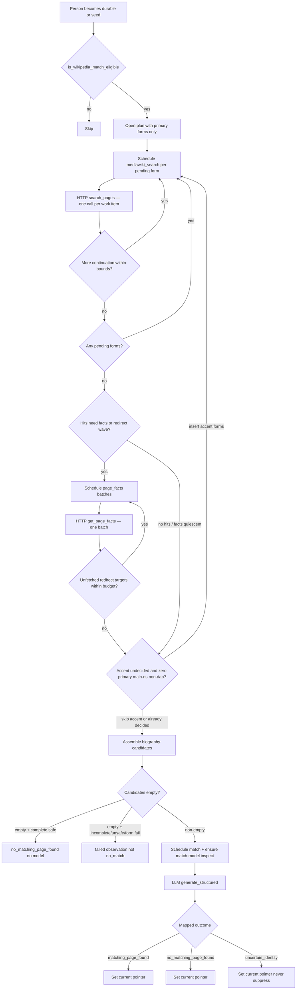

# Milestone 4: Wikipedia Identity Matching

| Field | Value |
| --- | --- |
| **Status** | Implemented (revision 3) |
| **Date** | 2026-07-30 |
| **Author** | (design agent) |
| **Branch** | `feat/wikipedia-identity-matching` (proposed) |
| **Programme** | Notable Person Finder clean-slate rewrite |
| **Depends on** | Milestones 1–3b2 complete on `refactor/rearchitecture` |

## Overview

Milestone 3b2 leaves every durable person without a Wikipedia identity
judgment: people, sourced names, and entity-resolution observations exist, but
nothing asks whether a current English Wikipedia article describes that person.
Milestone 4 turns eligible canonical people into inspectable Wikipedia identity
observations through bounded MediaWiki retrieval and, only when needed, one
focused OpenRouter comparison.

This milestone owns:

- the `MediaWikiClient` provider adapter (`search_pages`, `get_page_facts`);
- durable MediaWiki page rows and search observations;
- mechanical, text-grounded query plans and candidate assembly;
- immutable Wikipedia identity observations with outcomes
  `matching_page_found`, `no_matching_page_found`, and `uncertain_identity`;
- the person’s current Wikipedia observation pointer;
- work-item kinds that respect **exactly one external call per execute**;
- deterministic empty-complete-search short-circuit (no model call);
- refresh, merge reconciliation, and operator-facing Wikipedia counters.

It reuses the dual HTTP/LLM worker pools, shared transport, pacing gate,
retry coordinator, multi-model inspection, prepare/execute/settle handlers, and
attempt accounting from milestones 2–3b2. It does **not** run coverage research,
lead assessment, digest ranking, Brave search, article fetch, Promptfoo suites,
or audit commands. It never writes or edits Wikipedia.

## Background & Motivation

### Current state (end of 3b2)

- Canonical `person` rows, `sourced_name` rows, operational projection helpers,
  entity-resolution observations, `possible_same_person`, and confirmed merges
  exist under `people/` with migration `0005_people_identity.sql`.
- `TaskHandler.execute` performs **exactly one external call**, never retries,
  never sleeps, and never opens SQLite. `TaskHandler` carries fixed `provider`
  and `operation` per handler (no per-attempt override).
- Dual pools: HTTP (feeds today; MediaWiki here) and LLM (OpenRouter).
- Pacing already defines `mediawiki_min_interval_ms = 900` but no MediaWiki
  adapter exists under `providers/`.
- Task config has `detect_people` and `resolve_person_entity` only.
- Priorities: feed 10 → inspect 20 → detect 30 → resolve/reconsider 40.
- Digest and `notable status` report detection and person-identity counters;
  no Wikipedia surface.
- Merge supersedes person- and relation-scoped work; Wikipedia pointers do not
  yet exist (3b2 left that as a later reconciliation surface).

### Pain points this milestone removes

- Operators cannot see whether a discovered person already has an English
  Wikipedia biography.
- Coverage research (milestone 5) has no durable stop condition for people who
  are already covered on Wikipedia.
- There is no MediaWiki attempt history, page cache, or entity-scoped mapping
  to stable page IDs.

### Authorities this design refines

This document refines, without replacing:

- `docs/architecture/legacy-behaviors/03-wikipedia-identity-matching.md` —
  approved dispositions (preserve/delete/change table).
- `docs/superpowers/specs/2026-07-24-product-workflow-design.md` — lifecycle:
  `matching_page_found` stops coverage research; `no_matching_page_found`
  continues; `uncertain_identity` continues with warning and never suppresses.
- `docs/superpowers/specs/2026-07-24-domain-persistence-design.md` — MediaWiki
  pages/searches, Wikipedia identity observations, current pointer on person.
- `docs/superpowers/specs/2026-07-24-provider-adapters-design.md` —
  `MediaWikiClient`, maxlag, user agent, pacing, unauthenticated public API.
- `docs/superpowers/specs/2026-07-24-llm-evaluation-design.md` — Task 3
  `match_wikipedia_identity` I/O contract.
- `docs/superpowers/specs/2026-07-24-overarching-system-design.md` — `wikipedia`
  capability package ownership.
- `docs/superpowers/specs/2026-07-30-durable-person-identity-design.md` —
  people, fingerprints, multi-model inspection, empty-candidate short-circuit
  precedents (K3/K23/K24 patterns).
- `docs/superpowers/specs/2026-07-29-model-gateway-and-detection-design.md` —
  dual pools, prepare/execute/settle, attempt accounting.
- `docs/architecture/at-least-once-execution.md` — paid/external crash windows.

## Goals & Non-Goals

### Goals

Milestone 4 must:

1. Add `MediaWikiClient` in `providers/` as the only package that performs
   MediaWiki HTTP, with `search_pages` and `get_page_facts`, using the shared
   transport, pacing (`mediawiki` provider key), concurrency, and failure
   classification. No authentication secret is required for the public
   MediaWiki Action API.
2. Introduce durable MediaWiki page rows keyed by stable page ID; search
   observations with query forms, bounds, truncation, time, and ranked hits;
   and immutable Wikipedia identity observations with full decision basis and
   model provenance when a model is used.
3. Attach identity state to the **canonical person** (after redirect flatten),
   never to a bare name. Reuse a prior mapping only for the same person entity.
4. Schedule Wikipedia work when a person first becomes durable and when the
   Wikipedia material fingerprint changes; refresh after a configurable
   interval even when material is unchanged.
5. Use deterministic code for query plans, namespace filtering, redirect
   following, disambiguation detection, deduplication, bounds, and empty
   complete-search → `no_matching_page_found` **without** a model call, work
   item for match, or paid attempt (same family as 3b1 `insufficient_input` /
   3b2 empty-candidate `created_new`).
6. Call `match_wikipedia_identity` only when a non-empty, code-selected
   candidate set of plausible biography pages exists.
7. Persist outcomes that workflow and milestone 5 can honor:
   - `matching_page_found` — suppresses **coverage research** (not yet built;
     this milestone sets the pointer and observation correctly);
   - `no_matching_page_found` — does not suppress;
   - `uncertain_identity` — never suppresses.
8. Split work into HTTP vs LLM kinds so each `execute` performs exactly one
   external call under a fixed handler `provider`/`operation`.
9. Extend multi-model inspection so the match model is inspected when this run
   has or will need Wikipedia match work (K21: active plans/HTTP work, active
   match work, or K17-eligible people), including mid-run
   `ensure_model_inspections_for_run` when match is scheduled.
10. Reconcile Wikipedia work and pointers on confirmed person merge.
11. Expose truthful Wikipedia identity progress on the digest and
    `notable status` without inventing ranking, synthesis, or coverage-skip
    claims that the product cannot yet enforce end-to-end.
12. Preserve every run-engine invariant: no transaction across network calls,
    workers never open SQLite, every external call maps to one attempt, only
    the central coordinator retries, secrets never enter durable product state.

### Non-goals

- Brave Web Search, article fetch/extract, coverage plans (milestone 5).
- Lead assessment, ranking, digest shortlist synthesis, digest queue, audit
  commands (milestone 6).
- Promptfoo suites, full live verification matrix, legacy comparison, cutover
  (milestone 7).
- Automated Wikipedia edits, drafts, or notability verdicts of any kind.
- Nickname maps, biography category scores as identity evidence, name-only
  page reuse across different people.
- Migrating legacy JSONL Wikipedia indexes.
- Engine extensions for multi-call execute, per-attempt provider override, or
  prepare-time network I/O.
- Claiming in status/digest that coverage research was “skipped” as an
  operational count before milestone 5 exists — only identity outcomes and
  eligibility counters.

## Key Decisions

| # | Decision | Rationale |
| --- | --- | --- |
| K1 | **New `wikipedia/` package; do not fold into `people/`.** | Overarching design assigns query plans, MediaWiki observations, candidate assembly, and identity state to `wikipedia`. People remain the subject entity; Wikipedia owns the capability. Mirrors coverage as a later sibling package. |
| K2 | **Three work-item kinds: `mediawiki_search` (HTTP), `mediawiki_page_facts` (HTTP), `match_wikipedia_identity` (LLM).** | Engine contract: one external call per execute; fixed provider/operation per handler. Multi-query search and page-fact batches cannot share one execute with each other or with OpenRouter. |
| K3 | **Subject of terminal identity is always canonical `person`.** Search/facts work may use plan-query and plan-batch subjects that ultimately reference that person. Mentions are never Wikipedia subjects. | Product: mapping is entity-scoped; namesakes must not share mappings. |
| K4 | **Empty complete bounded search ⇒ schedule-time / settle-time deterministic `no_matching_page_found`: no match work item, no model attempt.** Mirrors 3b2 empty-candidate create and 3b1 `insufficient_input`. | Legacy Gate 3 runner; LLM-evaluation empty-candidate rule; avoids fake OpenRouter attempts. |
| K5 | **Unsafe truncation never yields `no_matching_page_found`.** Set `truncated_unsafe_for_negative = true` when pagination/hit-cap is incomplete **or** unique main-namespace non-dab pages after filters exceed `max_candidates` (capped set sent to model). Empty candidates + unsafe → `failed` (not no-match). Non-empty + unsafe → model may run for `matching_page` / `uncertain` only; reject model `no_matching_page` as invalid domain output (≤1 malformed retry, then permanent failed observation). Coerce-to-uncertain is illegal. | Legacy: negatives require a complete, untruncated candidate universe. |
| K6 | **Model schema uses Task 3 short outcomes (`matching_page`, `no_matching_page`, `uncertain`); persistence stores product outcomes (`matching_page_found`, `no_matching_page_found`, `uncertain_identity`).** Mapping is one-to-one in `persist`. | LLM-evaluation contract vs product/domain vocabulary; avoids dual truth in SQLite. |
| K7 | **Names, spelling similarity, edit distance, and category “biography scores” never establish identity.** They may order candidates only; the model (or empty-complete-search) decides outcomes. No nickname map; accent-stripped queries are fallback variants only. | Approved legacy dispositions. |
| K8 | **Disambiguation pages and non-main-namespace pages are never biography match candidates.** Redirects are followed to the terminal page ID via multi-wave `get_page_facts` (K24) before final assembly. | Deterministic MediaWiki facts; a dab page is not a biography. |
| K9 | **Reuse / skip only for the same person entity and current material fingerprint (plus refresh rules).** Never reuse by normalized name across people. | Deletes legacy Gate 0 known-page-by-name behaviour. |
| K10 | **Refresh after `refresh_interval` for every completed semantic outcome** (`matching_page_found`, `no_matching_page_found`, `uncertain_identity`), not only matches; also re-arm when person material changes. Refresh uses `refresh_of_observation_id` in the material fingerprint (see K17 algorithm). Failed observations never become current and do not participate in refresh_of (see K25). | Pages can change; no-match and uncertain must not be permanent clocks. |
| K11 | **`matching_page_found` is the only outcome that will suppress coverage research.** This milestone sets `person.current_wikipedia_identity_observation_id` correctly. Milestone 5 must honor it; status/digest in m4 report identity state only and do not invent coverage-skipped counters. | Product lifecycle table. |
| K12 | **Priority: feed 10 → inspect 20 → detect 30 → resolve/reconsider 40 → MediaWiki HTTP 50 → Wikipedia match model 55.** | Required discovery/identity before Wikipedia; retrieval before match within a person; inspections still claim first. |
| K13 | **MediaWiki attempts are HTTP attempts: no OpenRouter USD budget reservation.** Match-model generations reserve under the existing OpenRouter hard cap. | MediaWiki is free/public; budget policy is OpenRouter-only today. |
| K14 | **One migration `0006_wikipedia_identity.sql` ships full Wikipedia DDL in PR1** including `wikipedia_page_facts_batch` and attempt-id uniques. Later PRs do not edit 0006; missing columns become 0007+. | Same forward-only rule as 0005; batch subject must not be invented mid-PR. |
| K15 | **Query plan is durable and person-scoped under the Wikipedia material fingerprint.** Plan rows drive which `mediawiki_search` items exist; completion of all forms + needed facts triggers empty short-circuit or match scheduling. Two-phase accent (K23). | Makes multi-call retrieval resumable without multi-call execute. |
| K16 | **Merge never copies another person’s Wikipedia current pointer as-is.** Supersede loser Wikipedia work; schedule `ensure_wikipedia_identity` for the survivor under the combined identity fingerprint. Historical observations on the loser remain immutable. | Domain merge policy: no incompatible pointer adoption; entity after merge is a new operational projection. |
| K17 | **Shared eligibility algorithm `is_wikipedia_match_eligible`** (normative procedure below) used by seed, digest `wikipedia_eligible_remaining`, and status. **Not** the sole gate for match-model inspection (see K21). Successive interval refreshes always re-anchor on the **current completed** observation id (`refresh_of=cur.id`), never on the original base observation. Material match is **forward recompute** via plan `refresh_of` + live person/config — never reverse-hash surgery. | Prevents perpetual planning for settled people; counters share one predicate; K10 multi-refresh must not dead-end after one cycle. |
| K18 | **Permanent preflight for the match model settles active `match_wikipedia_identity` work out-of-band** (extend 3b2 K23 settler), writing failed Wikipedia observations with the inspection `attempt_id` (CHECK requires non-null attempt on failed-with-call paths). HTTP kinds do not depend on model inspection. | Matches detect/resolve preflight pattern. |
| K19 | **At most one active Wikipedia plan per canonical person per material fingerprint.** Supersede stale plans when fingerprint changes (algorithm under Plan terminal transitions). | Prevents duplicate concurrent retrieval for the same judgment. |
| K20 | **No second model call for uncertainty in v1.** `uncertain_identity` continues; later coverage (m5) may support one reconsideration in a future design — out of scope here beyond leaving the observation and pointer correct. | Legacy disposition; product table. |
| K21 | **Match-model inspection arming: (a) + (b).** `models_needed_for_run` includes the match model when any of: K17-eligible people; active `match_wikipedia_identity` work; **or active Wikipedia plans in `retrieving`/`ready_for_match` (or any active MediaWiki HTTP work for a Wikipedia plan).** Additionally, `maybe_advance_plan` calls `ensure_model_inspections_for_run` whenever it schedules `match_wikipedia_identity` so mid-run cold-start cannot wedge behind `ready=false`. | Closes cold-start: seed opens only HTTP plans, so K17 alone is false while plans are active and match work does not yet exist. |
| K22 | **Partial form failure with usable candidates still allows match.** Permanent failure of one query form fails **that form** only. If, after all forms are terminal, biography candidates are non-empty from successful forms, advance to match with `partial_retrieval=true` on the plan/view (blocks durable no-match). Empty candidates + any form permanent fail or incomplete → failed observation / not no-match. | Legacy requires complete retrieval for **negatives**, not erasure of already-usable positive candidates when a secondary form dies. |
| K23 | **Two-phase query plan for accent fallback.** Open plan with primary forms only (`exact`, `comma_swap`). When all primaries complete with zero main-namespace non-dab hits (after facts waves for those hits, or with zero hits so no facts), insert accent forms if under `max_query_forms` and schedule their search work. If primaries already produced main-namespace non-dab hits, **never** insert accent. | Conditional accent must not be pre-inserted at plan open. |
| K24 | **Multi-wave page facts for redirect terminals.** After each `get_page_facts` settle, if any observed page redirects to an unfetched page id within hop budget (default max hops 3 from each search-hit root; max total fact pages per plan = `max_fact_pages_per_plan`, default 40), create/schedule another `wikipedia_page_facts_batch`. Do not assemble candidates or short-circuit until no pending redirect targets remain or hop/page budget is exhausted (exhausted → drop that trail; if no other candidates, treat as incomplete retrieval / failed path for empty sets, not no-match). | Search often returns redirect sources; terminal extracts live on the target. |
| K25 | **Current pointer only for `disposition='completed'`.** Permanent `failed` Wikipedia observations do **not** set or move `person.current_wikipedia_identity_observation_id`. Failed rows close the material fingerprint (no re-plan until material/config/`refresh_of` changes) but leave any prior completed current pointer intact. | Failed is operational, not a semantic identity judgment; status “current matching/no-match/uncertain” stays meaningful. |
| K26 | **Domain `failure_category` vocabulary is separate from `ProviderFailure.category`.** Observation CHECK allows a fixed domain set including `unsafe_truncation`, `partial_retrieval_empty`, `redirect_budget_exhausted`, `invalid_model_output`, `permanent_provider`, `permanent_preflight`, plus provider category strings when a call failed. Do not require membership in the `FailureCategory` StrEnum. | Avoids conflating provider enums with local assembly failures that have no attempt. |
| K27 | **Operational projection for all person-derived Wikipedia inputs.** Query forms, material fingerprints, and Task 3 name/fact assembly use 3b2 helpers: `canonical_person_id`, `person_id_closure_for_canonical`, `mentions_for_canonical_person`, sourced names on the survivor (and closure as required). Do not reimplement merge-blind `person_id = canonical` only loads. | Post-merge facts remain on loser-linked mentions. |

## Proposed Design

### Component ownership

```text
src/notable_person_finder/
  providers/
    mediawiki.py              # NEW: MediaWikiClient, DTOs, failure translation
  wikipedia/                  # NEW package
    __init__.py
    queries.py                # mechanical query-form generation
    candidates.py             # namespace/dab/redirect filter, rank, bounds
    matching.py               # Task 3 I/O, schema hash, validate, prompt hash
    models.py                 # domain DTOs
    repository.py             # pages, searches, plans, observations SQL
    service.py                # seed, ensure, handlers, multi-model hooks
    merge_hooks.py            # called from people/merge reconciliation
    prompts/
      match_wikipedia_identity.md
  config/models.py            # MediaWikiConfig, MatchWikipediaIdentityConfig
  db/migrations/
    0006_wikipedia_identity.sql
  people/merge.py             # call wikipedia merge hook (thin)
  reporting/digest.py         # Wikipedia section
  cli/main.py                 # register handlers, seed, status lines
```

| Component | Owns | Must not own |
| --- | --- | --- |
| `wikipedia/` | query plans, candidate assembly, match schema/prompt, Wikipedia SQL, handlers, eligibility | HTTPX, MediaWiki wire types, OpenRouter SDK, person ER merges |
| `providers/mediawiki.py` | one search page request; one page-facts batch request; typed DTOs; `ProviderFailure` | workflow, empty-search decisions, model prompts |
| `people/` | person entity, identity fingerprint, merge transaction | MediaWiki HTTP, Wikipedia outcome semantics |
| `runs/` | work items, attempts, retry, dual pools, budget | Wikipedia domain rules |
| `config/` | endpoint, maxlag, bounds, match model, refresh interval | retrieval SQL |
| `reporting/` / `cli/` | rendering counters | inventing counts from logs |

### End-to-end data flow



### MediaWiki adapter

#### Placement and protocol

`providers/mediawiki.py` is the only module that may call the MediaWiki HTTP
API. Domain code depends on a narrow protocol:

```python
class MediaWikiClient(Protocol):
    def search_pages(
        self, query: str, *, continuation: str | None
    ) -> MediaWikiSearchPage: ...

    def get_page_facts(self, page_ids: Sequence[int]) -> MediaWikiPageFactsBatch: ...
```

#### Endpoint and request policy

| Setting | Default / rule |
| --- | --- |
| Base URL | `https://en.wikipedia.org/w/api.php` (configurable HTTPS public URL; no query/fragment) |
| `maxlag` | configurable integer seconds, default `5`, sent on every request |
| User agent | `transport.resolved_user_agent(version)` — same application UA as feeds |
| Auth secret | **None.** Public Action API; no `MEDIAWIKI_*` env secret; not listed beside `OPENROUTER_API_KEY` / `BRAVE_API_KEY` |
| Provider key for pacing/pause | `"mediawiki"` |
| Operations | `search_pages`, `get_page_facts` |
| Transport | shared run-scoped `HttpTransport` |
| Pacing | `PacingGate` interval `mediawiki_min_interval_ms` (default 900) |
| Concurrency | global HTTP pool + per-origin cap on `en.wikipedia.org` |
| Retries | SDK/httpx retries disabled; only central coordinator retries |
| Response size | `transport.max_api_response_bytes` |

#### `search_pages(query, continuation)`

Exactly one Action API request. Returns:

- ordered hits: page ID (when present), title, snippet/timestamp as available;
- completeness: whether more results exist, opaque continuation token;
- provider-reported total hits when available;
- raw safety: adapter never decides workflow completeness.

Application supplies `srlimit` from config (per request page size). Application
owns how many continuation steps to schedule.

#### `get_page_facts(page_ids)`

Exactly one request for a **caller-bounded** list of page IDs (application
partitions larger sets). Normalized facts per page:

| Field | Notes |
| --- | --- |
| `page_id` | stable MediaWiki page ID |
| `requested_title` / `canonical_title` | as returned |
| `namespace` | integer |
| `missing` | bool |
| `redirect_to_page_id` / `redirect_to_title` | when redirect |
| `is_disambiguation` | from page props / categories / API props as available |
| `canonical_url` | `https://en.wikipedia.org/wiki/...` form |
| `description` | Wikidata description or equivalent when present, length-bounded |
| `extract` | lead extract, length-bounded by config |
| `categories` | bounded list of category titles when available |

This milestone **extends** the programme provider-adapters page-facts list with
optional `description` and bounded `categories` (and redirect title trail
fields) solely for Task 3 model context. They are **not** identity gates and
must not drive biography scoring. Adapter normalization remains free of
workflow decisions.

Missing pages and redirects are first-class; adapter does not silently drop
them.

#### Failure classification

Translate to existing `FailureCategory` values (`network`, `timeout`,
`rate_limit`, `transient_server_error`, `malformed_response`, `configuration`,
`access_denied`, etc.). Honor `Retry-After` when present (including maxlag 503
style responses when MediaWiki signals lag). Never leak response bodies or full
query strings into `ProviderFailure.detail` — type name and compact codes only,
same as feeds.

#### Normalization rules (adapter vs domain)

- **Adapter:** JSON parse, typed DTO, HTTP/maxlag errors, size limits.
- **Domain (`wikipedia/`):** query plan, which forms to run, continuation bound,
  namespace filter, dab exclusion, redirect follow graph, candidate cap,
  truncation-safe-for-negative judgment, model input assembly.

### Query plan generation

Owned by `wikipedia/queries.py`. Inputs use the **operational projection**
(K27): sourced names on the canonical person (post-merge upserts) plus
name-kind facts and non-name identity facts from
`mentions_for_canonical_person` via `people/identity.py` helpers. Sourced
names and identity facts feed **model context**; **search queries are
name-derived only**.

#### Allowed mechanical variants (text-grounded)

| Variant kind | Phase | Rule |
| --- | --- | --- |
| `exact` | Primary (plan open) | Honorific-stripped exact/search forms from operational sourced names and name-kind facts; whitespace-collapsed; preserve useful casing for the API query string |
| `comma_swap` | Primary (plan open) | If a name matches `Last, First...`, emit `First... Last` |
| `accent_fallback` | Secondary (conditional) | Unicode accent-stripped form of primary query strings; **never** identity evidence |

#### Two-phase scheduling (K23)

1. **Plan open:** insert and schedule only primary forms (`exact`,
   `comma_swap`). Deduplicate identical query strings. Cap at
   `max_query_forms`. Do **not** insert `accent_fallback` rows yet.
2. **Accent gate** (inside `maybe_advance_plan` when every primary form is
   terminal and no primary form is still pending/deferred):
   - Compute whether any primary path produced at least one main-namespace
     non-disambiguation page (after multi-wave facts for any hits, or
     trivially false when all primaries completed with zero hits).
   - If **zero** such hits and remaining form budget
     (`max_query_forms - count(existing forms) > 0`): generate accent
     variants not already present as query text, insert
     `wikipedia_query_form` rows with continuing ordinals, status
     `pending`, schedule `mediawiki_search` for each; stay in `retrieving`.
   - If primaries already had main-namespace non-dab hits: **skip accent**
     entirely (no form rows, no work).
   - Accent forms that permanently fail follow K22 (form-level), not
     automatic whole-plan death when other candidates exist.

#### Explicitly forbidden

- Nickname bidirectional expansion maps.
- Model-invented aliases.
- Initials expansion from model memory.
- Queries built only from non-name facts (profession, nationality, etc.).
- Pre-inserting accent forms at plan open.

#### Bounds

| Config field | Default | Bound |
| --- | --- | --- |
| `max_query_forms` | 6 | 1–16 |
| `search_srlimit` | 10 | 1–50 |
| `max_continuations_per_form` | 1 | 0–5 |
| `max_search_hits_per_form` | 20 | 1–100 |
| `max_redirect_hops` | 3 | 1–5 |
| `max_fact_pages_per_plan` | 40 | 1–100 |

### Candidate assembly

Owned by `wikipedia/candidates.py`. Runs only when search forms are terminal
**and** multi-wave page facts have no pending unfetched redirect targets
(K24), or the fact-page budget is exhausted.

1. Union all search hits by page ID (or by title resolved through facts).
2. For each hit root, walk redirect edges using stored `mediawiki_page` rows
   up to `max_redirect_hops`; terminal must have been fetched (or budget
   exhausted — see K24).
3. Drop `missing` terminals.
4. Drop namespace ≠ 0.
5. Drop `is_disambiguation`.
6. Deduplicate by terminal page ID.
7. Rank: best (lowest) search rank across forms, then lower page ID.
8. Let `uncapped_count` = number of unique biography pages after step 6.
9. Keep top `max_candidates` (default 8, bound 1–16) for the model/set.

**No biography category score gate.** Categories may appear on the candidate
payload for the model as context only.

#### Truncation safety for negatives (K5)

`truncated_unsafe_for_negative = true` when **any** of:

| Condition | Applies to empty set? | Applies to non-empty set? |
| --- | --- | --- |
| A form hit `search_srlimit` and had a continuation not fetched because `max_continuations_per_form` was exhausted while more results remained | yes | yes |
| Hits discarded solely due to `max_search_hits_per_form` while more provider results existed | yes | yes |
| `uncapped_count > max_candidates` (model sees only top N) | impossible (empty ⇒ uncapped 0) | **yes — always set the flag** |
| Redirect hop or fact-page budget exhausted with unresolved trails that could have added candidates | yes | yes — **stored only as `truncated_unsafe_for_negative = 1`** (no separate incomplete-redirect column) |
| `partial_retrieval` (K22: at least one form permanent-failed) | yes (cannot no-match) | yes (blocks model no-match) |

#### Terminal assembly outcomes

| Final biography candidates | Retrieval completeness | Action |
| --- | --- | --- |
| empty | All forms succeeded, NOT truncated_unsafe, NOT partial_retrieval | Deterministic `no_matching_page_found` (K4); plan `completed`; set current pointer |
| empty | Any form permanent-failed OR truncated_unsafe OR redirect budget left unresolved roots | `failed` observation; domain `failure_category` ∈ {`unsafe_truncation`, `partial_retrieval_empty`, `redirect_budget_exhausted`, …}; plan `failed`; **do not** set current pointer (K25) |
| non-empty | any (including partial_retrieval / capped) | plan `ready_for_match`; schedule `match_wikipedia_identity`; set `truncated_unsafe_for_negative` per table above so model `no_matching_page` is rejected when unsafe |

### Observation model and DDL sketch

Migration **`0006_wikipedia_identity.sql`** (full DDL in PR1).

#### `mediawiki_page`

Provider entity keyed by stable page ID (English Wikipedia v1 single endpoint
implies one ID space; store `wiki_id` default `'enwiki'` for future-proofing).

```text
mediawiki_page(
  id INTEGER PK,                    -- application surrogate
  wiki_id TEXT NOT NULL,            -- 'enwiki'
  page_id INTEGER NOT NULL,         -- MediaWiki page id
  canonical_title TEXT NOT NULL,
  canonical_url TEXT NOT NULL,
  namespace INTEGER NOT NULL,
  is_disambiguation INTEGER NOT NULL CHECK (0/1),
  is_missing INTEGER NOT NULL CHECK (0/1),
  redirect_to_page_id INTEGER,      -- MediaWiki id, nullable
  description TEXT,
  extract TEXT,
  categories_json TEXT NOT NULL,    -- canonical JSON array
  last_observed_at TEXT NOT NULL,   -- *Z
  last_attempt_id INTEGER,          -- optional provenance
  UNIQUE (wiki_id, page_id)
)
```

Upsert on each successful `get_page_facts` observation; historical identity
observations reference `mediawiki_page.id` (application FK), not transient
titles alone.

#### `wikipedia_identity_plan`

```text
wikipedia_identity_plan(
  id INTEGER PK,
  person_id INTEGER NOT NULL REFERENCES person(id),
  run_id INTEGER NOT NULL REFERENCES run(id),
  material_fingerprint TEXT NOT NULL,  -- 64 hex
  status TEXT NOT NULL CHECK IN (
    'retrieving', 'ready_for_match', 'completed', 'failed', 'superseded'
  ),
  refresh_of_observation_id INTEGER REFERENCES wikipedia_identity_observation(id),
  truncated_unsafe_for_negative INTEGER NOT NULL CHECK (0/1),
    -- includes pagination caps, candidate cap, AND redirect hop/page budget
    -- exhaustion with unresolved trails (no separate incomplete-redirect column)
  partial_retrieval INTEGER NOT NULL CHECK (0/1),  -- K22: ≥1 form permanent-failed
  created_at TEXT NOT NULL,
  completed_at TEXT,
  failure_category TEXT,
  UNIQUE active plan: partial unique on (person_id, material_fingerprint)
    WHERE status IN ('retrieving', 'ready_for_match')
)
```

#### `wikipedia_query_form`

```text
wikipedia_query_form(
  id INTEGER PK,
  plan_id INTEGER NOT NULL REFERENCES wikipedia_identity_plan(id),
  ordinal INTEGER NOT NULL,
  variant_kind TEXT NOT NULL CHECK IN ('exact', 'comma_swap', 'accent_fallback'),
  query_text TEXT NOT NULL,
  status TEXT NOT NULL CHECK IN ('pending', 'completed', 'failed'),
  continuations_used INTEGER NOT NULL,
  hit_count INTEGER,
  truncated INTEGER NOT NULL CHECK (0/1),
  failure_category TEXT,
  UNIQUE (plan_id, ordinal)
)
```

#### `wikipedia_page_facts_batch` (work-item subject)

Durable subject for `mediawiki_page_facts` work items (`subject_id` =
batch row id). Supersede path: batch → `plan_id` → `person_id`.

```text
wikipedia_page_facts_batch(
  id INTEGER PK,
  plan_id INTEGER NOT NULL REFERENCES wikipedia_identity_plan(id),
  ordinal INTEGER NOT NULL,              -- wave/order within plan
  page_ids_json TEXT NOT NULL,           -- canonical JSON sorted MediaWiki page ids
  status TEXT NOT NULL CHECK IN (
    'pending', 'completed', 'failed', 'superseded'
  ),
  wave INTEGER NOT NULL CHECK (wave >= 1),  -- 1 = search-hit ids; 2+ = redirect targets
  attempt_id INTEGER,                    -- set when a successful/failed call settled
  failure_category TEXT,
  created_at TEXT NOT NULL,
  completed_at TEXT,
  UNIQUE (plan_id, ordinal),
  UNIQUE (attempt_id)                    -- NULL allowed once in SQLite; use
    -- partial unique WHERE attempt_id IS NOT NULL if needed
)
```

#### `mediawiki_search_observation`

Immutable per external search call. **At-least-once:** one observation per
attempt.

```text
mediawiki_search_observation(
  id INTEGER PK,
  query_form_id INTEGER NOT NULL REFERENCES wikipedia_query_form(id),
  run_id INTEGER NOT NULL,
  attempt_id INTEGER NOT NULL,      -- required for external call
  query_text TEXT NOT NULL,
  continuation_in TEXT,             -- token used for this call, if any
  continuation_out TEXT,            -- next token, if any
  srlimit INTEGER NOT NULL,
  hit_count INTEGER NOT NULL,
  truncated INTEGER NOT NULL CHECK (0/1),
  response_complete INTEGER NOT NULL CHECK (0/1),
  observed_at TEXT NOT NULL,
  FOREIGN KEY (attempt_id, run_id) REFERENCES attempt(id, run_id),
  UNIQUE (attempt_id)               -- idempotent persist: insert-or-load
)
```

#### `mediawiki_search_hit`

```text
mediawiki_search_hit(
  id INTEGER PK,
  search_observation_id INTEGER NOT NULL,
  rank INTEGER NOT NULL,            -- 1-based within this response page
  page_id INTEGER,                  -- nullable if provider omitted
  title TEXT NOT NULL,
  UNIQUE (search_observation_id, rank)
)
```

#### `wikipedia_identity_observation`

```text
wikipedia_identity_observation(
  id INTEGER PK,
  person_id INTEGER NOT NULL REFERENCES person(id),
  plan_id INTEGER REFERENCES wikipedia_identity_plan(id),
  run_id INTEGER NOT NULL REFERENCES run(id),
  attempt_id INTEGER,               -- see CHECK truth table
  model_inspection_id INTEGER,      -- NULL when no model
  disposition TEXT NOT NULL CHECK IN ('completed', 'failed'),
  semantic_outcome TEXT CHECK (
    semantic_outcome IS NULL OR semantic_outcome IN (
      'matching_page_found',
      'no_matching_page_found',
      'uncertain_identity'
    )
  ),
  matched_mediawiki_page_id INTEGER REFERENCES mediawiki_page(id),
  candidate_page_ids_json TEXT NOT NULL,  -- MediaWiki page_id list as JSON
  canonical_supplied_input_json TEXT NOT NULL,
  validated_output_json TEXT,
  prompt_hash TEXT,                 -- NULL on deterministic completed no_match / local failed
  schema_hash TEXT,
  schema_version INTEGER,
  task_fingerprint TEXT NOT NULL,   -- 64 hex
  supporting_fact_ids_json TEXT,
  conflicting_fact_ids_json TEXT,
  rationale TEXT NOT NULL,
  failure_category TEXT,            -- domain vocabulary (K26), not only FailureCategory
  observed_at TEXT NOT NULL,
  ... CHECKs per truth table below ...
)
```

Unique: `(person_id, task_fingerprint)`.

#### Person pointer

```text
ALTER TABLE person ADD COLUMN current_wikipedia_identity_observation_id
  INTEGER REFERENCES wikipedia_identity_observation(id);
```

Ownership triggers (mirror ER/triage): when set, the observation’s `person_id`
must equal the person row and `disposition` must be `completed` (failed rows
must not be pointed at). Observation subject ownership is immutable.

### Outcome truth table

#### Completed rows (set current pointer — K25)

| semantic_outcome | attempt | inspection | matched page | candidates | How reached |
| --- | --- | --- | --- | --- | --- |
| no_matching_page_found | NULL | NULL | NULL | `[]` | Empty complete safe search (K4); fixed `validated_output_json` |
| matching_page_found | non-NULL | non-NULL | non-NULL | non-empty | Model `matching_page` + validated ID ∈ candidates |
| no_matching_page_found | non-NULL | non-NULL | NULL | non-empty | Model `no_matching_page` when NOT truncated_unsafe |
| uncertain_identity | non-NULL | non-NULL | NULL | non-empty | Model `uncertain` |

#### Failed rows (do **not** set current pointer — K25)

| Path | attempt_id | model_inspection_id | failure_category (domain) | Notes |
| --- | --- | --- | --- | --- |
| Permanent MediaWiki / model generation | non-NULL (that call) | optional / required for model | `permanent_provider` or provider category string | CHECK: attempt NOT NULL |
| Permanent match-model preflight (K18) | non-NULL (**inspection** attempt) | non-NULL when known | `permanent_preflight` | Same pattern as 3b2 failed ER |
| Local empty + unsafe truncation / partial_retrieval_empty / redirect budget | **NULL** | NULL | `unsafe_truncation` / `partial_retrieval_empty` / `redirect_budget_exhausted` | No external call on terminal assembly; CHECK allows attempt NULL only for these domain categories |
| Invalid model output after retries | non-NULL (last generate) | non-NULL | `invalid_model_output` | |

CHECK sketch:

```text
CASE disposition
  WHEN 'completed' THEN
    semantic_outcome IS NOT NULL AND failure_category IS NULL
    AND validated_output_json IS NOT NULL
    AND (/* per-outcome attempt/inspection/matched rules above */)
  WHEN 'failed' THEN
    semantic_outcome IS NULL
    AND failure_category IS NOT NULL
    AND validated_output_json IS NULL
    AND matched_mediawiki_page_id IS NULL
    AND (
      attempt_id IS NOT NULL
      OR failure_category IN (
        'unsafe_truncation',
        'partial_retrieval_empty',
        'redirect_budget_exhausted'
      )
    )
END
```

Workflow consequence (product; coverage m5 consumes):

| Current completed outcome | Coverage research | Surfacing |
| --- | --- | --- |
| matching_page_found | **Stop** | Do not treat as missing-biography lead |
| no_matching_page_found | Continue | Normal |
| uncertain_identity | Continue with warning | Never suppress; may rank below completed no-match later |
| failed / none | Do not invent no-match | Required work remains or is permanent-failed |

### Attach to durable people

#### Material fingerprint helpers

```text
base_material_fingerprint(person, config, *, refresh_of_observation_id=None) =
  sha256(canonical_json({ ... fields in Fingerprints section ...,
                          refresh_of_observation_id }))

# Plans and observations always retain the refresh_of used at open time:
#   plan.refresh_of_observation_id  (nullable FK)
#   observation.task_fingerprint == base_material_fingerprint(
#       person_at_open, config_at_open, refresh_of=plan.refresh_of_observation_id)
```

**Forward material match (never reverse a 64-hex digest):**

```text
function observation_matches_live_material(obs, P, config) -> bool:
  # Requires obs.plan_id (always set for completed/failed rows produced by a plan).
  plan = load(obs.plan_id)
  expected = base_material_fingerprint(
      P, config, refresh_of_observation_id=plan.refresh_of_observation_id
  )
  return obs.task_fingerprint == expected
```

If `plan_id` is NULL (should not occur for production rows), treat as not
matching live material. There is **no** `material_without_refresh(hash)` API.

#### Eligibility algorithm (`is_wikipedia_match_eligible`) — normative (K17)

Shared by seed, digest `wikipedia_eligible_remaining`, and status. **Not** the
sole `models_needed_for_run` gate (K21).

```text
function is_wikipedia_match_eligible(connection, person_id, config, now) -> bool:
  P = load person
  if P.merged_into_person_id is not null: return false
  if no sourced_name on operational projection with non-empty match_key: return false

  base_fp = base_material_fingerprint(P, config, refresh_of_observation_id=None)

  def has_active_plan(fp):
    return exists plan for (P.id, material_fingerprint=fp)
           status in ('retrieving', 'ready_for_match')

  def has_terminal_obs(fp):
    return exists wikipedia_identity_observation
           for (person_id=P.id, task_fingerprint=fp)
           disposition in ('completed', 'failed')

  cur_id = P.current_wikipedia_identity_observation_id  # completed only (K25)
  cur = load(cur_id) if cur_id is not null else None

  # --- Branch 1: current completed observation still matches live material ---
  # Anchor EVERY interval refresh on cur.id (not the original base observation).
  # After refresh R1 (refresh_of=O0) becomes current, the next cycle uses
  # refresh_of=R1.id → R2, then R2.id → R3, indefinitely (Issue 23).
  if cur is not null and observation_matches_live_material(cur, P, config):
    if now - cur.observed_at < config.refresh_interval:
      return false  # fresh completed judgment (any semantic outcome)
    live_fp = base_material_fingerprint(P, config, refresh_of_observation_id=cur.id)
    return not has_terminal_obs(live_fp) and not has_active_plan(live_fp)

  # --- Branch 2: material changed (current missing or no longer matches live) ---
  # Live work is always under base_fp (refresh_of=null) for the new material.
  # A failed terminal for base_fp closes eligibility until material/config changes
  # again (no time-based refresh_of from failed rows — K25).
  if has_terminal_obs(base_fp):
    t = terminal_obs(base_fp)  # any disposition for that fingerprint
    if t.disposition == 'failed':
      return false
    # completed base_fp without current pointer should not occur (K25 sets
    # pointer on completed). If it does, treat like a fresh completed base:
    if t.disposition == 'completed':
      if now - t.observed_at < config.refresh_interval:
        return false
      live_fp = base_material_fingerprint(P, config, refresh_of_observation_id=t.id)
      return not has_terminal_obs(live_fp) and not has_active_plan(live_fp)

  if has_active_plan(base_fp):
    return false
  return true
```

`ensure_wikipedia_identity` uses the **same branches** to choose `live_fp`:

| Condition | `live_fp` / plan `refresh_of` |
| --- | --- |
| Branch 1, interval elapsed | `refresh_of = cur.id` |
| Branch 2, no terminal base_fp | `refresh_of = null` (`base_fp`) |
| Branch 2, completed base without pointer, interval elapsed | `refresh_of = that observation id` |
| Ineligible | no plan |

**Clock-controlled double-refresh (required test):** under fixed person+config
material, complete observation O0 at t0; advance clock past one
`refresh_interval` → plan/observation R1 with `refresh_of=O0.id` becomes
current; advance past another full interval → plan/observation R2 with
`refresh_of=R1.id` is scheduled/eligible (not blocked by O0’s terminal row).
A third interval may produce R3 with `refresh_of=R2.id`.

#### Operator counters (aligned digest + status)

| Counter name | Definition |
| --- | --- |
| `wikipedia_eligible_remaining` | Count of canonical people where `is_wikipedia_match_eligible` is true (includes refresh-due people who already have a current terminal observation) |
| `canonical_people_without_wikipedia_pointer` | Count of canonical people with `current_wikipedia_identity_observation_id IS NULL` |

Do **not** label K17 as “without terminal observation.” Both counters appear
on digest and status with these exact meanings.

#### Mandatory `schedule_wikipedia_after_person_ready` call sites

Call after identity fingerprint recompute (or person create) on the
application thread, joining the open settlement transaction when present:

| People path | When |
| --- | --- |
| Empty-candidate `created_new` | After person create + fingerprint |
| First-pass `same_person` link | After link + sourced name upsert + fingerprint recompute |
| First-pass `different_people` / `uncertain` create | After create + fingerprint |
| Reconsider confirmed merge | Via `reconcile_on_merge` → ensure survivor (K16); not separately on loser |
| Peer-edge / non-name material attach that recomputes fingerprint | After `recompute_identity_fingerprint` when fingerprint string changes |
| Run seed | `seed_wikipedia_identity` for all eligible people |

If fingerprint is unchanged, `ensure` is a cheap eligibility no-op. Tests
must cover each create/link path, not only “new person.”

Do **not** schedule Wikipedia work from `do_not_research` mentions that never
created a person.

#### Mapping reuse

- Same person + same material fingerprint with existing terminal observation →
  reuse / ineligible per algorithm; no network.
- Same display name, different person → **never** reuse.
- After merge, survivor must earn a new or revalidated observation under K16;
  do not copy loser’s current pointer FK onto survivor without a new
  observation row owned by the survivor.

### Work-item kinds

| Task type | Pool | provider | operation | Subject kind | Priority |
| --- | --- | --- | --- | --- | --- |
| `mediawiki_search` | HTTP | `mediawiki` | `search_pages` | `wikipedia_query_form` | 50 |
| `mediawiki_page_facts` | HTTP | `mediawiki` | `get_page_facts` | `wikipedia_page_facts_batch` | 50 |
| `match_wikipedia_identity` | LLM | `openrouter` | `generate_structured` | `person` | 55 |

Constants live in `wikipedia/service.py` (or repository), analogous to people
task constants.

#### Fingerprints

**Plan / observation material fingerprint** (shared core). Person material is
represented by `identity_fingerprint` alone (no duplicate sorted match-key
list — avoids drift with 3b2). Include **every** bound that changes Task 3
supplied input or candidate text:

```text
sha256(canonical_json({
  "task": "wikipedia_identity",
  "adapter_version": WIKIPEDIA_ADAPTER_VERSION,  # 1
  "person_id": <canonical int>,
  "identity_fingerprint": <person.identity_fingerprint>,
  "query_plan_version": QUERY_PLAN_VERSION,      # 1
  "model": <match model slug>,
  "parameters": {temperature, top_p, reasoning_effort},
  "max_input_tokens": ...,
  "max_completion_tokens": ...,
  "max_candidates": ...,
  "max_query_forms": ...,
  "search_srlimit": ...,
  "max_continuations_per_form": ...,
  "max_search_hits_per_form": ...,
  "max_page_ids_per_facts_request": ...,
  "max_redirect_hops": ...,
  "max_fact_pages_per_plan": ...,
  "max_extract_characters": ...,
  "max_categories_per_page": ...,
  "max_names_in_prompt": ...,
  "max_facts_in_prompt": ...,
  "max_title_characters": ...,
  "max_summary_characters": ...,
  "prompt_hash": <64 hex>,
  "schema_hash": <64 hex>,
  "schema_version": MATCH_SCHEMA_VERSION,
  "refresh_of_observation_id": <int or null>,
}))
```

**Work-item fingerprints:**

- `mediawiki_search`: plan material fingerprint + `query_form_id` +
  `continuation_in` token (or continuation step ordinal).
- `mediawiki_page_facts`: plan material fingerprint + batch id (or sorted
  `page_ids_json` + wave).
- `match_wikipedia_identity`: plan material fingerprint (person subject).
  Live candidate page IDs are not in the fingerprint (plan already bound
  identity + bounds); stored on the observation.

#### Handler phases

**`mediawiki_search`**

| Phase | Behavior |
| --- | --- |
| prepare | Load form + continuation; refuse if form not pending / plan superseded |
| execute | Exactly one `client.search_pages(query, continuation=...)` |
| persist | Insert-or-load `mediawiki_search_observation` by `UNIQUE(attempt_id)` + hits; update form counters; if continuation needed and within bounds, schedule next search work; if form complete, `maybe_advance_plan` |
| persist_failure | Permanent → mark **form** `failed` (K22); call `maybe_advance_plan` (does not always fail the plan); never write `no_matching_page_found` |

**`mediawiki_page_facts`**

| Phase | Behavior |
| --- | --- |
| prepare | Load `wikipedia_page_facts_batch` by subject_id; refuse if superseded |
| execute | Exactly one `client.get_page_facts(page_ids)` |
| persist | Upsert `mediawiki_page` rows; mark batch `completed` and link `attempt_id` (unique); if redirect targets unfetched within budget, insert new pending batch rows (next ordinal/wave) and schedule work; else `maybe_advance_plan` |
| persist_failure | Permanent → mark batch `failed`; if no alternate path to candidates, plan may fail on advance; call `maybe_advance_plan` |

**`maybe_advance_plan`** (application thread, txn-neutral join):

Ordering is load-bearing: accent (K23) is decided only after primary search
forms are terminal **and** multi-wave facts for their hits are quiescent, so
“main-namespace non-dab hit” is known before inserting accent forms.

1. If plan status is `superseded` / `completed` / `failed` → return.
2. If any form still `pending` → return (includes accent forms once inserted).
3. **Facts for known hits (K24):** collect unique MediaWiki page IDs from
   successful search hits on **completed** forms not yet covered by a
   facts batch. Partition into pending `wikipedia_page_facts_batch` rows
   (wave 1) and schedule if needed.
4. If any facts batch still `pending` → return.
5. **Redirect wave:** if completed batches expose `redirect_to_page_id`
   values not yet fetched and under hop/page budgets, insert wave N+1
   batches and schedule; return. If budget exhausted with unresolved trails,
   set **`plan.truncated_unsafe_for_negative = 1`** (Issue 25 — no separate
   incomplete-redirect column; empty assembly then uses
   `failure_category='redirect_budget_exhausted'` when candidates empty).
6. **Accent phase (K23)** — only when all **primary** forms are terminal,
   facts for primary hits are quiescent, and accent is not yet decided:
   - If any main-namespace non-disambiguation terminal page is already
     reachable from primary hits → mark accent **skipped** (no form rows).
   - Else if form budget remains → insert accent forms, schedule their
     `mediawiki_search` work, return (step 2 will wait; later iterations
     run facts for accent hits via steps 3–5).
   - Else → mark accent skipped (budget exhausted).
7. **All forms terminal (primary + any accent) and facts quiescent** →
   assemble candidates:
   - empty + complete safe → deterministic no_match; plan `completed`; set
     current pointer (K25);
   - empty + (truncated_unsafe_for_negative OR partial_retrieval) →
     failed observation (attempt NULL allowed); plan `failed`; no pointer move;
     domain failure_category distinguishes `unsafe_truncation` vs
     `redirect_budget_exhausted` vs `partial_retrieval_empty` when useful;
   - non-empty → plan `ready_for_match`; set
     `truncated_unsafe_for_negative` / `partial_retrieval` flags; schedule
     `match_wikipedia_identity`; **call `ensure_model_inspections_for_run`
     (K21b)** so match work is not stuck behind missing inspect.

**`match_wikipedia_identity`**

| Phase | Behavior |
| --- | --- |
| ready | `inspection_ready(..., match_model)` |
| prepare | Load operational projection (K27) + assembled candidates from plan; empty race → deterministic path then `ValueError` refuse; existing obs for fingerprint → reuse then refuse; build Task 3 input; prepare-returned nano-USD reservation |
| execute | Exactly one `generate_structured`; validate; unseen page ID / truncated+no_matching_page → invalid |
| persist | Map outcomes; insert observation; set current pointer; plan `completed` |
| persist_failure | Idempotent failed observation for fingerprint; plan `failed` if not already terminal; **no-op** if completed row exists; do not move current pointer (K25) |

#### Plan terminal transitions (K19 / K14 lifecycle)

| Event | Plan status | Observation | Current pointer |
| --- | --- | --- | --- |
| Deterministic empty no_match | `completed` | completed no_match | set |
| Match model success | `completed` | completed semantic | set |
| Match model permanent fail / invalid output | `failed` | failed (attempt set) | unchanged |
| Permanent preflight for match | `failed` | failed (inspection attempt) | unchanged |
| Empty + unsafe / partial / redirect budget | `failed` | failed (local category) | unchanged |
| All forms failed and candidates empty | `failed` | failed | unchanged |
| Material fingerprint change while plan active | old plan `superseded` | none from supersede | unchanged |
| Merge loser | `superseded` | none | loser pointer retained historically |

**Fingerprint supersession algorithm** when `ensure` opens a new
`live_fp` while an active plan exists for a different fingerprint on the same
person:

1. Mark old plan `superseded`.
2. Supersede active work: `mediawiki_search` for old plan forms;
   `mediawiki_page_facts` for old plan batches; `match_wikipedia_identity`
   with `subject_kind=person` and fingerprint tied to old plan (if any).
3. Open new plan under `live_fp` with primary forms only.

In-flight worker completes after supersede: persist must no-op domain writes
when plan is `superseded` (same belt-and-braces as people merge).

### `match_wikipedia_identity` contract

Strict Pydantic (`extra=forbid`), aligned with Task 3. Names and facts use the
**operational projection** (K27), not merge-blind `person_id = canonical` only.

```python
class MatchWikipediaIdentityInput(_StrictBoundaryModel):
    task: Literal["match_wikipedia_identity"]
    person_id: int
    display_name: str
    sourced_names: tuple[MatchName, ...]
    identity_facts: tuple[MatchFact, ...]  # local ids f1, f2, ...
    candidates: tuple[MatchWikiCandidate, ...]  # length 1..max_candidates
    max_candidates: int
    view: MatchView  # truncated_unsafe_for_negative, partial_retrieval, etc.

class MatchWikiCandidate(_StrictBoundaryModel):
    page_id: int
    title: str
    canonical_url: str
    namespace: int
    is_disambiguation: bool  # always false in supplied set
    description: str | None
    extract: str | None
    categories: tuple[str, ...]
    redirect_trail: tuple[str, ...]  # titles if any

class MatchWikipediaIdentityOutput(_StrictBoundaryModel):
    outcome: Literal["matching_page", "no_matching_page", "uncertain"]
    selected_page_id: int | None  # required iff matching_page
    supporting_fact_ids: tuple[str, ...]
    conflicting_fact_ids: tuple[str, ...]
    rationale: str
```

Validation before domain writes:

- `matching_page` ⇒ `selected_page_id` ∈ supplied candidate page IDs.
- `no_matching_page` / `uncertain` ⇒ `selected_page_id` is null.
- Fact ids ⊆ supplied local ids.
- Rationale non-empty, length-bounded.
- If plan `truncated_unsafe_for_negative`: `no_matching_page` is **invalid**
  output (K5).
- No JSON repair; no second model; no tool use; no outside knowledge.

Prompt: `wikipedia/prompts/match_wikipedia_identity.md`.
`MATCH_SCHEMA_VERSION = 1`.

Persist mapping:

| Model outcome | Stored semantic_outcome |
| --- | --- |
| matching_page | matching_page_found |
| no_matching_page | no_matching_page_found |
| uncertain | uncertain_identity |

### Failure and budget rules

| Failure | Effect |
| --- | --- |
| Transient MediaWiki | Central retry; then defer work item; plan stays retrieving; no identity observation |
| Permanent MediaWiki on a form | Form `failed` only; `maybe_advance_plan` applies K22 (match if candidates non-empty; fail plan if empty) |
| Permanent MediaWiki on a facts batch | Batch `failed`; advance may still match if other pages suffice; empty incomplete → plan failed |
| maxlag / 503 / rate limit | Retryable; honor Retry-After; provider pause after configured exhaustions |
| Unsafe truncation + empty candidates | Failed observation; domain category `unsafe_truncation`; attempt_id NULL |
| Transient OpenRouter | Retry/defer; no observation |
| Malformed / invalid model output | ≤1 malformed retry; then permanent + failed observation; plan `failed` |
| Unseen selected page ID | Invalid domain output (same retry policy) |
| Valid uncertain | Success; pointer set; never suppress coverage |
| Budget exhaustion (OpenRouter) | Defer match work only; MediaWiki work unaffected |
| MediaWiki | No USD reservation |
| Permanent match-model preflight | K18 out-of-band settler fails active match work; failed observation with inspection attempt_id; plan `failed`; does not move current pointer |
| One person fails | Independent of other people |

Operational failure never becomes `no_matching_page_found` or
`matching_page_found`.

### At-least-once and crash windows

External MediaWiki and OpenRouter calls share the engine’s two crash windows —
see `docs/architecture/at-least-once-execution.md` (do not restate).

Milestone-specific:

- `mediawiki_search_observation.UNIQUE(attempt_id)` and
  `wikipedia_page_facts_batch` attempt uniqueness: persist is insert-or-load by
  attempt_id; never double-insert hits for one attempt.
- Deterministic no_match / local failed has no attempt; crash mid-transaction
  rolls back; re-seed re-enters `ensure` / `maybe_advance_plan`.
- Match persist unique on `(person_id, task_fingerprint)`: second success loads
  existing and points current pointer; does not create a second semantic row.

### Multi-model inspection (K21)

```text
def wikipedia_match_model_needed(connection, run_id, config) -> bool:
  return (
    has_wikipedia_match_eligible_people(connection, config)   # K17
    or has_active_match_wikipedia_work(connection)
    or has_active_wikipedia_plan(connection)                  # retrieving | ready_for_match
    or has_active_mediawiki_wikipedia_http_work(connection)   # search/facts subjects under active plans
  )

# models_needed_for_run:
if wikipedia_match_model_needed(...):
    needed.append(config.tasks.match_wikipedia_identity.model)
```

Additionally, whenever `maybe_advance_plan` schedules `match_wikipedia_identity`,
it calls `ensure_model_inspections_for_run` on the application thread so a
cold-start run that opened only HTTP plans at seed still arms inspect mid-run
before match work is claimable under `ready`.

- `match_wikipedia_identity.ready` → inspection for match model.
- HTTP MediaWiki kinds have **no** model ready gate.
- Permanent-preflight settler task→model map includes
  `match_wikipedia_identity` (K18).

**Required test:** cold-start people → seed schedules only MediaWiki HTTP →
after facts complete, match work is scheduled **and** match-model inspection
is present so match becomes ready in the same run.

### Merge reconciliation

Extend `people/merge.py` to call `wikipedia.merge_hooks.reconcile_on_merge`:

1. Supersede active work items where:
   - `task_type = match_wikipedia_identity` and `subject_kind = person` and
     `subject_id = loser`;
   - `task_type = mediawiki_search` and subject is a `wikipedia_query_form`
     whose `plan.person_id = loser`;
   - `task_type = mediawiki_page_facts` and subject is a
     `wikipedia_page_facts_batch` whose `plan.person_id = loser`.
2. Mark loser active plans `superseded`.
3. Do **not** set `survivor.current_wikipedia_identity_observation_id` from
   loser.
4. `ensure_wikipedia_identity(survivor)` under combined identity fingerprint
   in the merge transaction (txn-neutral join).

### Configuration

```toml
[mediawiki]
endpoint = "https://en.wikipedia.org/w/api.php"
maxlag_seconds = 5

[tasks.match_wikipedia_identity]
model = "openai/gpt-5.4-mini"
max_input_tokens = 4096
max_completion_tokens = 1024
max_candidates = 8
max_query_forms = 6
search_srlimit = 10
max_continuations_per_form = 1
max_search_hits_per_form = 20
max_page_ids_per_facts_request = 20
max_redirect_hops = 3
max_fact_pages_per_plan = 40
max_extract_characters = 1200
max_categories_per_page = 20
max_names_in_prompt = 8
max_facts_in_prompt = 16
refresh_interval_hours = 720  # 30 days
max_title_characters = 500
max_summary_characters = 4000

[tasks.match_wikipedia_identity.parameters]
temperature = 0.0
top_p = 1.0
reasoning_effort = "low"
```

- `PacingConfig.mediawiki_min_interval_ms` already exists.
- `TasksConfig.match_wikipedia_identity` added.
- Example TOML updated. No new secrets. Config validate does **not** require
  OpenRouter key for MediaWiki-only paths, but `notable run` still follows
  existing secret rules when any model task is configured (unchanged: key
  required when models are configured for the run).

### Seed composition (CLI)

`_compose_seed` order becomes:

```text
1. seed_feeds
2. seed_untriaged
3. seed_unresolved_mentions
4. seed_wikipedia_identity          # NEW
5. ensure_model_inspections_for_run # includes match model when needed
```

Resolution settlement paths that create/link people also call
`ensure_wikipedia_identity` in-process so same-run Wikipedia work is scheduled
without waiting for the next process start.

### Status / digest surface

#### Digest section

```markdown
### Wikipedia identity
- Matching page found (this run): N
- No matching page (this run): N
- Uncertain identity (this run): N
- Deterministic no-match (empty complete search): N
- People with current matching page (corpus): N
- People with current no-match (corpus): N
- People with current uncertain identity (corpus): N
- Wikipedia eligible remaining: N
- Canonical people without Wikipedia pointer: N
- MediaWiki work deferred: N
- MediaWiki work permanently failed: N
- Match model deferred: N
- Match model permanently failed: N
```

Counter definitions (must match status exactly):

- **Wikipedia eligible remaining** =
  `wikipedia_eligible_remaining` = count where `is_wikipedia_match_eligible`
  (includes refresh-due people who already have a current completed
  observation).
- **Canonical people without Wikipedia pointer** =
  `canonical_people_without_wikipedia_pointer` =
  `merged_into_person_id IS NULL AND current_wikipedia_identity_observation_id IS NULL`.

OpenRouter cost remains the single shared budget line. Shortlist stays a
placeholder. Do **not** add “coverage skipped because Wikipedia match” until
milestone 5 implements coverage.

#### `notable status`

Corpus lines when 0006 schema present (same definitions as digest):

- people with current `matching_page_found`;
- people with current `no_matching_page_found`;
- people with current `uncertain_identity`;
- `wikipedia_eligible_remaining`;
- `canonical_people_without_wikipedia_pointer`;
- per-task deferred/failed for MediaWiki and match may remain under general
  required deferred/failed until status gains a breakdown (digest carries
  per-run MediaWiki/match deferred and failed lines).

Still no digest backlog, queue tiers, or budget breakdown on status.

## Public interfaces

```python
# providers/mediawiki.py
PROVIDER = "mediawiki"
class MediaWikiClient(Protocol): ...
class HttpxMediaWikiClient: ...

# wikipedia/service.py
MEDIAWIKI_SEARCH_TASK_TYPE = "mediawiki_search"
MEDIAWIKI_PAGE_FACTS_TASK_TYPE = "mediawiki_page_facts"
MATCH_WIKIPEDIA_IDENTITY_TASK_TYPE = "match_wikipedia_identity"
SUBJECT_KIND_WIKIPEDIA_QUERY_FORM = "wikipedia_query_form"
SUBJECT_KIND_WIKIPEDIA_PAGE_FACTS_BATCH = "wikipedia_page_facts_batch"
SUBJECT_KIND_PERSON = "person"
MEDIAWIKI_HTTP_PRIORITY = 50
MATCH_WIKIPEDIA_PRIORITY = 55

def build_mediawiki_search_handler(...) -> TaskHandler: ...
def build_mediawiki_page_facts_handler(...) -> TaskHandler: ...
def build_match_wikipedia_handler(...) -> TaskHandler: ...
def seed_wikipedia_identity(...) -> int: ...
def ensure_wikipedia_identity(...) -> str: ...  # scheduled|reused|ineligible|completed_empty|...
def is_wikipedia_match_eligible(...) -> bool: ...
def schedule_wikipedia_after_person_ready(...) -> None:  # txn join from people paths

# wikipedia/merge_hooks.py
def reconcile_on_merge(connection, *, survivor_id, loser_id, run_id, now) -> None: ...
```

CLI registers the three handlers on `notable run`. No new top-level commands.

## Alternatives considered

### A1. Single work item that searches, fetches facts, and matches in one execute

Rejected: violates exactly-one-external-call execute contract and fixed
provider/operation per handler.

### A2. Fold Wikipedia into `people/`

Rejected: overarching design assigns a `wikipedia` capability package; keeps
people merge/ER focused; mirrors future `coverage/` boundary.

### A3. Always call the model, including zero candidates

Rejected: wastes paid calls; contradicts LLM-evaluation and legacy empty
short-circuit.

### A4. Reuse mappings by normalized name

Rejected: namesakes; approved legacy deletion.

### A5. Biography category score gate before the model

Rejected: incomplete taxonomy; approved legacy deletion. Categories are
context only.

### A6. Nickname map query expansion

Rejected: culturally narrow; approved deletion.

### A7. Multi-call execute with multiple attempt rows

Rejected: engine does not support multi-attempt execute; would be an engine
extension this milestone forbids.

### A8. Suppress status “research stopped” counters without coverage module

Rejected: would invent product state milestone 5 owns. Report identity only.

## Risks and mitigations

| Risk | Severity | Mitigation |
| --- | --- | --- |
| Unsafe `matching_page_found` suppresses real research | **Critical** | Model must cite supplied facts; unseen page IDs rejected; names alone insufficient; Promptfoo in m7; uncertain continues |
| False `no_matching_page_found` from truncated search | **Critical** | K5 unsafe truncation rules; tests for truncated empty sets |
| Name-based mapping reuse across people | **Critical** | K9 entity scope only; namesake tests |
| Multi-call retrieval wedges mid-plan | **High** | Durable plan/forms/batches; seed re-advances; supersession on fingerprint change |
| Match model never inspected on cold-start HTTP-only seed | **Critical** | K21: active plans/HTTP work arm inspect at seed; `maybe_advance_plan` re-ensures inspect when scheduling match; explicit cold-start test |
| Partial form failure drops real candidates | **High** | K22: form-level fail; match if candidates non-empty |
| Redirect targets never fact-fetched | **High** | K24 multi-wave facts |
| Merge copies wrong Wikipedia page | **High** | K16 no pointer copy; re-ensure survivor |
| Priority inversion starves resolve | **Medium** | Wikipedia priorities 50/55 after resolve 40 |
| MediaWiki maxlag storms | **Medium** | maxlag param, pacing 900ms, retry/pause |
| Crash double MediaWiki or paid match | **Medium** | Architecture note; idempotent persists |
| Accent fallback / comma_swap over-retrieval | **Low** | max_query_forms; accent only after empty primaries |

## Rollout plan

1. Approve this design; write implementation plan under
   `docs/superpowers/plans/` (separate task).
2. Implement on `feat/wikipedia-identity-matching` via ordered PRs targeting
   `refactor/rearchitecture`.
3. Offline gates green; mutation evidence for locked rules.
4. Optional live smokes: MediaWiki (no secret) and OpenRouter match (key).
5. No feature flag: backfill on next `notable run` after migrate.
6. Rollback = previous package version; new tables inert if code does not
   schedule Wikipedia work. No reverse migration.

## Completion gate / verification strategy

### Offline gate (milestone close)

```bash
uv sync --frozen
uv run ruff check .
uv run ruff format --check .
uv run pyright
uv run pytest tests/foundation tests/run_engine tests/ingestion tests/people tests/wikipedia
```

### Required test themes

- Migration 0005 → 0006; full DDL including `wikipedia_page_facts_batch` and
  `UNIQUE(attempt_id)` on search observations; person pointer ownership
  triggers; failed CHECK matrix (attempt null only for local domain
  categories).
- MediaWiki adapter: fixtures for search, redirects, namespaces, dab, missing,
  maxlag/rate limit, malformed JSON; no secret required; description/categories
  optional fields.
- Query generation: honorific/comma_swap table tests; no nickname map;
  two-phase accent: primaries with hits never schedule accent; empty primaries
  schedule accent once under max_query_forms.
- Candidate assembly: dab/namespace drop; multi-wave redirect facts (chain
  length 1 and 2); hop budget exhausted drops trail; dedupe, cap, rank;
  `uncapped_count > max_candidates` sets truncated_unsafe.
- Empty complete search ⇒ no_match observation, **zero** match work items,
  **zero** OpenRouter calls; zero-hit plans skip facts batches.
- Truncated empty ⇒ failed, not no_match; attempt_id NULL for local failed.
- Partial form permanent fail + non-empty candidates from other forms ⇒ match
  scheduled with partial_retrieval; empty + form fail ⇒ failed not no_match.
- Model path: three outcomes; unseen page ID rejected; truncated/capped rejects
  `no_matching_page`.
- Eligibility K17 algorithm (forward `observation_matches_live_material` only);
  refresh_of for **all** completed outcomes after interval (clock); **double
  (and triple) interval refresh** re-anchors on current observation id each
  cycle (R1.refresh_of=O0, R2.refresh_of=R1, …); failed does not set current
  and does not time-refresh; material change (identity/config) makes current
  fail live-material match and re-arms `base_fp`.
- Namesake people: no shared mapping.
- Seed backfill; ensure on every listed people call site (created_new,
  same_person link, different_people, uncertain create, merge survivor,
  fingerprint change).
- Priorities and dual pools; workers never open SQLite.
- **Cold-start inspect:** seed only HTTP Wikipedia work → after facts, match
  work + match-model inspection both present; match becomes ready same run.
- Multi-model inspect when only Wikipedia backlog remains (eligible or active
  plan).
- Permanent match-model preflight settler; plan `failed`; pointer unchanged.
- Merge supersession via form/batch subjects + survivor re-ensure; no pointer
  copy.
- Interrupt/idempotency: double settle same attempt_id does not duplicate
  search hits.
- Digest/status: `wikipedia_eligible_remaining` and
  `canonical_people_without_wikipedia_pointer` same definitions; no false
  coverage-skipped lines.
- Mutation evidence per Agents.md for each locked rule.

### Live smoke (opt-in)

```bash
# MediaWiki public API
uv run pytest tests/wikipedia -m live -v

# Match model (when key available)
OPENROUTER_API_KEY=… uv run pytest tests/wikipedia tests/people -m live -v
```

Not in the default gate. Record model/provider/usage/cost/outcome without
secrets before programme cutover when a key is available.

## Acceptance criteria

- Domain code imports no HTTPX MediaWiki wire types; only `wikipedia/` and
  `providers/mediawiki.py` touch MediaWiki DTOs at the boundary.
- Every MediaWiki and OpenRouter call maps to exactly one attempt.
- Empty complete search writes `no_matching_page_found` without a model call.
- Unsafe truncation never writes `no_matching_page_found`.
- `matching_page_found` references a stable `mediawiki_page` row from the
  supplied candidate set and sets the person current pointer.
- `uncertain_identity` never suppresses (documented for m5; pointer set).
- Mappings are person-entity-scoped, never name-scoped.
- Application never writes or edits Wikipedia.
- Offline gate green; `git diff --check` clean on the feature branch as
  applicable.

## Open questions

None that block implementation. Revisions 2–3 lock the previously open policy
gaps: match-model inspection arming (K21), page-facts batch DDL, multi-wave
redirect facts (K24), K17 eligibility/refresh algorithm, form-failure vs
candidates (K22), two-phase accent (K23), fingerprint completeness, failed
pointer/CHECK rules (K25–K26), and aligned counters. Residual product
evaluation (unsafe match rate) belongs to Promptfoo in milestone 7.

## References

- `docs/architecture/legacy-behaviors/03-wikipedia-identity-matching.md`
- `docs/superpowers/specs/2026-07-24-redesign-program-design.md`
- `docs/superpowers/specs/2026-07-24-overarching-system-design.md`
- `docs/superpowers/specs/2026-07-24-product-workflow-design.md`
- `docs/superpowers/specs/2026-07-24-domain-persistence-design.md`
- `docs/superpowers/specs/2026-07-24-provider-adapters-design.md`
- `docs/superpowers/specs/2026-07-24-llm-evaluation-design.md`
- `docs/superpowers/specs/2026-07-29-model-gateway-and-detection-design.md`
- `docs/superpowers/specs/2026-07-30-durable-person-identity-design.md`
- `docs/superpowers/plans/2026-07-30-durable-person-identity.md`
- `docs/architecture/at-least-once-execution.md`
- `Agents.md`
- Code: `src/notable_person_finder/people/`,
  `src/notable_person_finder/providers/`,
  `src/notable_person_finder/runs/engine.py`,
  `src/notable_person_finder/reporting/digest.py`,
  `src/notable_person_finder/cli/main.py`,
  `src/notable_person_finder/db/migrations/0005_people_identity.sql`

---

## PR Plan

Incremental PRs targeting `refactor/rearchitecture`. **Migration:** PR1 ships
complete `0006_wikipedia_identity.sql`. No later PR edits 0006.

### PR 1 — Full Wikipedia DDL + page/search repository

| Field | Content |
| --- | --- |
| **Title** | `wikipedia: identity schema (0006)` |
| **Files** | `db/migrations/0006_wikipedia_identity.sql`; `wikipedia/repository.py` page/search/plan/batch/observation writers; ownership triggers tests; CHECK truth-table inserts |
| **Depends on** | None (against integration branch with 0005) |
| **Description** | Full unused-capable schema: mediawiki_page, plans, forms, **wikipedia_page_facts_batch**, search observations with **UNIQUE(attempt_id)**, hits, wikipedia_identity_observation (failed attempt rules), person.current pointer. |

### PR 2 — MediaWiki adapter

| Field | Content |
| --- | --- |
| **Title** | `providers: MediaWikiClient search_pages and get_page_facts` |
| **Files** | `providers/mediawiki.py`; fixture tests; pacing provider key already present; config `MediaWikiConfig` endpoint/maxlag |
| **Depends on** | None |
| **Description** | Shared transport only; failure classification; normalization DTOs; no workflow decisions. |

### PR 3 — Query plan + candidate assembly

| Field | Content |
| --- | --- |
| **Title** | `wikipedia: query forms and candidate assembly` |
| **Files** | `queries.py`, `candidates.py`; table-driven tests; no nickname map; accent fallback gating; truncation flags |
| **Depends on** | PR 1 |
| **Description** | Pure deterministic logic with fixture page/search data. |

### PR 4 — Match schema, prompt, config

| Field | Content |
| --- | --- |
| **Title** | `wikipedia: match_wikipedia_identity contract and config` |
| **Files** | `matching.py`, `models.py`, prompt, `TasksConfig`, example.toml; validation unit tests |
| **Depends on** | None (merge after PR1 for ease) |
| **Description** | Task 3 I/O; outcome mapping table unit-tested; K5 truncation validation. |

### PR 5 — HTTP handlers (search + page facts) + plan advancement

| Field | Content |
| --- | --- |
| **Title** | `wikipedia: mediawiki_search and mediawiki_page_facts handlers` |
| **Files** | `service.py` HTTP handlers; plan lifecycle; two-phase accent; multi-wave facts; empty complete no_match; K22 partial form fail; CLI registration for HTTP kinds |
| **Depends on** | PRs 1–3, PR 2 |
| **Description** | One call per execute; durable plan/batches. **Intermediate gate:** service/repository fixture tests for retrieval + empty no_match (no CLI seed required yet). |

### PR 6 — Match model handler + multi-model inspection

| Field | Content |
| --- | --- |
| **Title** | `wikipedia: match_wikipedia_identity handler and inspect gating` |
| **Files** | match handler; K21 `models_needed_for_run` + mid-run ensure; K18 preflight settler; readiness priority 55 |
| **Depends on** | PR 4, PR 5 |
| **Description** | Model path outcomes; cold-start inspect test via direct service APIs; permanent preflight. |

### PR 7 — Seed, person hooks, merge reconciliation

| Field | Content |
| --- | --- |
| **Title** | `wikipedia: seed, ensure on person ready, merge hooks` |
| **Files** | `seed_wikipedia_identity`, all mandatory people call sites, `merge_hooks.py`, people/merge call site; eligibility K17 |
| **Depends on** | PR 5–6 |
| **Description** | Full CLI backfill; same-run scheduling after every resolution path; K16 merge. |

### PR 8 — Operator surface + milestone gate

| Field | Content |
| --- | --- |
| **Title** | `wikipedia: digest and status counters` |
| **Files** | digest section, status CLI, aligned counter helpers, live smoke stubs, package tests under `tests/wikipedia/` |
| **Depends on** | PRs 5–7 |
| **Description** | Full offline gate including `tests/wikipedia`; mutation evidence. Closes milestone 4. |

### Merge order

```text
PR1 → PR3 → PR5 → PR6 → PR7 → PR8
PR2 ↗       ↗
PR4 ────────↗
```

PR2 (adapter) and PR4 (contract) may proceed in parallel with PR1/PR3.
HTTP pipeline (PR5) before match handler (PR6). Operator surface last.
PR5/PR6 intermediate gates use **direct service/repository fixtures**; full
CLI seed/backfill is PR7–8. Full programme gate after PR8:

```bash
uv run pytest tests/foundation tests/run_engine tests/ingestion tests/people tests/wikipedia
```

Keep K2 three-handler split and the Wikipedia-edit/non-goal boundary unchanged
in the implementation plan completion wording.
